<!-- ### Historical example

- https://en.wikipedia.org/wiki/Jim_Simons

--- -->

### Example Netflix

--

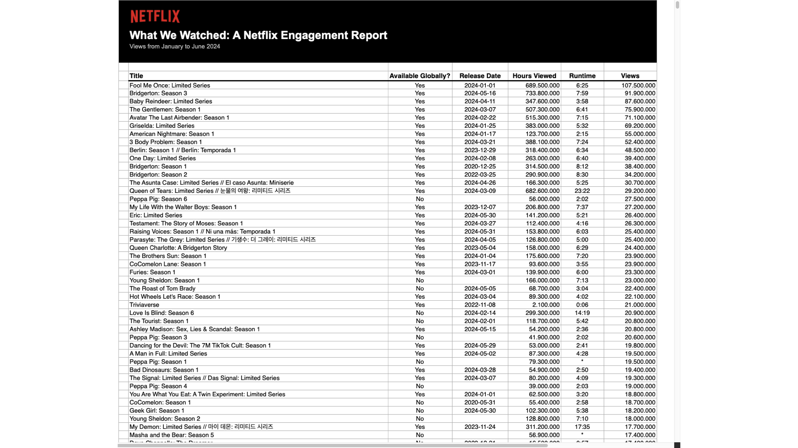

Why does Netflix collect this data?

Note:

Here we should have a discussion and find a lot of ideas why netflix might collect this data

1. Which Types of Content Drive Engagement?
   - Question: What genres or types of films (e.g., documentaries, thrillers, comedies) have the highest views and longest hours watched?
   - Motivation: Identifying high-performing genres helps Netflix decide on future content investments, ensuring they produce or license films that maximize viewer engagement.
2. What is the Return on Content Investment?
   - Question: How do hours viewed and views per title correlate with production costs or licensing fees?
   - Motivation: Understanding the profitability of content allows Netflix to prioritize high-ROI films and optimize spending on content that attracts and retains subscribers.
3. What Trends in Viewership Patterns Can Inform Release Timing?
   - Question: Are there seasonal patterns in views or hours watched that can guide the timing of releases for similar types of content?
   - Motivation: Aligning new releases with peak demand periods (e.g., holidays) could enhance engagement and maximize return on investment.
4. What Impact Does Runtime Have on Viewer Engagement?
   - Question: How does the runtime of a film correlate with the total hours viewed and completion rates?
   - Motivation: This helps optimize runtimes for future productions. If certain durations yield higher engagement or completion rates, Netflix can align runtimes with audience preferences.
5. How Does the Release Date Affect Initial and Sustained Engagement?
   - Question: Does releasing films on specific dates (e.g., weekends vs. weekdays) impact initial views and long-term engagement?
   - Motivation: Knowing the best times to release content can help Netflix schedule launches for maximum viewership and subscriber retention.
6. What Content is Most Likely to Drive New Subscriptions?
   - Question: Are there films that disproportionately attract first-time viewers or appear in viewing patterns for new subscribers?
   - Motivation: Insights here help Netflix understand which films contribute most to subscriber acquisition, guiding future content and marketing decisions.

--

- What are business relevant questions for netflix?
- What (data) do we need to answer those questions?
- Where do we get this information from?
- Who needs access to this information?

Note: put some on the whiteboard

--

That is BI!

--

[source](https://about.netflix.com/en/news/what-we-watched-the-first-half-of-2024)

---

### BI for dummies

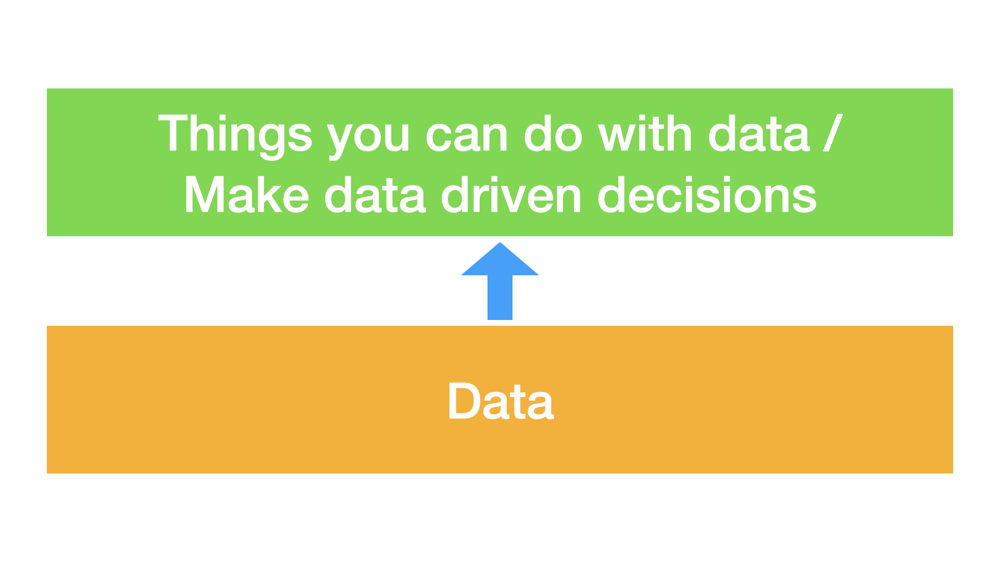

---

### Important BI Goals & Benefits

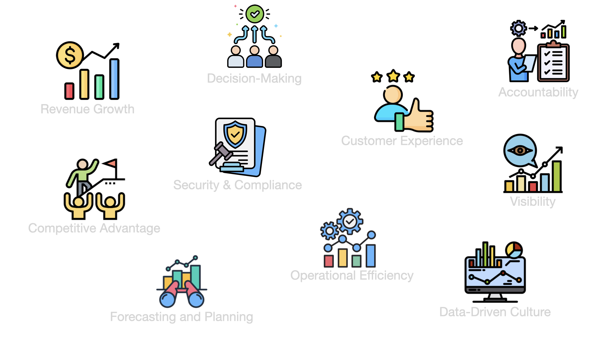

--

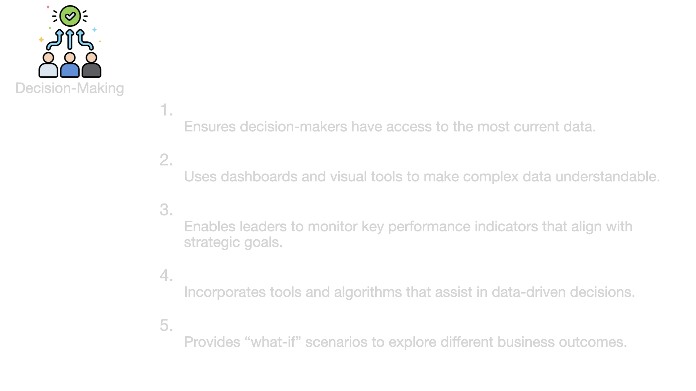

--

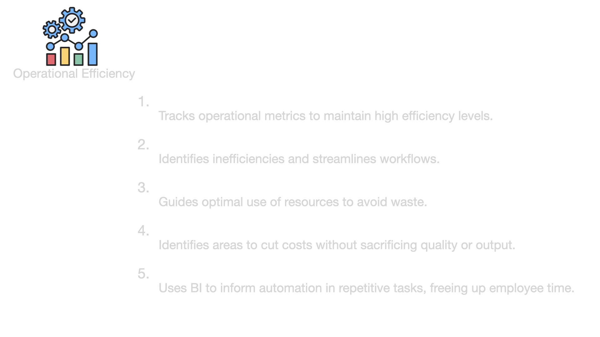

--

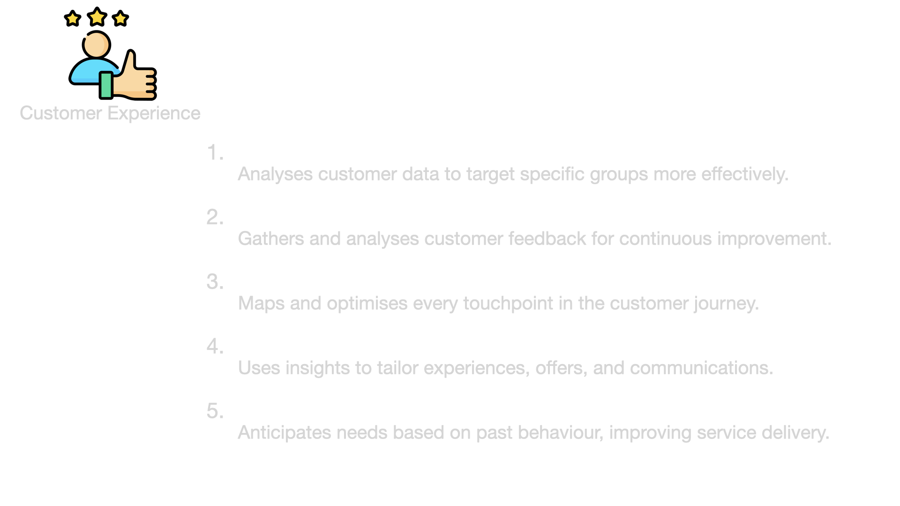

--

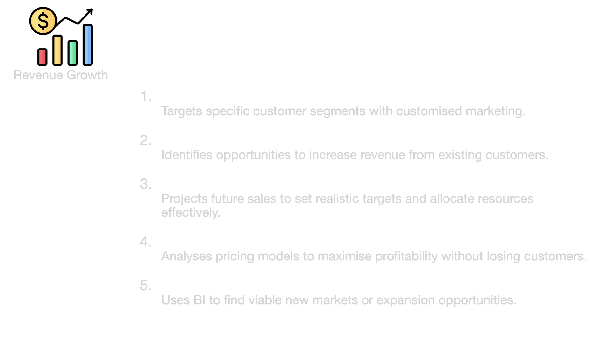

--

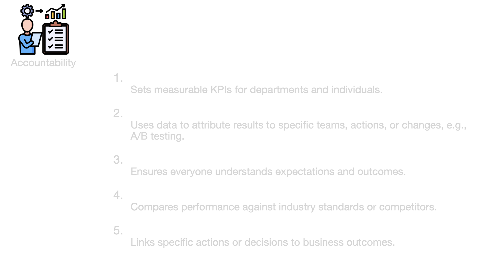

--

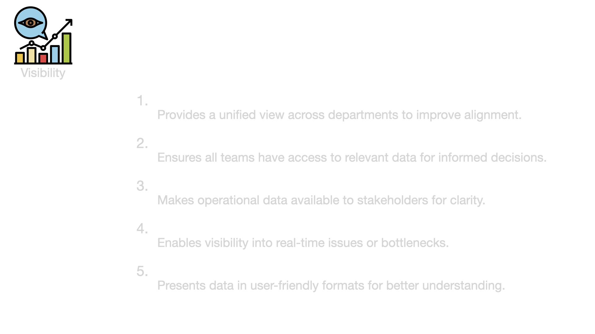

--

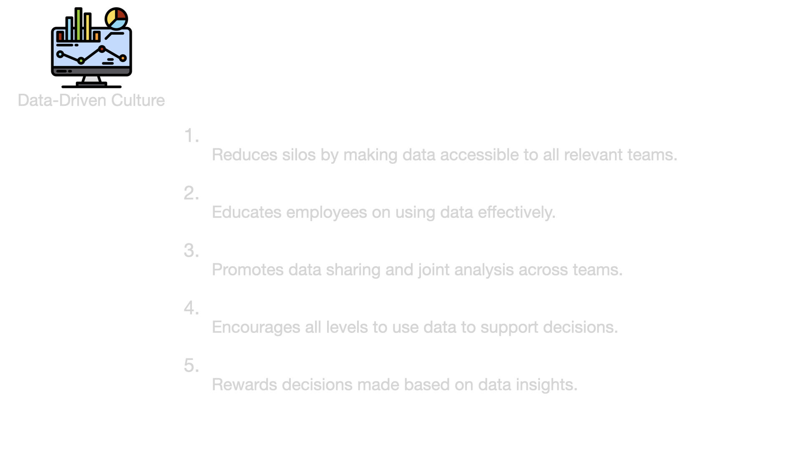

--

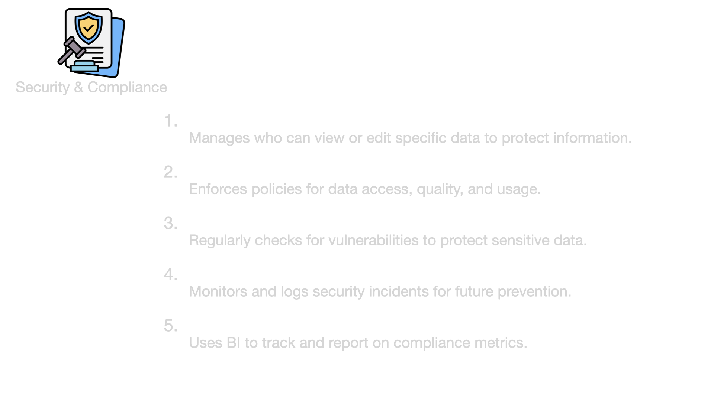

--

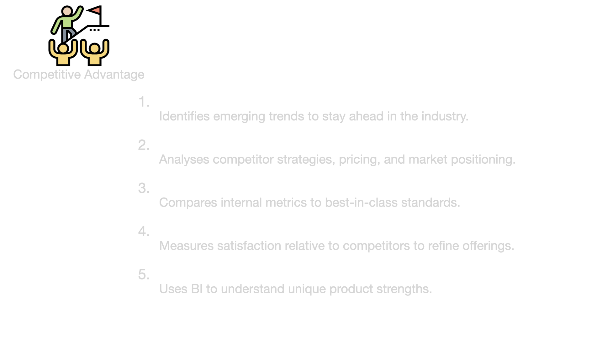

--

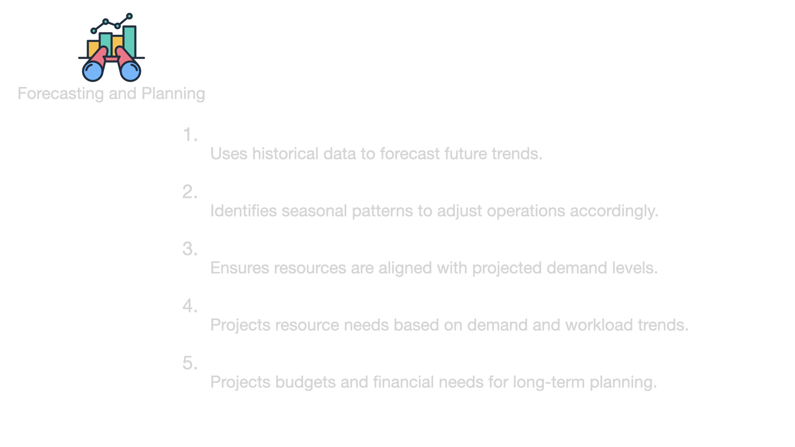

---

### BI Components

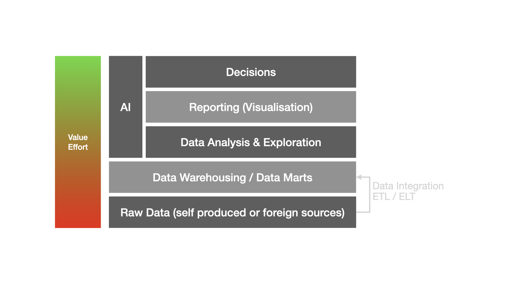

---

### Who does the work?

--

- no hard borders
- dependent on company structure and complexity multi-roles possible
- many more roles involved, e.g. for decision making PO

---

### Stages of Analytics

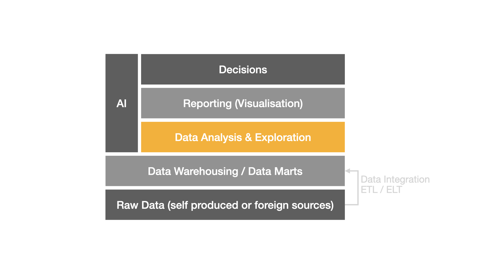

--

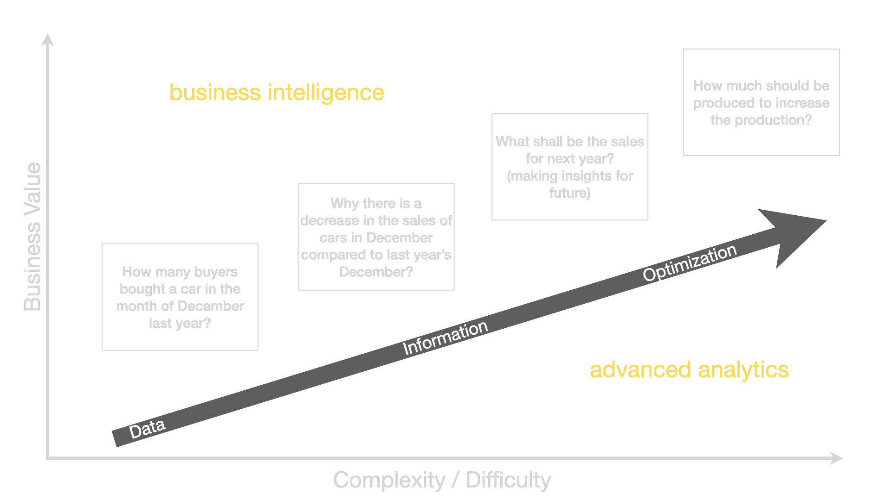

--

Case Study

An online retailer observes a deterioration in sales.
An initial assumption: customer loyalty has declined.

--

Descriptive Analytics

What data or metrics would you examine to understand the current state of customer loyalty and sales?

- historical sales data, customer repeat purchase rates, average order value, and site traffic trends
- key metrics such as monthly active users, average purchase frequency, and customer satisfaction ratings

--

Diagnostic Analytics

Why might customer loyalty and sales be declining? What factors could be causing this trend?

- Investigate possible issues such as product availability, customer feedback (e.g., complaints, reviews), competitive factors, or recent changes in pricing or service.
- Check if there’s been an increase in customer support tickets, returns, or complaints about a specific product category or aspect of service.

--

Predictive Analytics

Based on the data, what can we predict about future sales or customer loyalty if current trends continue?

- Forecast future sales using time series models and analyze if there’s a trend indicating further decline or possible recovery.
- Examine customer cohorts to predict repeat purchase behavior, or use demographic data to anticipate seasonal trends in customer loyalty.

--

Prescriptive Analytics

What strategies or actions could the retailer take to improve customer loyalty and boost sales?

- Recommend targeted loyalty programs, personalized offers, or new product lines to increase engagement.
- Consider adjustments in marketing strategies, pricing, customer service improvements, or implementing a feedback loop for continual improvement.

---

### BI vs. Operational BI (OBI)

Please read the following article and explain with your own words
the difference between BI and OBI:

What is Operational Business Intelligence? Here’s Everything You Need to Know [[click]](https://blog.fabrichq.ai/what-is-operational-business-intelligence-heres-everything-you-need-to-know-7a51112ceb18)

---

### BI is not an end in itself

- BI (components) is not a one-way standalone structure
- BI is a supportive structure for e.g. Decision-Making Models
- BI should be fully integrated into processes, e.g. decision-making processes
- Example:
  - [OODA](https://en.wikipedia.org/wiki/OODA_loop) by [John Richard Boyd](<https://en.wikipedia.org/wiki/John_Boyd_(military_strategist)>)

--

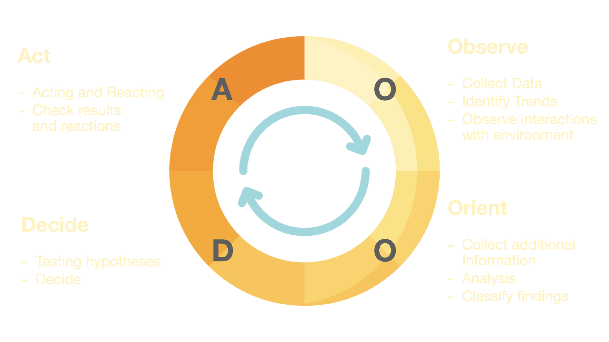

--

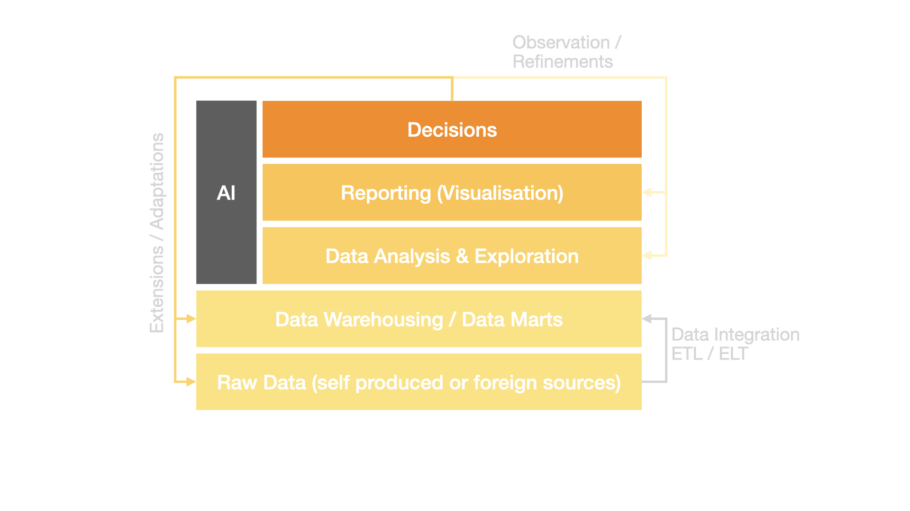

---

### Organizational BI pitfalls

---

**Lack of Data-Driven Culture**

**Focus**

Cultural or strategic failure to prioritize data in decision-making.

[Literature](https://www.datacamp.com/blog/how-to-create-data-driven-organization?dc_referrer=https%3A%2F%2Fwww.google.com%2F)

--

**Explanation**

This refers to an organization’s broader inability to incorporate data into its core decision-making processes. Even when the infrastructure, teams, and data are present, if decision-makers
do not prioritize or value data-driven insights, BI efforts will fall flat.

--

**Main Issue**

Cultural resistance or indifference toward using data, causing BI initiatives to fail or underperform.

---

**Data Silos**

**Focus**

Separation of data across departments or systems.

[Link](https://estuary.dev/why-data-silos-problematic/)

--

**Explanation**

Data silos occur when different teams or departments have their own isolated data systems that are not easily shared or integrated with the rest of the organization.

--

**Main Issue**

Lack of data integration, which hinders comprehensive analysis and BI.

---

**Organizational Silos**

**Focus**

Lack of communication and collaboration between departments.

[Literature](https://www.investopedia.com/terms/s/silo-mentality.asp#:~:text=In%20business%2C%20organizational%20silos%20refer,shared%20because%20of%20system%20limitations)

--

**Explanation**

This term refers to a broader isolation within an organization, where departments (like Data Science, IT, Marketing, Sales) operate independently, often driven by different objectives. Even if the data is accessible, the organizational culture or structure prevents teams from working together effectively.

--

**Main Issue**

Disconnection between departments, causing strategic misalignment and inefficiency in BI efforts.

---

**Business-Data Disconnect**

**Focus**

Misalignment between data insights and business objectives.

[Literature](https://medium.com/geekculture/what-to-do-when-business-and-data-teams-are-disconnected-ecc717d9affc)

--

**Explanation**

This describes the gap when data teams don’t fully understand business needs, or decision-makers don’t know how to leverage data effectively. Even when the data is integrated, insights generated by data scientists might be irrelevant or misaligned with what the business needs.

--

**Main Issue**

Mismatch between the focus of data scientists and the real-world business goals, leading to poor decision-making support.

---

**Shadow BI**

**Focus**

Unsanctioned BI practices within departments.

[Literature](https://www.fastloop.ai/insights/eliminate-shadow-bi)

--

**Explanation**

This occurs when departments or individuals start using their own BI tools and processes without involving the central data science or BI teams. It usually happens because official processes are seen as too slow or misaligned with business needs, so teams create their own ad hoc analysis, often using unverified data.

--

**Main Issue**

Lack of oversight, consistency, and data quality control, leading to potential inaccuracies and risk in decision-making.

---

**And more**

- Decision-Action Gap
- Data Governance Issues
- Communication Gaps
- Technology Lag

Note:

- Decision-Action Gap: Decision-makers fail to act on data-driven insights, even when they are available. This could be due to hesitation, lack of trust in the data, or resistance to change.
- Data Governance Issues: Problems related to managing the availability, usability, integrity, and security of data. This includes unclear data ownership, inconsistent data standards, and poor data quality, which can hinder BI efforts.
- Communication Gaps: This refers to poor communication between data scientists and decision-makers, resulting in misunderstandings or ineffective translation of insights into business actions.
- Technology Lag: When organizations have outdated or insufficient technology for handling modern BI practices. Even with a good data team and strong business collaboration, old systems can prevent effective BI.
- ...

---

### Exercise

You are a consultant who has been asked by a company to help them evaluate their company in terms of BI. There are some problems, but they first want an unbiased analysis from you as a consultant. A first description of the company is already available.

What does the company do well? What is not so good? Prepare a list!

--

**Company: DataPro Solutions**

Description:

DataPro Solutions has been a player in the software solutions industry for over a decade, providing custom software services for small to mid-sized companies. Recently, it decided to embrace digital transformation and enhance its decision-making process by integrating BI tools. The company has invested in training its IT department in BI practices, aiming to generate insights across its finance, HR, and marketing departments.

Each department has its own data system optimized for its specific needs, and while teams occasionally exchange reports, they usually work independently. Upper management often drives decisions based on intuition and experience, viewing BI as a supportive tool rather than a fundamental part of decision-making. The company operates on a fairly tight budget, resulting in occasional limitations on software upgrades. Meanwhile, a few departments have adopted their own ad hoc data practices using various tools outside the official BI platform, hoping to meet their unique reporting needs.

--

- The separate data systems across departments can lead to data silos, although it isn’t explicitly stated.
- The emphasis on management’s intuition-based decision-making points subtly to a lack of a data-driven culture.
- Limited resources hint that technology constraints might prevent the company from updating critical systems for BI.
- The ad hoc data practices adopted by certain departments suggest shadow BI without directly stating it.

<!-- --

**Company 2: GreenGrow Industries**

Description:

GreenGrow Industries is a fast-growing eco-friendly product company that has recently built out its data analytics team. Initially focused on operations, the data team has since expanded its purview to include marketing insights and customer behavior analytics. Reports are frequently generated and distributed to relevant departments, though interpretations of the data often vary from team to team.

While the data team has worked hard to analyze sales trends, seasonal product demands, and customer feedback, they have sometimes found it challenging to keep pace with the requests from different departments. Each department values different metrics, and there’s a diverse range of reporting styles to suit each team’s preferences. GreenGrow recently invested in an advanced BI platform, but usage varies among team members due to its complexity. Leadership is highly supportive of BI initiatives and often expresses an interest in exploring further.

Note:

Hints for Students in Company 2’s Analysis:

    •	The variation in data interpretation hints at a business-data disconnect and communication gaps, as departments may not have a unified BI focus.
    •	The challenge in meeting departmental requests suggests the potential for data silos, where each department relies on tailored, sometimes isolated insights.
    •	The diversity in metrics and reporting preferences indicates a misalignment in business objectives, hinting at the business-data disconnect.
    •	The mention of leaders being interested in BI but no specific follow-through hints subtly at a decision-action gap—suggesting a gap between expressed interest and actual utilization. -->

<!-- --- -->
<!--
Notes

# todo vat

- jim simons slides
- add netflix challenge as seminal ai/bi story -->
