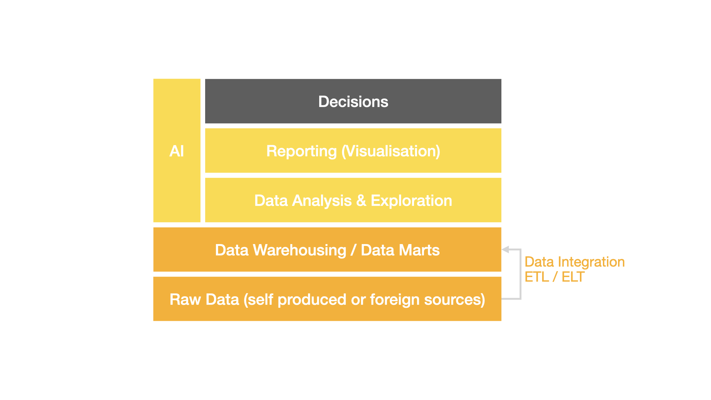
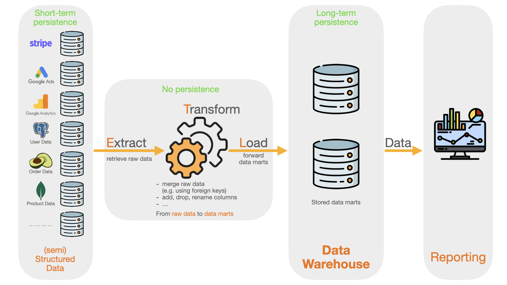
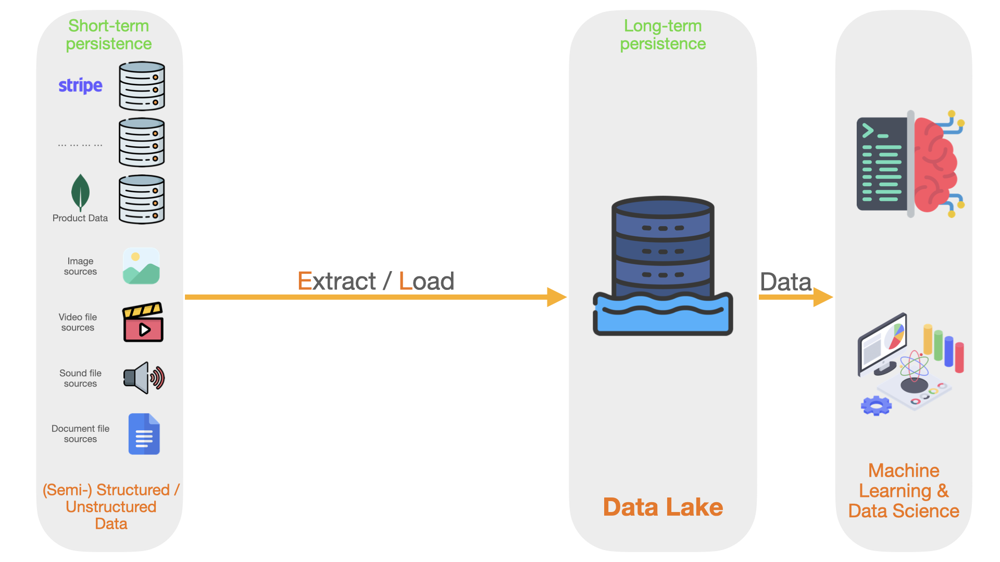
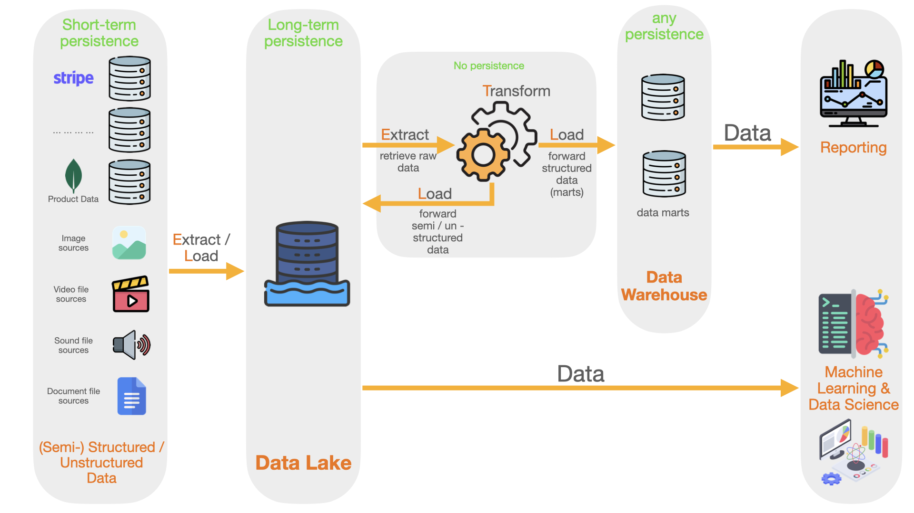
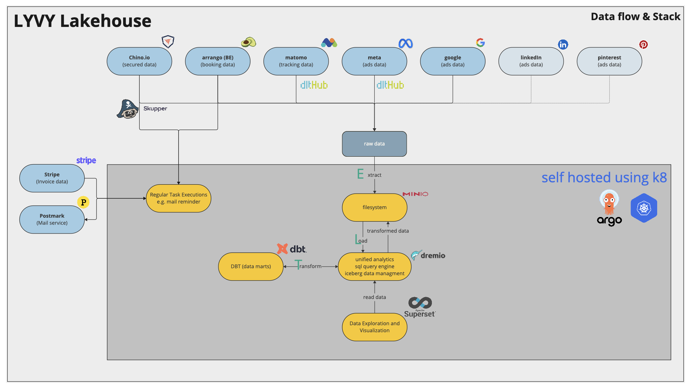
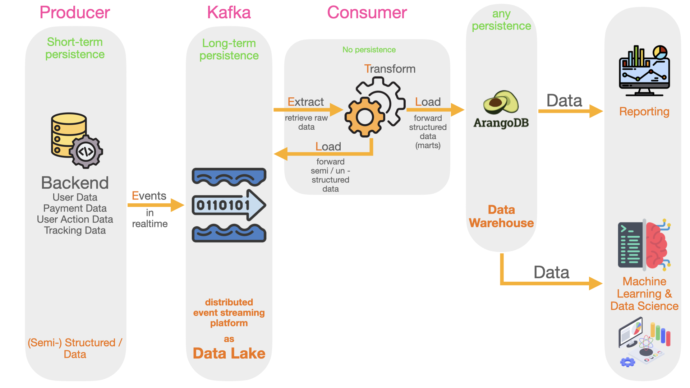
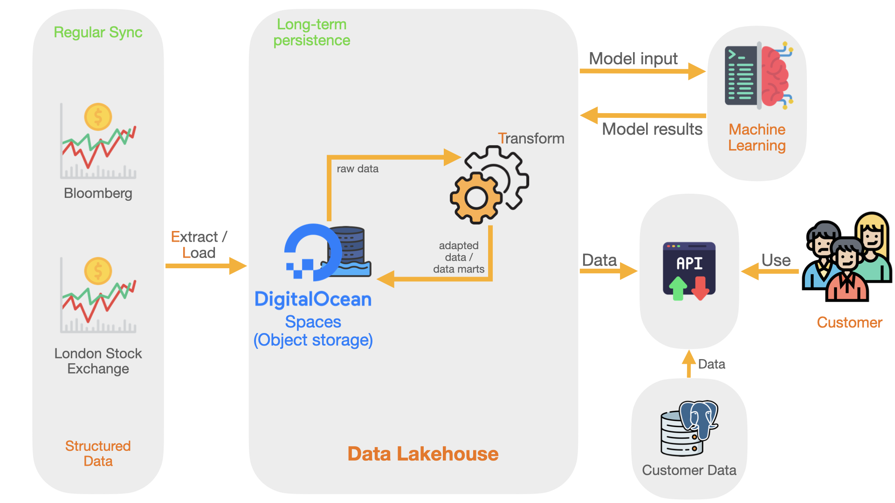

Where are we located during the lecture?

---

Outlook

- Data management architectures
- Deep-dive into lyvy's architecture
- Deep-dive into a realtime architecture
- Cloud vs. On-Premise
- Exercise: Design and Critique a Data Management Architecture yourself

---

Data management architectures

---

Data Warehouse

--

--

Description

<ol class="small-list">
<li>A Data Warehouse serves as a central hub for storing structured data.</li>
<li>Information is collected from multiple sources, processed / ingested (ETL), and then stored in the Warehouse.</li>
<li>The design of a Data Warehouse resembles a well-structured library, enabling easy data retrieval and analysis.</li>
<li>This organization allows businesses to gain insights quickly, enhancing operational efficiency and decision-making.</li>
<li>Additionally, its structured data foundation supports robust Business Intelligence (BI) analysis.</li>
</ol>

--

What can be high cost drivers in a pure data warehouse architecture?

--

Pros

<ol class="small-list">
<li>Transparent ETL processes helps to understand how data is created (e.g. using <em>dbt</em>)</li>
<li>Higher security: structured data organization in data marts</li>
<li>Very fast query processing</li>
<ul>
  <li>as only relevant data is saved as data marts the amount of data remains within limits</li>
  <li>typically relational databases are used, which are extremely performant within a certain data size limit</li>
</ul>
</ol>

--

Cons

<ol class="small-list">
<li>as intermediate data tables (like staging tables) are typically not persisted, troubleshooting can be difficult (virtual tables / views vs. physical tables / materialized)</li>
<li>changes in schema of data marts can be very expensive (reload external data sources)</li>
<li>loss of data can occur if data on external data sources has a short retention period</li>
<li>explorative data tasks based on raw- and intermediate data (staging) not possible</li>
<li>not suitable for machine learning tasks on unstructured data</li>
</ol>

--

What makes a good ETL process?

- schema documentation
- traceability of the data marts created (dependency graphs)
- configurable fault tolerance with monitoring
- testing with logging

---

Data Lake

--

--

Description

<ol class="small-list">
<li>A Data Lake serves as a central hub for storing all kinds of data</li>
<li>Information is extracted and directly loaded into the storage, <b>without transformations.</b></li>
<li>The design of a Data Lake resembles a copy of the original data sources, enabling data exploration, data science and machine learning tasks.</li>
<li>This organization allows businesses to persist data sources and making them long-term available.</li>
</ol>

--

Please provide a short list of pros and cons for the Data Lake.

--

Pros

<!-- - high flexibility, agility and no limits regarding
  - data format structure
  - type of data
  - amount of data
- typically low costs on storage size (roughly ranges from $0.01 to $0.025 / GB / month) -->

--

Cons

<!-- - higher costs on processing the data (no free lunch)
- lack of structure, therefore lack of transparency: risk of becoming a data swamp
- security challenges: might be challenging to identify security threats because of vast amount of data in vast amount of formats
- no default query execution: another tooling is necessary -->

---

Hybrid Data Lake

--

--

Description

<ol class="small-list">
<li>A Hybrid Data Lake combines the advantages of Data Warehouses and Data Lakes</li>
<li>to the expense of complexity.</li>
</ol>

--

Regarding costs, in a Hybrid Data Lake setting, the amount of storage is increased.

When is it still advisable?

---

Data Lakehouse

--

--

Description

<ol class="small-list">
<li>A Lakehouse combines the advantages of Data Warehouses and Data Lakes</li>
<li>and still keeps complexity low.</li>
<li>Often standalone query engine is necessary.</li>
</ol>

So what is a potential disadvantage of this structure? (Remember there is no free lunch!)

--

Hybrid Data Lake or Lakehouse?

- Hybrid Data Lake can provide high performance (low latency for e.g. operational BI) data with cheap data query costs
- Lakehouse lower complexity, less expenses regarding maintenance and still good performance, sufficient for most cases

---

Don't think of these architectures as being set in stone. They all have advantages and disadvantages and are applied in modified and combined forms.

---

On-Premises vs. Cloud

Please study the following link and explain with your words the difference between On-Premises and Cloud.
What different levels are there in the cloud sector and how do they differ?

[On-Premises vs. Cloud](https://www.bmc.com/blogs/saas-vs-paas-vs-iaas-whats-the-difference-and-how-to-choose/)

---

Deep-dive into lyvy's architecture

--

---

Deep-dive into a realtime architecture

--

---

Exercise: Design and Critique a Data Management Architecture yourself

--

Scenario

<ol class="small-text">
You are a consultant tasked with designing a data management architecture for an upcoming start-up, called DebtRay, handling expensive raw data from multiple providers (e.g. Bloomberg, London Stock Exchange). The architecture must address several challenges, including cost, scalability, and flexibility.
</ol>

<ol class="small-text">DebtRay's business model is the quantification and assessment of companies bond emissions.</ol>

--

Procedure

<ol class="smaller-list">
<li>Design Phase
    <ul>
        <li>Based on the provided key points, draft a data management architecture that balances costs, risks, and scalability.</li>
        <li>Describe each component of your architecture and justify your decisions.</li>
    </ul>
</li>
<li>Comparison Phase
    <ul>
        <li>Compare your architecture to the provided actual architecture.</li>
        <li>Identify strengths and weaknesses of both approaches.</li>
    </ul>
</li>
<li>Critique Phase
    <ul>
        <li>Suggest improvements for the actual architecture and for your own design.</li>
        <li>Focus on aspects like scalability, cost efficiency, and handling schema changes.</li>
    </ul>
</li>
</ol>

--

Key Facts of the Business

--

General Business

- not certain that business idea works and scales
- starting with just one person in the role as full stack data alchemist
- first implementation time is limited and must proceed quickly
- next to analytical services, the business provides machine learning models for predictions

--

Data

- high-priced external data as the basis for core business (Bloomberg / London Stock Exchange)
- data volumes manageable in the range under 1 GB
- live data desirable but not absolutely necessary, at least one update per month

--

Data Aggregation

- Processes: De-duplication, combining raw data, imputing, interpolating, sanity checks, and replay capabilities.
- Challenges: Complex workflows due to messy raw data and evolving requirements.
- Compatibility: Must handle schema evolution in raw data.

--

Reporting / Monitoring

- CFO should get information about costs
- CEO should get information about customers and corresponding KPIs
- CTO should get information about the state of the data infrastructure (Everything up and running? Did we face errors somewhere?)

--

Design a Data Management Architecture

Checklist

<ol class = "small-list">
<li>Provide schematic flowchart of your designed architecture.</li>
<li>Add names of tools for the different steps. (google for it, make proposals)</li>
<li>How does your architecture address the economic risk associated with raw data?</li>
<li>Does your design support future scalability and modularity?</li>
<li>How do you handle schema changes in raw data?</li>
<li>Compare the costs of your architecture with the current one (e.g. storage, compute, backup).</li>
<li>What trade-offs did you make in your design, and why?</li>
</ol>

--

Criticize Debtray's Architecture

