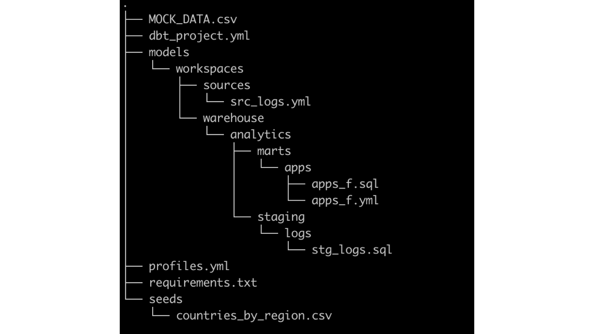
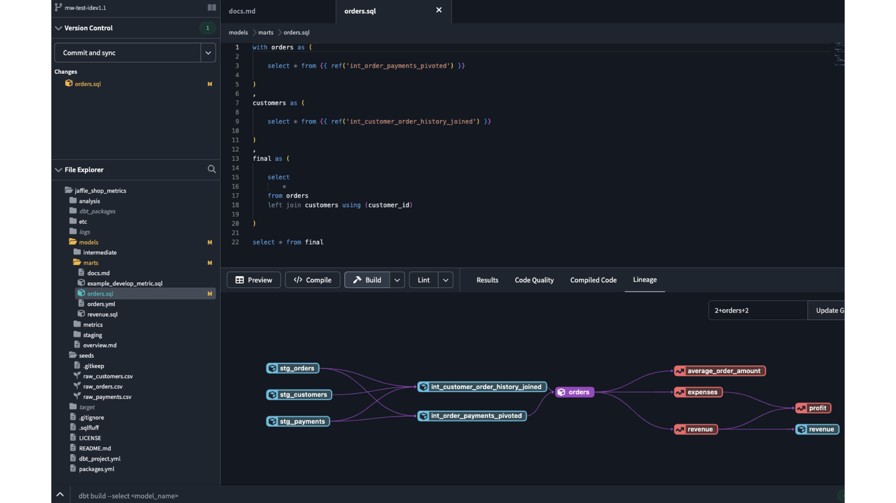

Where are we located during the lecture?

---

Outlook

- data management architectures
- lyvy's architecture
- realtime architecture
- Cloud vs. On-Premise

---

Data management architectures

---

Data Warehouse

--

--

Description

<ol class="small-list">
<li>Central hub for cleaned, structured data (e.g., <em>sales_orders</em>, <em>customers</em>, <em>products</em>).</li>
<li>Data from many sources is collected, cleaned, and loaded (ETL) into consistent tables.</li>
<li>Library analogy: to answer “Q4 revenue in Germany”, you go to the right shelf (sales) and index (country, date).</li>
<li>Result: fast, consistent reporting and BI dashboards.</li>
</ol>

--

What can be high cost drivers in a pure data warehouse architecture?

--

Answer (examples)

<ol class="small-list">
<li><strong>Schema changes:</strong> changing a mart often means reprocessing months/years of data.</li>
<li><strong>Complex ETL:</strong> many joins and transformations increase compute time.</li>
<li><strong>Large history reloads:</strong> backfills are expensive.</li>
<li><strong>Many marts:</strong> maintaining many curated tables adds cost and effort.</li>
</ol>

--

Pros

<ol class="small-list">
<li><strong>Clear lineage:</strong> you can see how a table was built (e.g., dbt model “monthly_revenue”).</li>
<li><strong>Fast queries:</strong> dashboards load quickly on curated data marts (e.g., sales by month).</li>
<li><strong>Stronger governance:</strong> access control by domain (e.g., HR mart separate from sales).</li>
</ol>

--

Cons

<ol class="small-list">
<li><strong>Less flexible for raw exploration:</strong> not ideal for logs/text/audio without extra storage.</li>
<li><strong>Schema changes are costly:</strong> changing a mart can require reloading pipelines.</li>
<li><strong>Raw data may be lost:</strong> if the source keeps data only briefly (e.g., 7‑day logs).</li>
</ol>

--

#### Example: e-commerce dashboard

<ul class="small-list">
  <li>Daily funnel: sessions → add_to_cart → orders</li>
  <li>Bounce rate and conversion rate</li>
  <li>Slice by <em>utm_source</em> (organic / paid / email)</li>
</ul>

--

#### Raw tables (messy)

  

    
raw_web_events

    <table class="small-list">
      <tr><th>event_time</th><th>session_id</th><th>user_id</th><th>event</th><th>utm_source</th></tr>
      <tr><td>2024/10/01 12:01</td><td>s-11</td><td>u-7</td><td>page_view</td><td>paid</td></tr>
      <tr><td>2024/10/01 12:02</td><td>s-11</td><td>u-7</td><td>add_to_cart</td><td>paid</td></tr>
      <tr><td>2024/10/01 12:03</td><td>s-12</td><td>u-9</td><td>page_view</td><td>organic</td></tr>
    </table>
  

  

    
raw_orders

    <table class="small-list">
      <tr><th>order_time</th><th>order_id</th><th>user_id</th><th>total_cents</th><th>currency</th></tr>
      <tr><td>2024-10-01T12:05Z</td><td>O-1001</td><td>u-7</td><td>129900</td><td>USD</td></tr>
      <tr><td>2024-10-01T12:10Z</td><td>O-1002</td><td>u-9</td><td>4990</td><td>EUR</td></tr>
    </table>
  

  Messy: different time formats, multiple events per session, currencies not aligned.

--

#### Staging tables (cleaned, reusable)

  

    
stg_sessions

    <table class="small-list">
      <tr><th>session_id</th><th>date</th><th>utm_source</th><th>events</th><th>bounce</th></tr>
      <tr><td>s-11</td><td>2024-10-01</td><td>paid</td><td>5</td><td>0</td></tr>
      <tr><td>s-12</td><td>2024-10-01</td><td>organic</td><td>1</td><td>1</td></tr>
    </table>
  

  

    
stg_orders

    <table class="small-list">
      <tr><th>order_id</th><th>date</th><th>session_id</th><th>revenue_eur</th></tr>
      <tr><td>O-1001</td><td>2024-10-01</td><td>s-11</td><td>118.00</td></tr>
      <tr><td>O-1002</td><td>2024-10-01</td><td>s-12</td><td>49.90</td></tr>
    </table>
  

  Staging is clean + reusable for multiple marts (marketing, finance, product).

--

#### Mart table (dashboard-specific)

mart_daily_funnel

<table class="small-list">
  <tr><th>date</th><th>utm_source</th><th>sessions</th><th>bounces</th><th>add_to_cart</th><th>orders</th><th>conversion</th></tr>
  <tr><td>2024-10-01</td><td>paid</td><td>120</td><td>18</td><td>45</td><td>20</td><td>16.7%</td></tr>
  <tr><td>2024-10-01</td><td>organic</td><td>180</td><td>40</td><td>30</td><td>15</td><td>8.3%</td></tr>
</table>

  This is built exactly for the dashboard charts (fast and simple).

--

#### What makes a good ETL process?

- <strong>Schema documentation:</strong> clear column names + types (e.g., <em>order_date</em> is a date, not text).
- <strong>Traceability:</strong> know the source of each mart (dependency graph from raw → staging → mart).
- <strong>Monitoring + alerts:</strong> missing data triggers a notification (e.g., Slack/email).
- <strong>Testing + logging:</strong> row counts, null checks, and errors are logged.

--

#### Use tooling meant for this purpose

- Often done with plain Python: connect to sources, transform data, and load into the warehouse.
- by far better: use dbt to get documentation, tests, and lineage (what makes a good ETL process).

--

#### by convention with structure

--

#### additionally webui for documentation & tracing

---

Data Lake

--

--

Description

<ol class="small-list">
<li>A Data Lake serves as a central hub for storing all kinds of data</li>
<li>Information is extracted and directly loaded into the storage, <b>without transformations.</b></li>
<li>The design of a Data Lake resembles a copy of the original data sources, enabling data exploration, data science and machine learning tasks.</li>
<li>This organization allows businesses to persist data sources and making them long-term available.</li>
</ol>

--

Please provide a short list of pros and cons for the Data Lake.

--

Pros

- high flexibility, agility and no limits regarding
  - data format structure
  - type of data
  - amount of data
- typically low costs on storage size (roughly ranges from $0.01 to $0.025 / GB / month)

--

Cons

- higher costs on processing the data
- lack of structure, therefore lack of transparency: risk of becoming a data swamp
- security challenges: might be challenging to identify security threats because of vast amount of data in vast amount of formats
- no default query execution: another tooling is necessary

---

Hybrid Data Lake

--

--

Description

<ol class="small-list">
<li>A Hybrid Data Lake combines the advantages of Data Warehouses and Data Lakes</li>
<li>to the expense of complexity.</li>
</ol>

--

Regarding costs, in a Hybrid Data Lake setting, the amount of storage is increased.

When is it still advisable?

---

Data Lakehouse

--

--

Description

<ol class="small-list">
<li>A Lakehouse combines the advantages of Data Warehouses and Data Lakes</li>
<li>and still keeps complexity low.</li>
<li>Often standalone query engine is necessary.</li>
</ol>

So what is a potential disadvantage of this structure?

--

Hybrid Data Lake or Lakehouse?

- Hybrid Data Lake can provide high performance (low latency for e.g. operational BI) data with cheap data query costs
- Lakehouse lower complexity, less expenses regarding maintenance and still good performance, sufficient for most cases

---

Don't think of these architectures as being set in stone. They all have advantages and disadvantages and are applied in modified and combined forms.

---

On-Premises vs. Cloud

Please study the following link and explain with your words the difference between On-Premises and Cloud.
What different levels are there in the cloud sector and how do they differ?

[On-Premises vs. Cloud](https://www.bmc.com/blogs/saas-vs-paas-vs-iaas-whats-the-difference-and-how-to-choose/)

---

Deep-dive into lyvy's architecture

--

---

A realtime architecture

--

