Where are we located during the lecture?

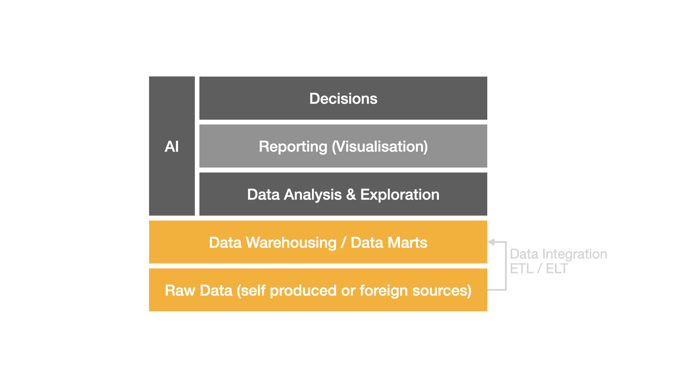

---

Is a file system all you need to store information?

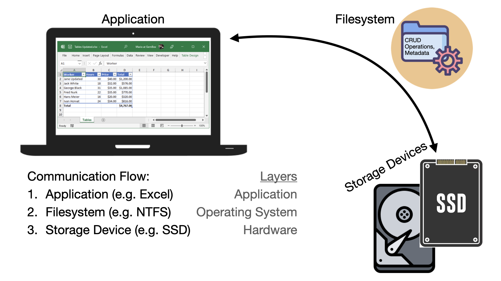

---

<span style="color: lightgreen;">What is the task of a file system?</span>

--

- bringing <span style="color: yellow;">order</span> to digital chaos
  - files and folders
  - metadata like creation date or file size

--

- <span style="color: yellow;">efficient</span> data <span style="color: yellow;">operation</span>
  - e.g. read in an excel file
  - e.g. make a change and save it


---

What are those operations?

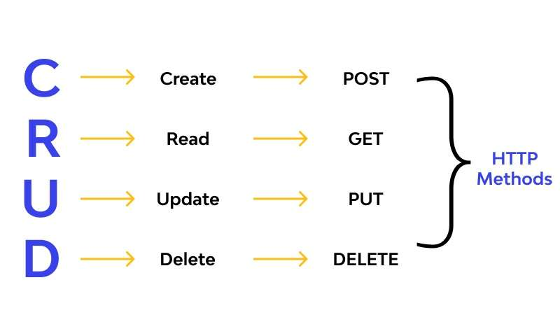

---

<span style="color: lightgreen;">Is a file system all you need to store information?</span>

--

No because of the <span style="color: yellow;">no free lunch theorem</span>:

- optimization towards certain tasks are tradeoffs
- optimizing read operations might lead to slower write operations
- faster write operations might lead to slower read operations
- ...

---

<span style="color: lightgreen;">What is a data base and what is it good for?</span>

--

What is a data base?


--

What is it good for?

- efficient <span style="color: yellow;">CRUD</span> operations
- <span style="color: yellow;">ACID</span> criteria guarantee on transitions
- storage efficiency
- scalability

---

<span style="color: lightgreen;">How can the efficiency of **CRUD** operations be influenced?</span>

--

What is slow and what is fast?

A case study of a row-oriented database

--

<span style="color: green;"> Fast </span>

- accessing data by the row number / row index is fast
  - direct access to memory location
  - e.g. given a data table returning row number 7
- in-memory access of data

--

<span style="color: red;"> Slow </span>

- accessing data by column values can be slow (in row-oriented databases)
  - iterate through rows, read and compare
  - e.g. given a data table with a column _name_ returning the row where _name_ equals Henry
- disk-based access of data

--

Example

Assume we have a <span style="color: yellow;">large data table</span> with _n_ entries:

| row_index | first_name | last_name | age | weight | ... |
| --------- | ---------- | --------- | --- | ------ | --- |
| 1         | Jack       | Sparrow   | 41  | 71     | ... |
| 2         | Hector     | Barbossa  | 63  | 74     | ... |
| 3         | Elizabeth  | Swann     | 32  | 53     | ... |
| ...       | ...        | ...       | ... | ...    | ... |

--

Given a last name, we want to get the relevant row.

<span style="color: lightgreen;">How can we do that?</span>

--

Most obvious: iterate through the rows one step after another and
check for equality with the given last name

<span style="color: lightgreen;">What is the worst case number of steps we need?</span>

--

Worst case scenario: last name is not in the data table

--

Complexity (Linear Search)

| Time                                       | Space                                      |
| ------------------------------------------ | ------------------------------------------ |
| <span style="color: yellow;">_O_(n)</span> | <span style="color: yellow;">_O_(1)</span> |

--

Wait what??? What's this <span style="color: orange;">`big O notation`</span>?

<span style="color: lightgreen;">Ask chatGPT or gemini for a simple explanation!</span>

--

Short Insertion: <span style="color: lightgreen;">What is the complexity of accessing data by a row number?</span>

--

Time / Space Complexity (Direct Access)

| Time                                       | Space                                      |
| ------------------------------------------ | ------------------------------------------ |
| <span style="color: yellow;">_O_(1)</span> | <span style="color: yellow;">_O_(1)</span> |

--

Back to our example:
<span style="color: lightgreen;">Can we do better?</span>

--
Auxiliary Table:

- consisting of
  - _last_name_
  - _row_id_
- <span style="color: yellow;">sorted</span> based on _last_name_

--

Binary Search

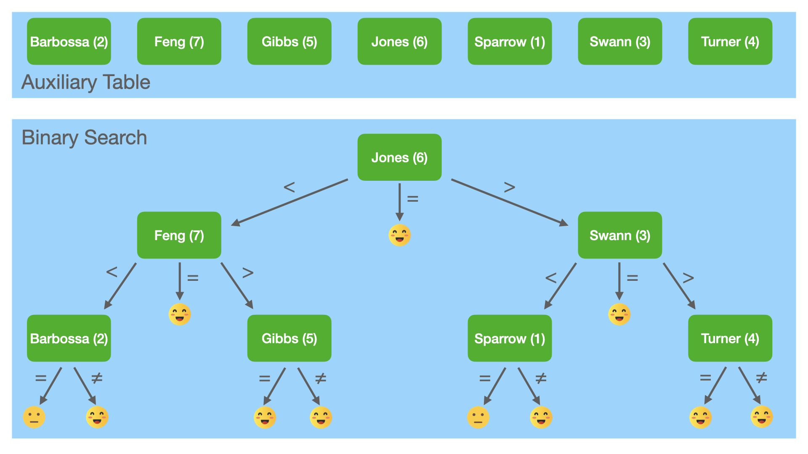

--

<span style="color: lightgreen;">What is the complexity?</span>

--

Complexity (Binary Search)

| Time                                            | Space                                      |
| ----------------------------------------------- | ------------------------------------------ |
| <span style="color: yellow;">_O_(log(n))</span> | <span style="color: yellow;">_O_(1)</span> |

--

Steps <span style="color: orange;">naive</span> vs. <span style="color: red;">binary search</span>:

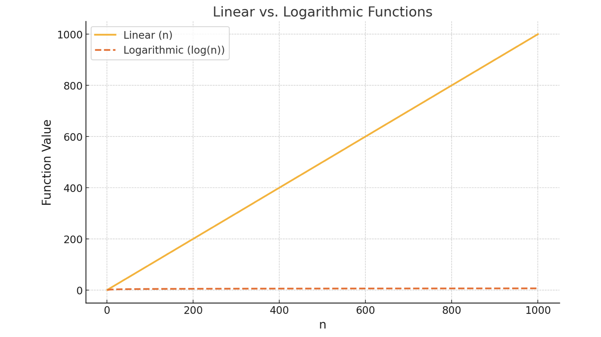

--

Steps <span style="color: orange;">naive</span> vs. <span style="color: red;">binary search</span> on a log scale:

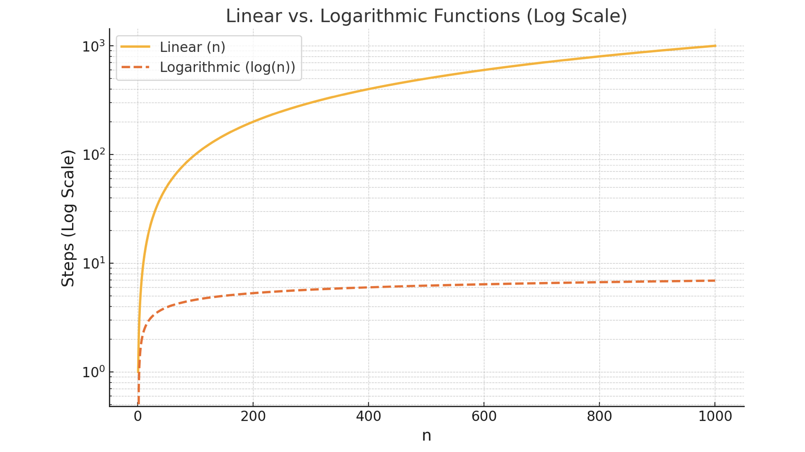

--

Tada, that's what we call an index!

--

<span style="color: red;">Alert</span>

!!Row index is not the same as an index of a data table!!

--

Remember: no free lunch theorem

<span style="color: lightgreen;">What is the tradeoff?</span>

--

We need an auxiliary table, which

1. needs to be kept up to date (so inserts and updates might take a little more time)
2. which costs storage capacity

<!-- --

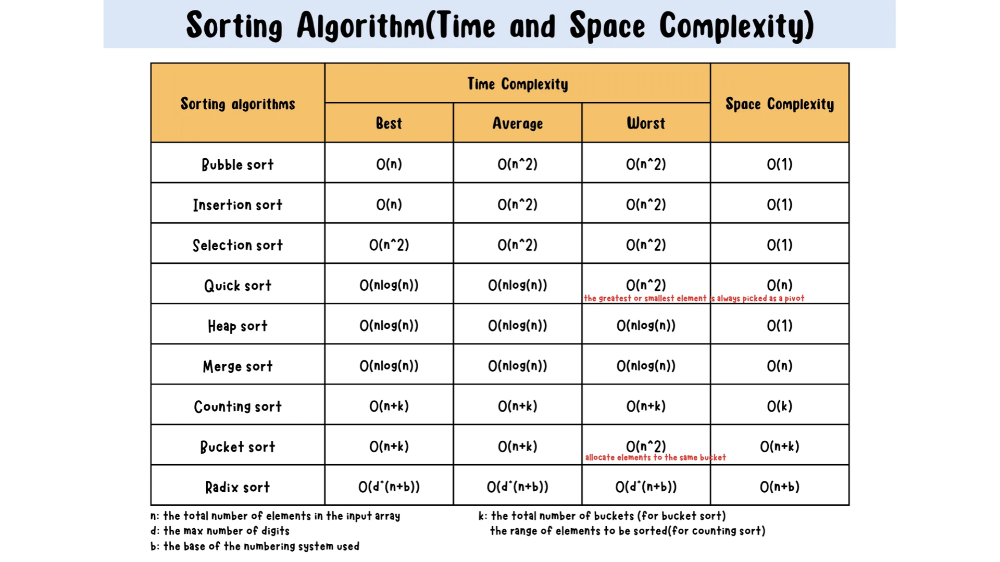 -->

---

<h3><span style="color: orange;">Transactions & ACID guarantees</span></h>

---

- What is a transaction?
- What are ACID criteria?
- Why are they important?
- What are the single parts of ACID?
- What is an example for each of those parts?

<span style="color: lightgreen;">Use any source to answer these questions.</span>

---

<span style="color: orange;">**Atomicity**</span>

--

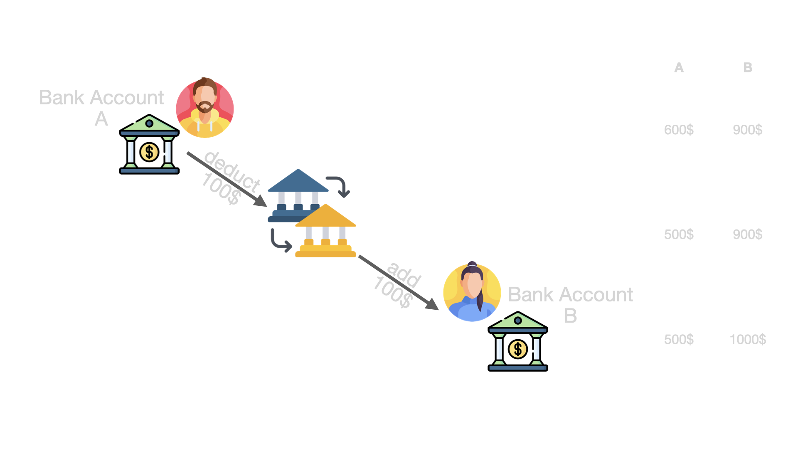

--

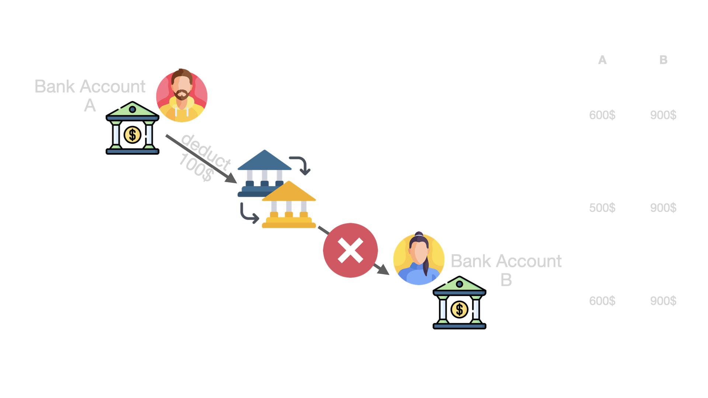

--

<span style="color: orange;">Atomicity</span> ensures that a transaction is treated as a single, indivisible unit of work. Either all the changes made by the transaction are committed to the database, or none of them are.

---

<span style="color: orange;">**Consistency**</span>

--

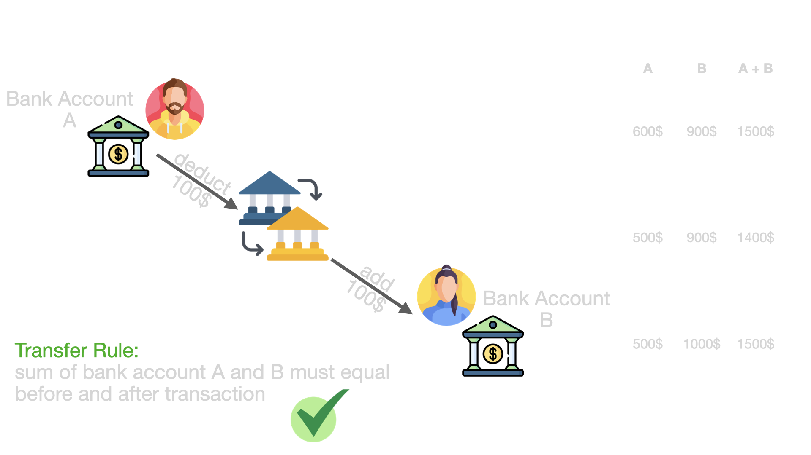

--

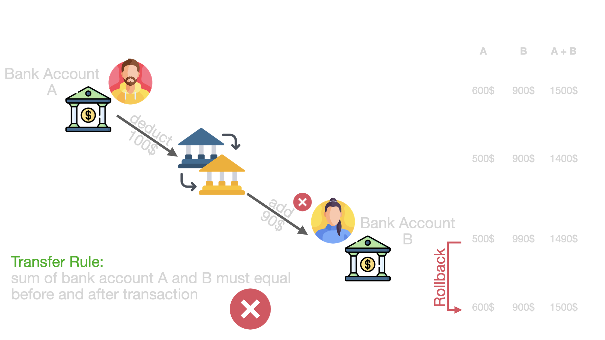

--

<span style="color: orange;">Consistency</span> ensures that a transaction brings the database from one valid state to another. The integrity constraints and rules defined for the database are maintained before and after the transaction.

---

<span style="color: orange;">**Isolation**</span>

--

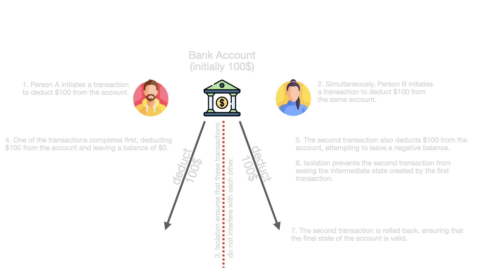

--

<span style="color: orange;">Isolation</span> ensures that the execution of one transaction is isolated from the execution of other transactions.

---

<span style="color: orange;">**Durability**</span>

--

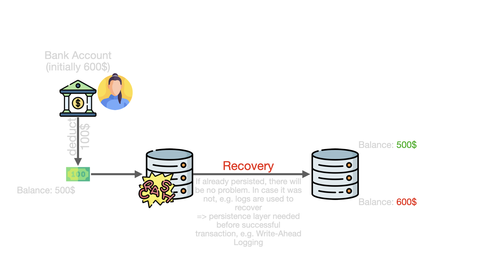

--

<span style="color: orange;">Durability</span> ensures that once a transaction is committed, its effects persist even in the event of system failures. The changes made by a committed transaction are permanent and survive system crashes or power outages.

---

<h3><span style="color: orange;">Database Metadata</span></h>

--

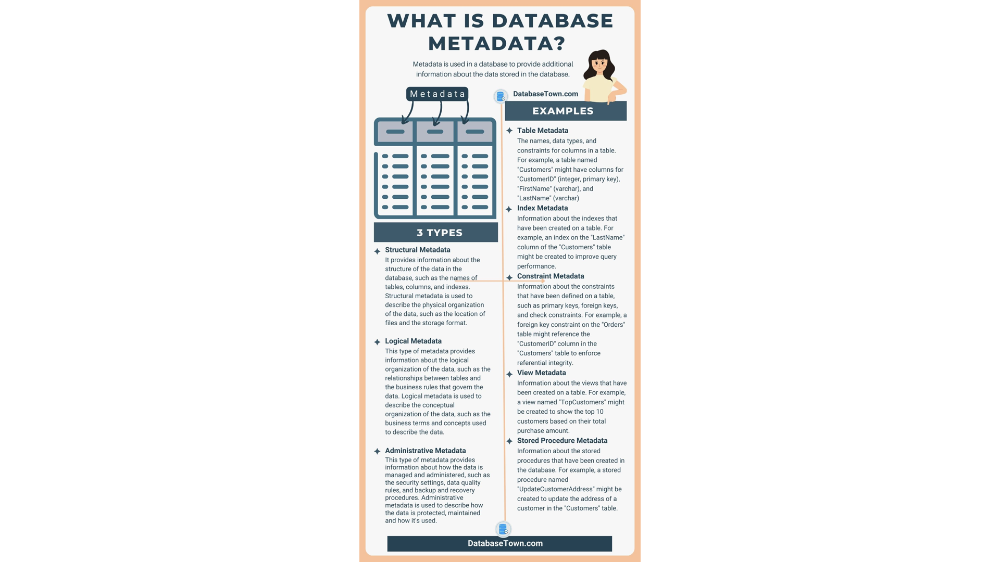

[Source](https://databasetown.com/what-is-database-metadata-examples-types/)

---

<h3><span style="color: orange;">Primary and Foreign Keys</span></h>

---

<span style="color: orange;">**Primary Keys**</span>

... typically a **unique** index, i.e. the values in a column defined as primary key exists exactly once. There are no duplicated values!

But why?

--

<span style="color: orange;">Ensuring Uniqueness</span>

- A primary key uniquely identifies each row in a table, ensuring that there are no duplicate rows. This is crucial for tables that represent entities with distinct identities (e.g., users, products, orders), as it helps prevent data redundancy and ambiguity.

--

<span style="color: orange;">Referential Integrity</span>

- When other tables reference a table, they often use a **foreign key** that points to the primary key in that table.
- Without a primary key, linking data across multiple tables becomes inconsistent and complex, as there’s no guaranteed, unique identifier to reference.

--

<span style="color: orange;">Efficient Data Access</span>

- e.g. PostgreSQL automatically creates a unique index for the primary key column(s). This index improves the efficiency of lookups, making retrieval of specific records faster.
- If you need to search for specific rows frequently, particularly in large tables, the primary key index allows PostgreSQL to quickly locate rows, improving performance.

--

<span style="color: orange;">Update and Delete Operations</span>

- Primary keys simplify and safeguard update and delete operations. For instance, if you want to delete a specific row, a primary key provides a unique reference.
- Without a primary key, you may end up deleting or updating multiple rows unintentionally if they share identical values across columns.

--

<span style="color: orange;">Avoiding Data Anomalies</span>

- Without a primary key, the database lacks a strong enforcement mechanism for ensuring each row’s uniqueness, which can lead to data anomalies. These anomalies can cause issues in reporting, data aggregation, and business logic implementation.

--

Remember the table:

| row_index | first_name | last_name | age | weight |
| --------- | ---------- | --------- | --- | ------ |
| 1         | Jack       | Sparrow   | 41  | 71     |
| 2         | Hector     | Barbossa  | 63  | 74     |
| 3         | Elizabeth  | Swann     | 32  | 53     |
| ...       | ...        | ...       | ... | ...    |

<span style="color: lightgreen;">What column would you choose as the primary index? Why?</span>

---

<span style="color: orange;">**Foreign Keys**</span>

... is used in relational databases like PostgreSQL to establish and enforce relationships between tables, ensuring referential integrity across your data.

--

<span style="color: orange;">Maintaining Referential Integrity</span>

- A foreign key in one table points to a primary key (or unique key) in another table, creating a link between the two. This link enforces referential integrity by ensuring that records in the referencing table (the one with the foreign key) correspond to valid records in the referenced table.

--

<span style="color: orange;">Preventing Orphaned Records</span>

- Foreign keys prevent orphaned records by enforcing that any record in a child table must have a corresponding record in the parent table. Without a foreign key constraint, it’s possible to delete or update data in the parent table without updating the child, leading to orphaned records (child records without a valid parent).

--

<span style="color: orange;">Enforcing Data Consistency Across Tables</span>

- Foreign keys ensure that related data in different tables remains consistent. They prevent actions that could break the logical relationships within your data, like inserting an order with a non-existent customer_id.

--

<span style="color: orange;">Supporting Cascading Actions</span>

- Foreign keys can be set up to cascade certain actions, like ON DELETE CASCADE or ON UPDATE CASCADE. This means that if a record in the parent table is deleted or updated, all related records in the child table will be automatically deleted or updated to match, maintaining consistency.
- Cascading actions can simplify maintenance of related data, reducing the need for complex operations to keep data consistent.

--

<span style="color: orange;">Improving Querying and Logical Structure</span>

- Foreign keys make relationships between tables explicit, which helps both the database engine and developers understand the logical connections within the data.
- They allow you to write queries that utilize these relationships, such as using JOIN operations, which are faster and easier to manage when relationships are clearly defined and enforced.

---

<span style="color: orange;">Example: Primary and Foreign Keys</span>

The customer, order and product chain. Let's be a data engineer.

--

| customer_id | first_name | last_name |
| ----------- | ---------- | --------- |
| 1           | Mary Jane  | Watson    |
| 2           | Harry      | Osborn    |
| 3           | Peter      | Parker    |
| ...         | ...        | ...       |

<span style="color: lightgreen;">Given a customer table, what should the primary key?</span>

--

| <span style="color: orange;">customer_id</span> | first_name | last_name |
| ----------------------------------------------- | ---------- | --------- |
| 1                                               | Mary Jane  | Watson    |
| 2                                               | Harry      | Osborn    |
| 3                                               | Peter      | Parker    |
| ...                                             | ...        | ...       |

- <span style="color: orange;">Primary Key</span>

--

<span style="color: lightgreen;">Create some fictitious tables for an online shop, with to goal to efficiently combine orders with customers and products. Define primary and foreign keys for each of the designed tables.</span>

--

Products

| <span style="color: orange;">product_id</span> | color  | weight | ... |
| ---------------------------------------------- | ------ | ------ | --- |
| 1                                              | red    | 12.8   | ... |
| 2                                              | orange | 9.56   | ... |
| 3                                              | yellow | 3.98   | ... |
| ...                                            | ...    | ...    | ... |

- <span style="color: orange;">Primary Key</span>
- <span style="color: yellow;">Foreign Key</span>

--

Order - Customer - Relation

| <span style="color: orange;">order_id</span> | <span style="color: yellow;">customer_id</span> | date       | gross costs |
| -------------------------------------------- | ----------------------------------------------- | ---------- | ----------- |
| 1                                            | 1                                               | 2024-11-01 | 23.06       |
| 2                                            | 2                                               | 2024-11-05 | 12.74       |
| 3                                            | 1                                               | 2024-10-02 | 31.57       |
| ...                                          | ...                                             | ...        |

- <span style="color: orange;">Primary Key</span>
- <span style="color: yellow;">Foreign Key</span>

--

Order - Product - Relation

| <span style="color: yellow;">order_id</span> | <span style="color: yellow;">product_id</span> | amount |
| -------------------------------------------- | ---------------------------------------------- | ------ |
| 1                                            | 1                                              | 2      |
| 1                                            | 3                                              | 1      |
| 3                                            | 2                                              | 5      |
| ...                                          | ...                                            | ...    |

- <span style="color: orange;">Primary Key</span>
- <span style="color: yellow;">Foreign Key</span>

--

That's also what we call a data model!

---

So far we discussed one of the most used database types: relational databases

---

<h3><span style="color: orange;">Different types of databases for different types of data</span></h>

---

<span style="color: orange;">Relational Databases (rdb)</span>

- all examples up to this point were examples for relational databases
- relational databases are a structured approach to data storage, using tables to organize and link data
- typically implements transactions (ACID)
- based on the relational model
- e.g. Postgres, MySQL, Microsoft SQL Server

--

**Origins of Relational Databases**

- Developed in the 1970s by Edgar F. Codd at IBM.
- Codd’s Relational Model paper in 1970 laid the foundation.
- Goals: data consistency, ease of use, and support for complex queries.
- Key players: IBM’s System R and Oracle as early adopters.

--

**Relational Model / Core Concepts**

- Table (<span style="color: orange;">Relation</span>): Structure holding rows and columns (like a spreadsheet).
- Rows (<span style="color: orange;">Tuples</span>): Each row represents a unique record.
- Columns (<span style="color: orange;">Attributes</span>): Each column represents a specific property (e.g., “name,” “age”).
- <span style="color: orange;">Primary Key</span>: Unique identifier for each row.
- <span style="color: orange;">Foreign Key</span>: Links rows across different tables.

--

**How Relational Databases Work**

- Data stored in tables; tables linked via keys.
- Relational databases use <span style="color: orange;">SQL (Structured Query Language)</span> to manage data.
- rDBs supports CRUD operations (Create, Read, Update, Delete).
- Benefits of structure: reduces redundancy and supports complex data retrieval.

--

**Data Table Relationships in Relational Databases**

- <span style="color: orange;">One-to-One Relationship</span>: Each record in Table A is linked to one in Table B.
- <span style="color: orange;">One-to-Many Relationship</span>: A single record in Table A relates to multiple records in Table B.
- <span style="color: orange;">Many-to-Many Relationship</span>: Records in Table A relate to multiple records in Table B, typically using a linking table. (Remember Order - Product - Relation Table)

--

<span style="color: lightgreen;">What is the relationship?</span>

- order to product
- product to order
- customer to order
- user to user-profile
- product to manufacturer
- advertisement to product

--

<span style="color: orange">SQL</span>

- Core SQL Standard: defines features the rdb should support, e.g. CREATE, SELECT, INSERT, UPDATE or DELETE
- ANSI/ISO has released multiple versions of SQL over the years: SQL-86, SQL-89, ..., SQL:2023
- Additional Vendor Specific Extensions, e.g. Postgres, Mysql, ...

--

Example <span style="color: orange">CREATE</span> to create a table

```SQL
CREATE TABLE users (
    user_id INT AUTO_INCREMENT PRIMARY KEY, -- Unique identifier for each user
    username VARCHAR(50) NOT NULL,          -- User's c hosen username
    email VARCHAR(100) UNIQUE NOT NULL,     -- User's email, must be unique
    password_hash VARCHAR(255) NOT NULL,    -- Encrypted password
    created_at TIMESTAMP DEFAULT CURRENT_TIMESTAMP, -- Timestamp of creation
    updated_at TIMESTAMP DEFAULT CURRENT_TIMESTAMP ON UPDATE CURRENT_TIMESTAMP, -- Timestamp of last update
    is_active BOOLEAN DEFAULT TRUE          -- Indicates if the user's account is active
);
```

--

Example <span style="color: orange">SELECT</span> to read data from data table

```SQL
SELECT user_id, username, email, created_at
FROM users
WHERE is_active = TRUE
ORDER BY created_at DESC;
```

--

Example <span style="color: orange">INSERT</span> to insert a new row into a table

```SQL
INSERT INTO users (username, email, password_hash, is_active)
VALUES
    ('janedoe', 'janedoe@example.com', 'hashed_password_1', TRUE),
    ('jacksmith', 'jacksmith@example.com', 'hashed_password_2', FALSE);
```

--

Example <span style="color: orange">UPDATE</span> to update a row in a table

```SQL
UPDATE users
SET email = 'newemail@example.com', updated_at = CURRENT_TIMESTAMP
WHERE user_id = 1;
```

--

Example <span style="color: orange">DELETE</span> to delete rows in a table which end with _example.com_.

```SQL
DELETE FROM users
WHERE user_id IN (
    SELECT user_id
    FROM users
    WHERE email LIKE '%example.com'
);
```

--

Example <span style="color: orange">FOREIGN KEY</span> to reference an order table to the user table.

```SQL
CREATE TABLE orders (
    order_id INT AUTO_INCREMENT PRIMARY KEY,
    user_id INT NOT NULL,
    order_date DATE NOT NULL,
    total_amount DECIMAL(10, 2) NOT NULL,
    FOREIGN KEY (user_id) REFERENCES users(user_id) ON DELETE CASCADE ON UPDATE CASCADE
);
```

-> ON DELETE/UPDATE CASCADE means, that if the user with a corresponding _user_id_ is deleted, the corresponding order is deleted as well

--

Example <span style="color: orange">JOIN</span> to join two tables.

```SQL
SELECT
  users.user_id, users.username, users.email,
  orders.order_id, orders.order_date, orders.total_amount
FROM users
INNER JOIN orders ON users.user_id = orders.user_id;
```

--

Example <span style="color: orange">CREATE VIEW</span> to create a virtual table.

```SQL
CREATE VIEW active_user_orders AS
SELECT
    users.user_id,
    users.username,
    users.email,
    orders.order_id,
    orders.order_date,
    orders.total_amount
FROM
    users
LEFT JOIN
    orders ON users.user_id = orders.user_id
WHERE
    users.is_active = TRUE;
```

Checkout what a [view](<https://en.wikipedia.org/wiki/View_(SQL)>) is.

--

Example <span style="color: orange">SELECT</span> applied on the _active_user_orders_ view.

```SQL
SELECT
  users.email,
  orders.order_date
FROM active_user_orders
```

Although it's just a virtual table, there is no difference in e.g. the SELECT statement.

-> see the equivalent SQL call on the next slide

--

```SQL
SELECT
  users.email,
  orders.order_date
FROM (
  SELECT
    users.user_id,
    users.username,
    users.email,
    orders.order_id,
    orders.order_date,
    orders.total_amount
  FROM
      users
  LEFT JOIN
      orders ON users.user_id = orders.user_id
  WHERE
      users.is_active = TRUE;
)
```

The view simplifies the access to the joined table and can be reused
everywhere without storing the joined table physically and without
duplicating the JOIN code everywhere.

---

<span style="color: orange;">Document Databases</span>

- one of the main representative of NoSQL databases
- instead of using table like structures, it uses **documents**
- e.g. MongoDB, Couchbase, ArangoDB

--

**An entry in a document database is called document**

- typically it is represented as **json** when querying the database

```json
{
  "firstName": "Bob",
  "lastName": "Smith",
  "address": {
    "type": "Home",
    "street1": "5 Oak St.",
    "city": "Boys",
    "state": "AR",
    "zip": "32225",
    "country": "US"
  }
}
```

<span style="color: lightgreen;">Does that bring back memories?</span>

--

- sometimes also as **xml** file format

```xml
<contact>
  <firstname>Bob</firstname>
  <lastname>Smith</lastname>
  <address>
    <type>Home</type>
    <street1>123 Back St.</street1>
    <city>Boys</city>
    <state>AR</state>
    <zip>32225</zip>
    <country>US</country>
  </address>
</contact>
```

--

- or something else :)
- it doesn't matter

--

<span style="color: orange;">**BUT WHY** document based databases when having RDBs?</span>

--

**Flexible Schema**

- Document DB: Schema-less or schema-flexible; documents can have different fields without predefined constraints.
- RDB: Requires a predefined schema (tables, columns, and data types). Changes often necessitate migrations, which can be time-consuming.

Use Case: Applications with evolving requirements where the data model frequently changes, such as content management systems or user profiles.

--

**Hierarchical and Nested Data**

- Document DB: Supports storing nested data (JSON, BSON, XML), allowing for hierarchical structures.
- RDB: Requires normalization into multiple tables with joins to represent nested relationships.

Use Case: E-commerce platforms storing product details, attributes, and reviews in a single document.

--

**Scalability**

- Document DB: Built for horizontal scaling; easier to distribute across multiple nodes for high availability and performance.
- RDB: Typically scales vertically (adding resources to a single machine). Sharding and replication can be complex.

Use Case: Large-scale applications needing distributed, high-availability setups, such as social media or IoT platforms.

--

**Performance for Specific Queries**

- Document DB: Optimized for read and write operations on hierarchical or key-value structures, often avoiding joins.
- RDB: Joins and complex queries can lead to performance bottlenecks in high-traffic applications.

Use Case: Applications with frequent reads and writes for semi-structured data, such as logging or analytics systems.

--

**Developer Productivity**

- Document DB: Easy to map application objects (e.g., JSON) directly into the database.
- RDB: Often requires additional layers to translate objects into relational tables.

Use Case: Rapid development environments like agile projects or startups.

--

**Sounds like RDBs are needless ... no they should be used when you have**

- strong transactional requirements (ACID compliance).
- complex querying with heavy reliance on joins or aggregations.
- data models that are stable and consistent over time.

---

<span style="color: orange;">Blob Storage Databases / Object Storages</span>

- optimized to store any kind of data (e.g. binary data) as objects (similar to files)
- adds metadata to stored objects
- e.g. minio, AWS S3, Azure Blob Storage, Digital Ocean Spaces

--

<span style="color: yellow;">Demo: Minio</span>

---

<span style="color: orange">Excursion: Data Types</span>

<span style="color: lightgreen">Please find out</span> the difference between

- unstructured data
- semi-structured data
- structured data

and <span style="color: lightgreen">map it to the discussed database types.</span>

---

#### Other Databases

- Graph Databases (e.g. ArangoDB)
- Key-Value Stores (e.g. Redis)
- Column-Family Databases (e.g. Apache Cassandra)
- Time-Series Databases (e.g. InfluxDB)
- Search Optimized Databases (e.g. Elasticsearch)
- Multimodel Databases (e.g. ArangoDB: Graph, document & Key-Value)
- NewSQL Databases (e.g. CockroachDB)

---

The [Stackoverflow Survey](https://survey.stackoverflow.co/2023/#most-popular-technologies-database) about the most popular databases in 2024

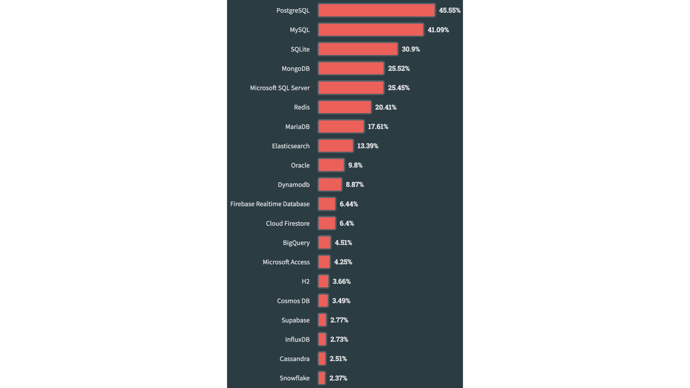

---

The choice depends on <span style="color: orange;">usecases</span>:

- What type of data do I have?
- Do I have a fixed schema?
- Do I have nested structures?
- Is my data dense?
- Do I need strong ACID criterias?
- ...
