Where are we located during the lecture?

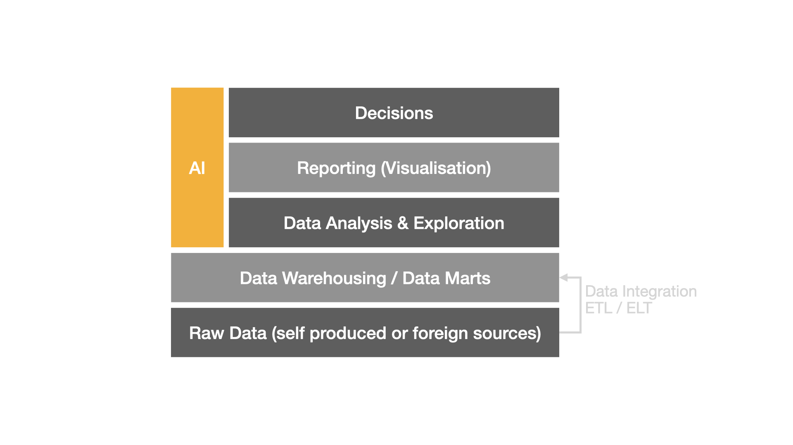

---

One more class of machine learning models:

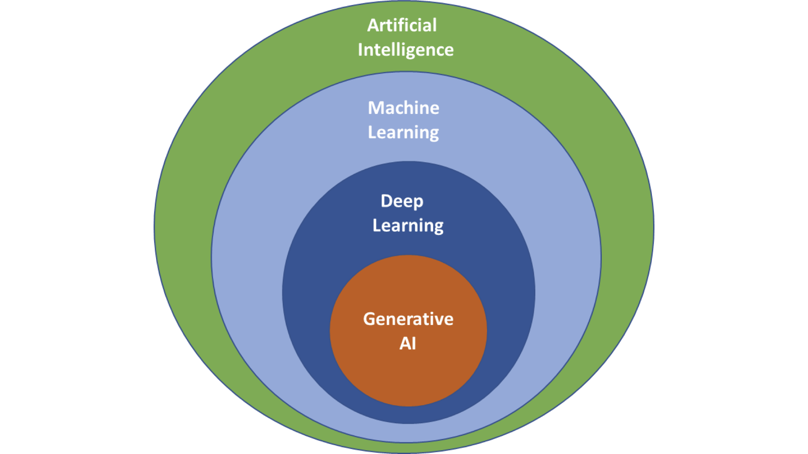

--

#### What is generative AI?

- synthetic data / content creation
- probabilistic modeling
  - given data, generative models learn to imitate data / to sample data

--

#### Generative Adversarial Networks (GANs)

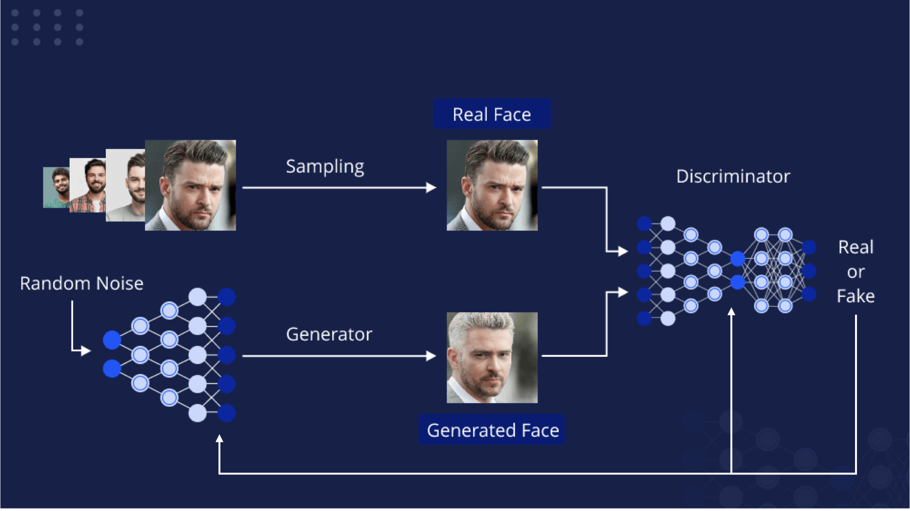

--

### Encoder - Decoder Models

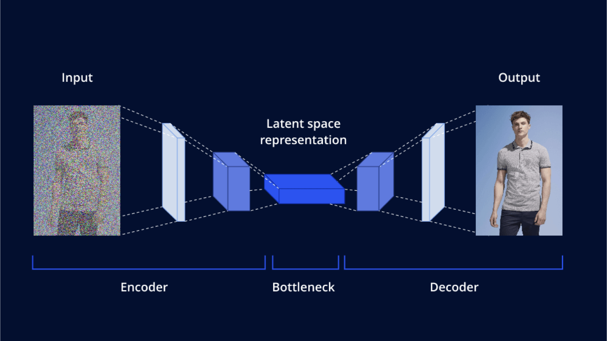

<span style="color: lightgreen;">How does the training data look like?</span>

---

#### <span style="color: orange;">Transformer models / Large Language Models (LLMs)</span>

--

#### <span style="color: orange;">What is different from latest LLM (> 2017) compared to preview architectures?</span>

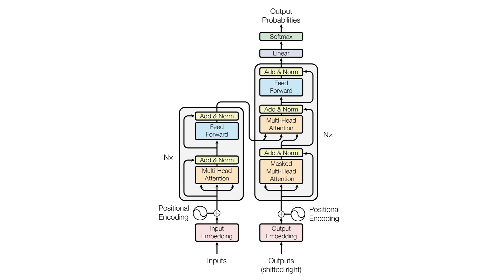

--

<span style="color: orange;">What is different from latest LLM (> 2017) compared to preview architectures?</span>

- transformer architecture allows for efficient large scale computation
- attention mechanism allows the model to focus on relevant part whlie disregarding the reest
- attention mechanism captures dependencies between words and therefore improve context understanding

--

#### Inference / Prediction

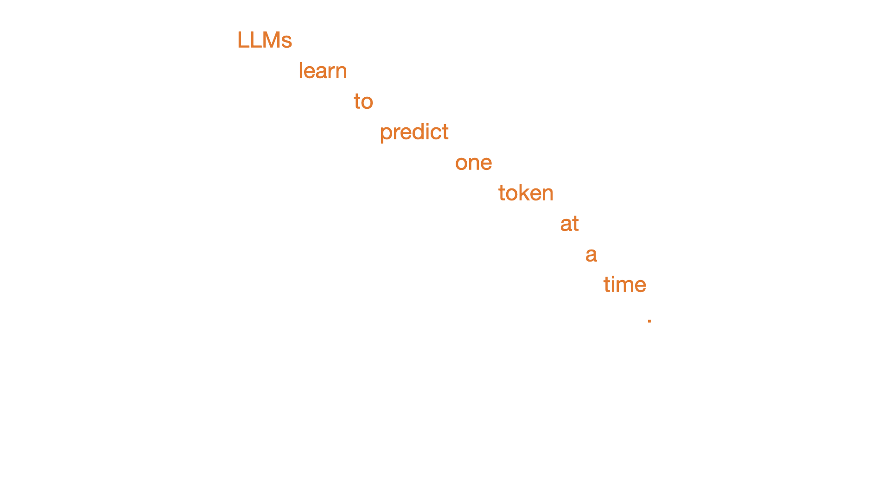

--

#### <span style="color: orange;">Wait what is the LLM predicting exactly, is it a token?</span>

--

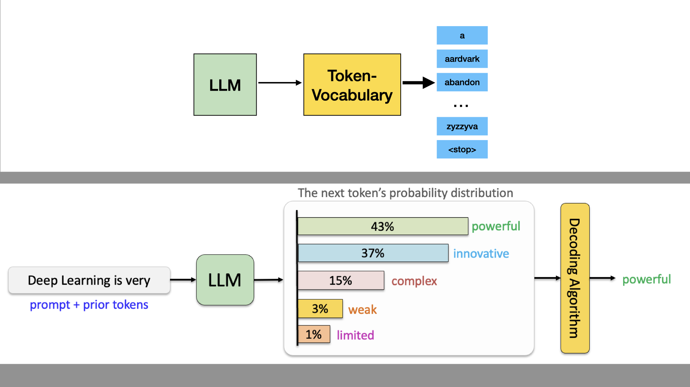

--

#### A detour into the training phase

--

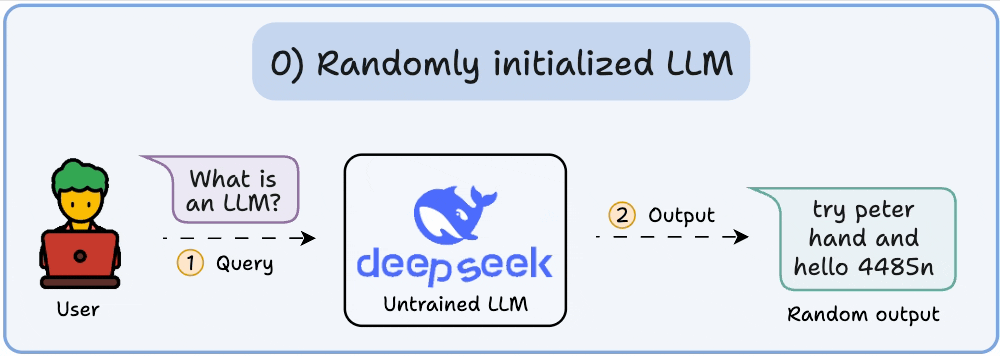

--

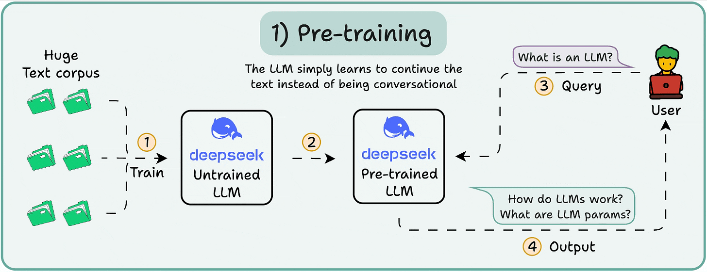

--

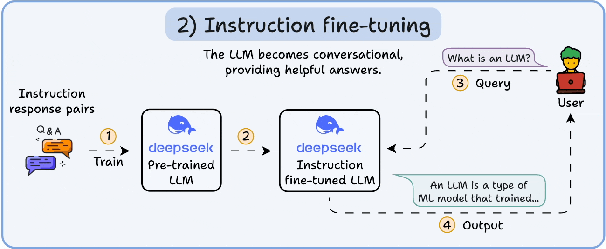

--

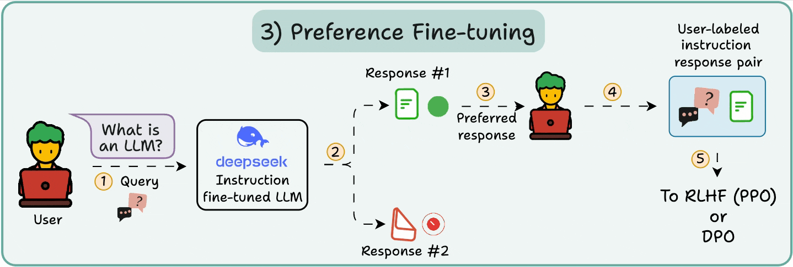

--

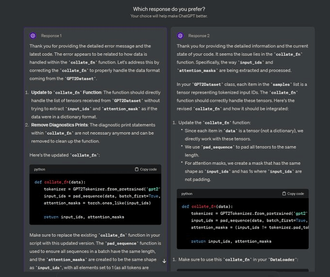

--

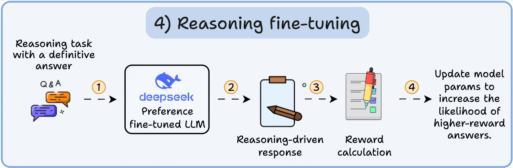

---

#### Let's scale a little (Parameters)

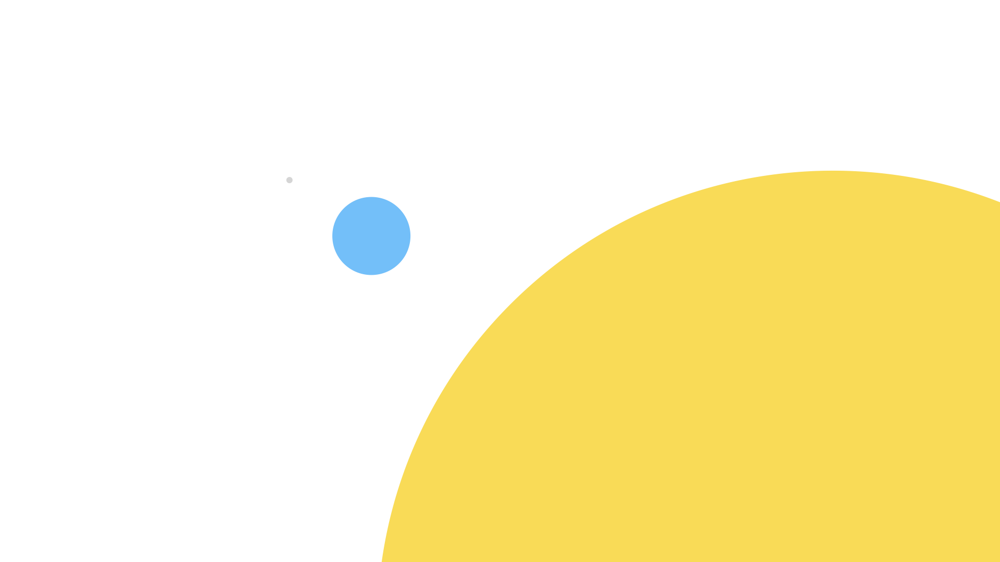

--

#### Since GPT4 it's not published anymore, just estimated by AI community

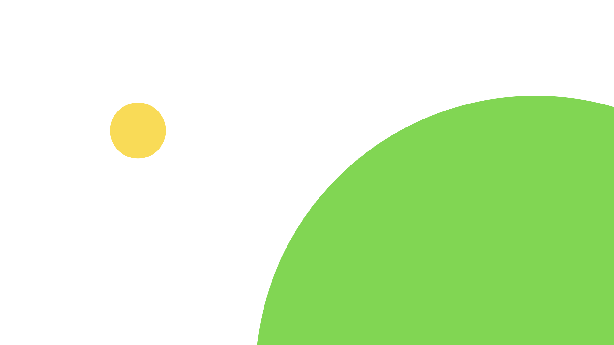

--

#### OpenAI learned from DeepSeek V2 and used Mixture of Experts (MoE)

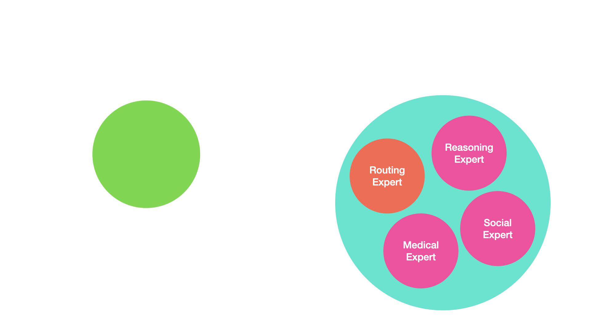

--

<span style="color: lightgreen;">What about computational resources? How many graphic cards do we need round about when we deploying such a model assuming we have high end graphics card with 80GB?</span>

---

#### ChatGPT (product)

<div class="two-col">
  <div>
    <ul>
      <li>End-user product (web/app UI)</li>
      <li>Includes tools, memory, and safety guardrails</li>
      <li>Great for interactive use and quick experiments</li>
    </ul>
  </div>
  <div>
    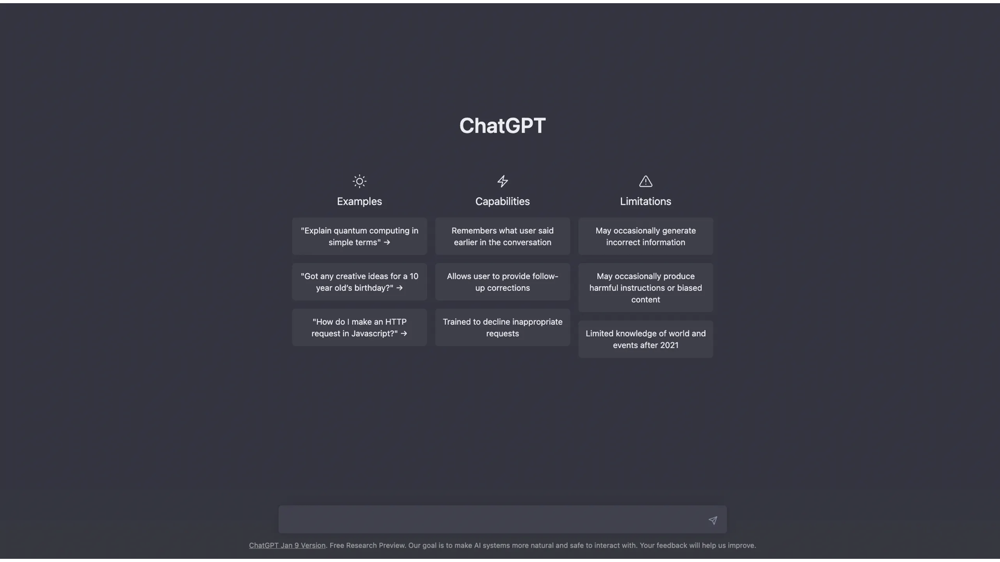
  </div>
</div>

--

#### GPT model via API (request/response)

<div class="two-col">
  <div>
    <ul>
      <li>Underlying LLM accessed via API (you build the app)</li>
      <li>Same model families; capabilities depend on model + tools + prompt</li>
      <li>Request/response JSON; you manage conversation state</li>
    </ul>
  </div>
  <div>
    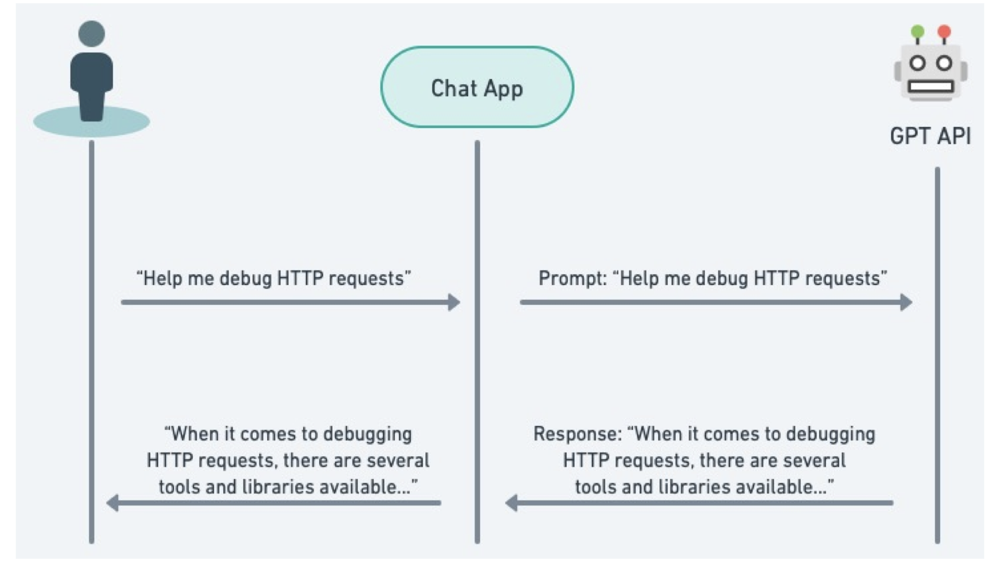
  </div>
</div>

--

#### Prompt roles (system + user + assistant)

```txt
system: You are a concise BI tutor.
user: Explain "data warehouse" in 1 sentence.
assistant: A data warehouse is a centralized, structured store optimized for analytics.
```

--

#### API call example (Python)

```
from openai import OpenAI
client = OpenAI()

messages = [
  {"role": "system", "content": "You are a concise BI tutor."},
  {"role": "user", "content": "Explain data warehouse in 1 sentence."},
]

response = client.chat.completions.create(
  model="gpt-4o-mini",
  messages=messages,
)

print(response.choices[0].message.content)
```

--

#### For most apis, context is re-sent every request (stateless API)

```
messages = [
  {"role": "system", "content": "You are a concise BI tutor."},
  {"role": "user", "content": "What is OLAP?"},
  {"role": "assistant", "content": "OLAP is ..."},
  {"role": "user", "content": "Now compare it to OLTP."},
]
```

- The server doesn't remember between calls; you include the full history
- ChatGPT handles this automatically;

---

Context vs. world knowledge

- Two sources in every answer:
  - Context = what you send now
  - World knowledge = what the model learned during training

--

#### 1) Context (grounded info)

- System + user messages
- Retrieved docs, tables, files
- Limited by the context window

Example (context snippet):

```
Table: revenue_by_country_q4
Germany = 3.2M EUR
France  = 2.4M EUR
```

--

#### 2) World knowledge (model memory)

- General facts and patterns
- Not specific to your company
- Can be stale or incomplete

Example (world knowledge):

```
Berlin is the capital of Germany.
GDP is a common macroeconomic indicator.
```

--

#### 3) What happens if context is missing?

Example question:

```
What was Germany Q4 revenue?
```

Possible response without context:

```
I'm not sure; I don't have your KPI data.
```

Bad response (hallucination):

```
Germany Q4 revenue was 4.8M EUR.
```

--

Takeaway:

- If the answer is not in the context, the model might guess.

---

Limitations of LLMs: Hallucinations

- Fabricates facts, numbers, or citations
- Sounds confident but is not grounded

Example (fabricated citation):

```
Q: Which paper proves that "X dashboard cuts churn by 40%"?
A: "Smith et al., 2023, Journal of BI Systems"
```

This paper doesn't even exist.

--

Limitations of LLMs: Stale knowledge

- Training data has a cutoff date
- New events, policies, or releases can be missing

Example (outdated fact):

```
Q: What are the latest 2025 KPIs for our company?
A: I don't have access to your 2025 data unless you provide it.
```

--

Limitations of LLMs: Context limits

- Only sees what fits into the context window
- Long documents get truncated or summarized

Example (missing earlier detail):

```
Q: In the 60-page report, what was the Q1 Germany margin?
A: I don't see that number in the provided context.
```

---

#### <span style="color: orange;">But how can the context be provided?</span>

--

#### ChatGPT (manual context)

- User uploads a document or pastes text
- Prompt asks for a task (summary, translation, Q&A)

Example:

```
User: Uploads "Q4_report.pdf" and asks:
      "Summarize the top 3 risks in one paragraph."
```

--

#### Business apps (automatic context)

- The app already has the data
- The user never sees the raw documents
- The system injects relevant context behind the scenes

Example: Help-center FAQ (retrieved docs)

```
User: "Can I return a laptop after 45 days?"
System context: KB article "Returns policy"
                Laptops: 30-day return window
                Accessories: 60-day return window
Assistant: "For laptops the return window is 30 days, so 45 days is outside the policy."
```

---

#### <span style="color: orange;">But how can we inject the relevant system context based on text documents?</span>

---

#### Vector databases: What is a Vector Embedding

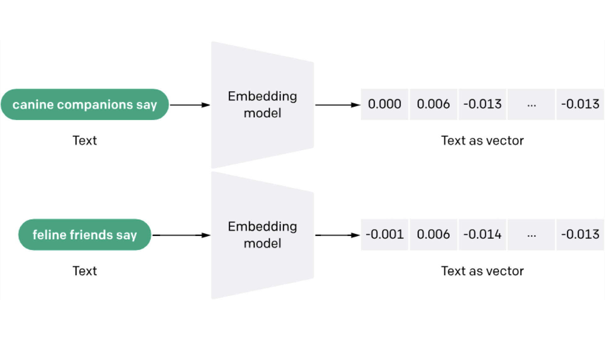

--

#### Vector Embedings: More than just a representation of words

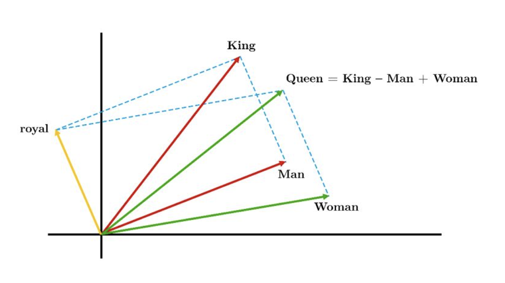

--

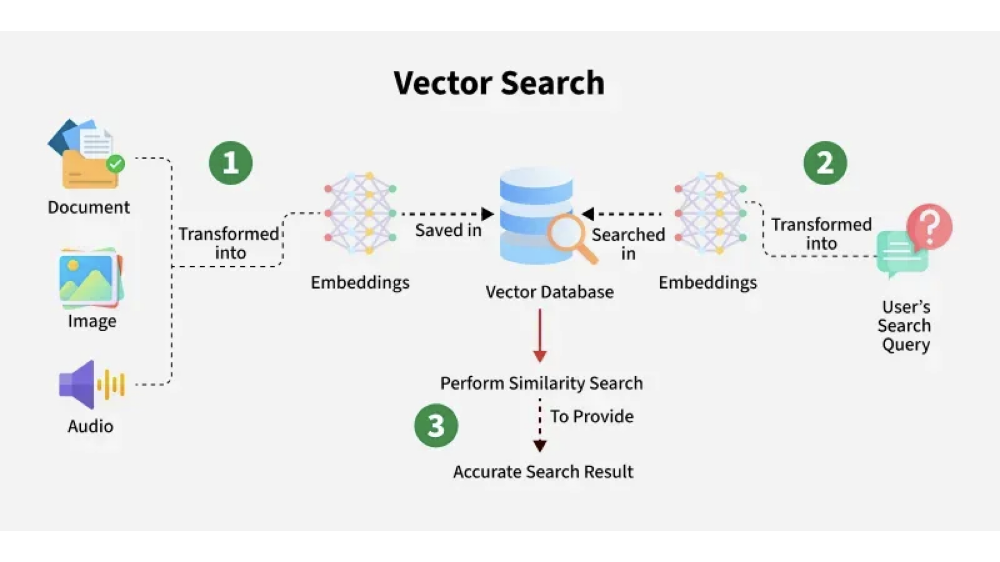

--

Grounding with Retrieval Augmentend Generation (RAG)

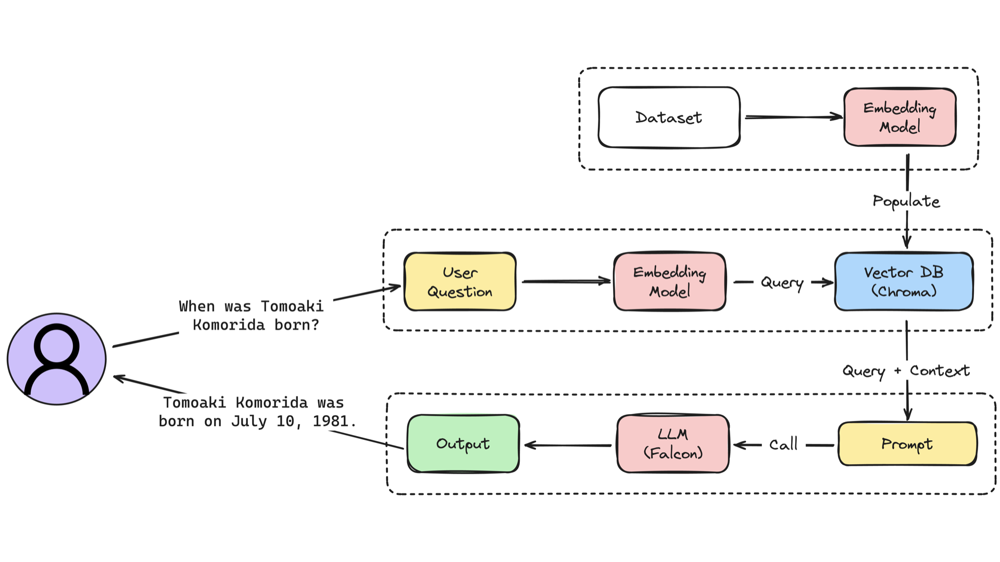

---

Agents: from models to actions

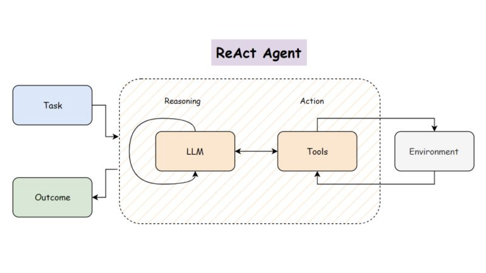

--

Agent loop (explained in words)

- <span style="color: orange;">Task/Goal</span> → user request
- <span style="color: orange;">LLM</span> → plan/decide what to do
- <span style="color: orange;">Tool call</span> → external action (search, DB, API)
- <span style="color: orange;">Environment</span> → returns observation
- <span style="color: orange;">Outcome</span> → final answer or next action

--

Key parts of an agent

- <span style="color: orange;">Reasoning step</span>: decide next action
- <span style="color: orange;">Tools</span>: functions with inputs/outputs
- <span style="color: orange;">Environment</span>: where actions happen
- <span style="color: orange;">Feedback</span>: observations update the context

---

Simple Python example (toy agent + tool)

```python
def search_tool(query: str) -> str:
    # pretend to call a search API
    return f"Result for '{query}': ... "

def run_agent(task: str) -> str:
    if "search" in task.lower():
        observation = search_tool(task)
        return f"Final answer using tool output: {observation}"
    return "Final answer without tools."

print(run_agent("Search: What is RAG?"))
```

---

AI Agent + Tools

- Buzzwords: tool calls, function interfaces, safety bounds
- Prepare: example tool list (search, calendar, DB)

---

MCP (Model Context Protocol)

- Buzzwords: standardization, tool discovery, connectors
- Prepare: simple client ↔ MCP server ↔ tool diagram
- USB C picture: from many standards to just one (https://www.faz.net/pro/digitalwirtschaft/kuenstliche-intelligenz/model-context-protocol-was-hinter-dem-neuen-standard-steckt-accg-200509814.html?premium=0xf96cbe2e76e7b601506905a135ed225333d725af0ec8d8cfde2e0ebb68da798c&share=androidfaznativeshare&gift)

---

ReAct agent

- Buzzwords: reasoning + acting, trace, iterate
- Prepare: 3-step thought/action/observation sequence

---

Deep Agent

- Buzzwords: subagents, delegation, parallel tasks
- Prepare: supervisor + workers diagram

---

ACP (Agent Communication Protocol)

- Buzzwords: inter-agent messaging, coordination
- Prepare: multi-agent message flow sketch

---
