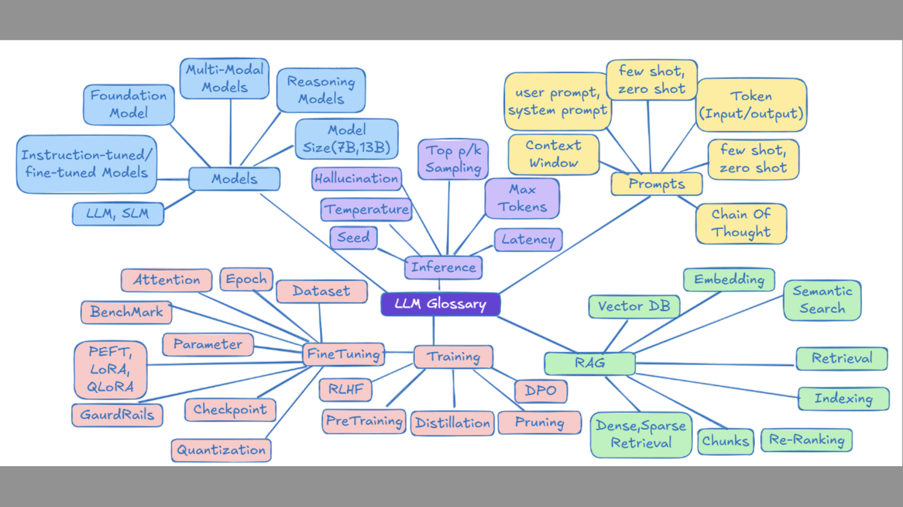

Where are we located during the lecture?


---

One more class of machine learning models:


--

#### What is generative AI?

- synthetic data / content creation
- probabilistic modeling
  - given data, generative models learn to imitate data / to sample data

--

#### Generative Adversarial Networks (GANs)


--

### Encoder - Decoder Models


<span style="color: lightgreen;">How does the training data look like?</span>

---

#### <span style="color: orange;">Transformer models / Large Language Models (LLMs)</span>

--

#### <span style="color: orange;">What is different from latest LLM (> 2017) compared to preview architectures?</span>


--

<span style="color: orange;">What is different from latest LLM (> 2017) compared to preview architectures?</span>

- transformer architecture allows for efficient large scale computation
- attention mechanism allows the model to focus on relevant part whlie disregarding the reest
- attention mechanism captures dependencies between words and therefore improve context understanding

--

#### Inference / Prediction


--

#### <span style="color: orange;">Wait what is the LLM predicting exactly, is it a token?</span>

--


--

#### A detour into the training phase

--


--


--


--


--


--


---

#### Let's scale a little (Parameters)


--

#### Since GPT4 it's not published anymore, just estimated by AI community


--

#### OpenAI learned from DeepSeek V2 and used Mixture of Experts (MoE)


--

<span style="color: lightgreen;">What about computational resources? How many graphic cards do we need round about when we deploying such a model assuming we have high end graphics card with 80GB?</span>

---

#### ChatGPT (product)

<div class="two-col">
  <div>
    <ul>
      <li>End-user product (web/app UI)</li>
      <li>Includes tools, memory, and safety guardrails</li>
      <li>Great for interactive use and quick experiments</li>
    </ul>
  </div>
  <div>
    
  </div>
</div>

--

#### GPT model via API (request/response)

<div class="two-col">
  <div>
    <ul>
      <li>Underlying LLM accessed via API (you build the app)</li>
      <li>Same model families; capabilities depend on model + tools + prompt</li>
      <li>Request/response JSON; you manage conversation state</li>
    </ul>
  </div>
  <div>
    
  </div>
</div>

--

#### Prompt roles (system + user + assistant)

```txt
system: You are a concise BI tutor.
user: Explain "data warehouse" in 1 sentence.
assistant: A data warehouse is a centralized, structured store optimized for analytics.
```

--

#### API call example (Python)

```
from openai import OpenAI
client = OpenAI()

messages = [
  {"role": "system", "content": "You are a concise BI tutor."},
  {"role": "user", "content": "Explain data warehouse in 1 sentence."},
]

response = client.chat.completions.create(
  model="gpt-4o-mini",
  messages=messages,
)

print(response.choices[0].message.content)
```

--

#### For most apis, context is re-sent every request (stateless API)

```
messages = [
  {"role": "system", "content": "You are a concise BI tutor."},
  {"role": "user", "content": "What is OLAP?"},
  {"role": "assistant", "content": "OLAP is ..."},
  {"role": "user", "content": "Now compare it to OLTP."},
]
```

- The server doesn't remember between calls; you include the full history
- ChatGPT handles this automatically;

---

Context vs. world knowledge

- Two sources in every answer:
  - Context = what you send now
  - World knowledge = what the model learned during training

--

#### 1) Context (grounded info)

- System + user messages
- Retrieved docs, tables, files
- Limited by the context window

Example (context snippet):

```
Table: revenue_by_country_q4
Germany = 3.2M EUR
France  = 2.4M EUR
```

--

#### 2) World knowledge (model memory)

- General facts and patterns
- Not specific to your company
- Can be stale or incomplete

Example (world knowledge):

```
Berlin is the capital of Germany.
GDP is a common macroeconomic indicator.
```

--

#### 3) What happens if context is missing?

Example question:

```
What was Germany Q4 revenue?
```

Possible response without context:

```
I'm not sure; I don't have your KPI data.
```

Bad response (hallucination):

```
Germany Q4 revenue was 4.8M EUR.
```

--

Takeaway:

- If the answer is not in the context, the model might guess.

---

Limitations of LLMs: Hallucinations

- Fabricates facts, numbers, or citations
- Sounds confident but is not grounded

Example (fabricated citation):

```
Q: Which paper proves that "X dashboard cuts churn by 40%"?
A: "Smith et al., 2023, Journal of BI Systems"
```

This paper doesn't even exist.

--

Limitations of LLMs: Stale knowledge

- Training data has a cutoff date
- New events, policies, or releases can be missing

Example (outdated fact):

```
Q: What are the latest 2025 KPIs for our company?
A: I don't have access to your 2025 data unless you provide it.
```

--

Limitations of LLMs: Context limits

- Only sees what fits into the context window
- Long documents get truncated or summarized

Example (missing earlier detail):

```
Q: In the 60-page report, what was the Q1 Germany margin?
A: I don't see that number in the provided context.
```

---

#### <span style="color: orange;">But how can the context be provided?</span>

--

#### ChatGPT (manual context)

- User uploads a document or pastes text
- Prompt asks for a task (summary, translation, Q&A)

Example:

```
User: Uploads "Q4_report.pdf" and asks:
      "Summarize the top 3 risks in one paragraph."
```

--

#### Business apps (automatic context)

- The app already has the data
- The user never sees the raw documents
- The system injects relevant context behind the scenes

Example: Help-center FAQ (retrieved docs)

```
User: "Can I return a laptop after 45 days?"
System context: KB article "Returns policy"
                Laptops: 30-day return window
                Accessories: 60-day return window
Assistant: "For laptops the return window is 30 days, so 45 days is outside the policy."
```

---

#### <span style="color: orange;">But how can we inject the relevant system context based on text documents?</span>

---

#### Vector databases: What is a Vector Embedding


--

#### Vector Embedings: More than just a representation of words


--


--

Grounding with Retrieval Augmentend Generation (RAG)


---

Agents: from models to actions


--

Agent loop (explained in words)

- <span style="color: orange;">Task/Goal</span> → user request
- <span style="color: orange;">LLM</span> → plan/decide what to do
- <span style="color: orange;">Tool call</span> → external action (search, DB, API)
- <span style="color: orange;">Environment</span> → returns observation
- <span style="color: orange;">Outcome</span> → final answer or next action

--

Key parts of an agent

- <span style="color: orange;">Reasoning step</span>: decide next action
- <span style="color: orange;">Tools</span>: functions with inputs/outputs
- <span style="color: orange;">Environment</span>: where actions happen
- <span style="color: orange;">Feedback</span>: observations update the context

---

Example prompt → tool call → answer

```
System: You are a BI assistant. Use tools when needed.
User: What is the EUR/USD rate today?
Assistant (tool call): search(query="EUR/USD rate today")
Tool: 1 EUR = 1.09 USD
Assistant: Today it's about 1.09 USD per EUR.
```

---

Deep Agents



--

- planning: break goal into steps
- using sub-agents: delegate parts of the task
- coordination: merge results + resolve conflicts
- memory/trace: keep intermediate state

---

MCP (Model Context Protocol)

- Purpose: standardize how apps connect to tools and data
- Role: the LLM stays the same, context/tools are plugged in
- Result: one protocol instead of many custom integrations
- Source: https://modelcontextprotocol.io/docs/learn/architecture

---

MCP architecture (high level)

<svg width="720" height="360" viewBox="0 0 720 360" aria-label="MCP architecture diagram">
  <defs>
    <marker id="arrow" markerWidth="10" markerHeight="7" refX="10" refY="3.5" orient="auto">
      <polygon points="0 0, 10 3.5, 0 7" fill="#bbb" />
    </marker>
  </defs>

  <rect x="40" y="20" width="140" height="60" rx="10" fill="#3b2f5f" stroke="#888" />
  <text x="110" y="50" text-anchor="middle" fill="#fff" font-size="13">Client</text>
  <text x="110" y="68" text-anchor="middle" fill="#bbb" font-size="11">User App</text>

  <rect x="260" y="20" width="180" height="60" rx="10" fill="#1f2a44" stroke="#888" />
  <text x="350" y="50" text-anchor="middle" fill="#fff" font-size="14">MCP Host</text>
  <text x="350" y="68" text-anchor="middle" fill="#bbb" font-size="12">AI App</text>

  <rect x="120" y="110" width="160" height="60" rx="10" fill="#2a3b5f" stroke="#888" />
  <text x="200" y="140" text-anchor="middle" fill="#fff" font-size="13">MCP Client A</text>

  <rect x="420" y="110" width="160" height="60" rx="10" fill="#2a3b5f" stroke="#888" />
  <text x="500" y="140" text-anchor="middle" fill="#fff" font-size="13">MCP Client B</text>

  <rect x="120" y="200" width="160" height="60" rx="10" fill="#1f2a44" stroke="#888" />
  <text x="200" y="230" text-anchor="middle" fill="#fff" font-size="13">MCP Server A</text>
  <text x="200" y="248" text-anchor="middle" fill="#bbb" font-size="11">tools/resources</text>

  <rect x="420" y="200" width="160" height="60" rx="10" fill="#1f2a44" stroke="#888" />
  <text x="500" y="230" text-anchor="middle" fill="#fff" font-size="13">MCP Server B</text>
  <text x="500" y="248" text-anchor="middle" fill="#bbb" font-size="11">tools/resources</text>

  <rect x="120" y="290" width="160" height="50" rx="10" fill="#2a3b5f" stroke="#888" />
  <text x="200" y="320" text-anchor="middle" fill="#fff" font-size="12">Tools / APIs</text>

  <rect x="420" y="290" width="160" height="50" rx="10" fill="#2a3b5f" stroke="#888" />
  <text x="500" y="320" text-anchor="middle" fill="#fff" font-size="12">Tools / APIs</text>

  <line x1="180" y1="50" x2="260" y2="50" stroke="#bbb" stroke-width="2" marker-end="url(#arrow)" />

  <line x1="350" y1="80" x2="200" y2="110" stroke="#bbb" stroke-width="2" marker-end="url(#arrow)" />
  <line x1="350" y1="80" x2="500" y2="110" stroke="#bbb" stroke-width="2" marker-end="url(#arrow)" />

  <line x1="200" y1="170" x2="200" y2="200" stroke="#bbb" stroke-width="2" marker-end="url(#arrow)" />
  <line x1="500" y1="170" x2="500" y2="200" stroke="#bbb" stroke-width="2" marker-end="url(#arrow)" />

  <line x1="200" y1="260" x2="200" y2="290" stroke="#bbb" stroke-width="2" marker-end="url(#arrow)" />
  <line x1="500" y1="260" x2="500" y2="290" stroke="#bbb" stroke-width="2" marker-end="url(#arrow)" />
</svg>

--

MCP primitives (what can be shared)

- <span style="color: orange;">Tools</span>: callable functions (search, DB, calendar)
- <span style="color: orange;">Resources</span>: data blobs (files, tables, logs)
- <span style="color: orange;">Prompts</span>: reusable templates (system + few-shot)
- Client-side extras: sampling, elicitation, logging

--

MCP request flow (very short)

1. initialize (capabilities)
2. tools/list (discover)
3. tools/call (execute)
4. return result to the LLM

```
client -> AI app: user request
AI app -> server: tools/list
server -> AI app: tool metadata
AI app -> server: tools/call {name, args}
server -> AI app: tool result
AI app -> client: final answer
```

--

MCP request flow (concrete example)

```
client -> AI app: "What's the weather in Berlin?"
AI app -> server: tools/list
server -> AI app: tools = ["weather_current"]

AI app -> server: tools/call
  name="weather_current"
  arguments={"location": "Berlin", "units": "metric"}

server -> AI app: result="12°C, cloudy"
AI app -> client: "In Berlin it's about 12°C and cloudy."
```

---

ACP (Agent Communication Protocol)

- Purpose: standard messages between agents
- Focus: coordination, delegation, and handoffs
- Useful for multi-agent systems and workflows

---

ACP: multi-agent message flow

<svg width="720" height="240" viewBox="0 0 720 240" aria-label="ACP multi-agent diagram">
  <rect x="280" y="20" width="160" height="60" rx="10" fill="#1f2a44" stroke="#888" />
  <text x="360" y="55" text-anchor="middle" fill="#fff" font-size="14">Supervisor</text>

  <rect x="60" y="140" width="160" height="60" rx="10" fill="#2a3b5f" stroke="#888" />
  <text x="140" y="175" text-anchor="middle" fill="#fff" font-size="13">Worker A</text>

  <rect x="280" y="140" width="160" height="60" rx="10" fill="#2a3b5f" stroke="#888" />
  <text x="360" y="175" text-anchor="middle" fill="#fff" font-size="13">Worker B</text>

  <rect x="500" y="140" width="160" height="60" rx="10" fill="#2a3b5f" stroke="#888" />
  <text x="580" y="175" text-anchor="middle" fill="#fff" font-size="13">Worker C</text>

  <line x1="360" y1="80" x2="140" y2="140" stroke="#bbb" stroke-width="2" />
  <line x1="360" y1="80" x2="360" y2="140" stroke="#bbb" stroke-width="2" />
  <line x1="360" y1="80" x2="580" y2="140" stroke="#bbb" stroke-width="2" />
</svg>

---

ACP message types (examples)

- Task assignment: who does what?
- Status update: progress or blockers
- Result handoff: summarize findings
- Conflict resolution: merge or choose

---
