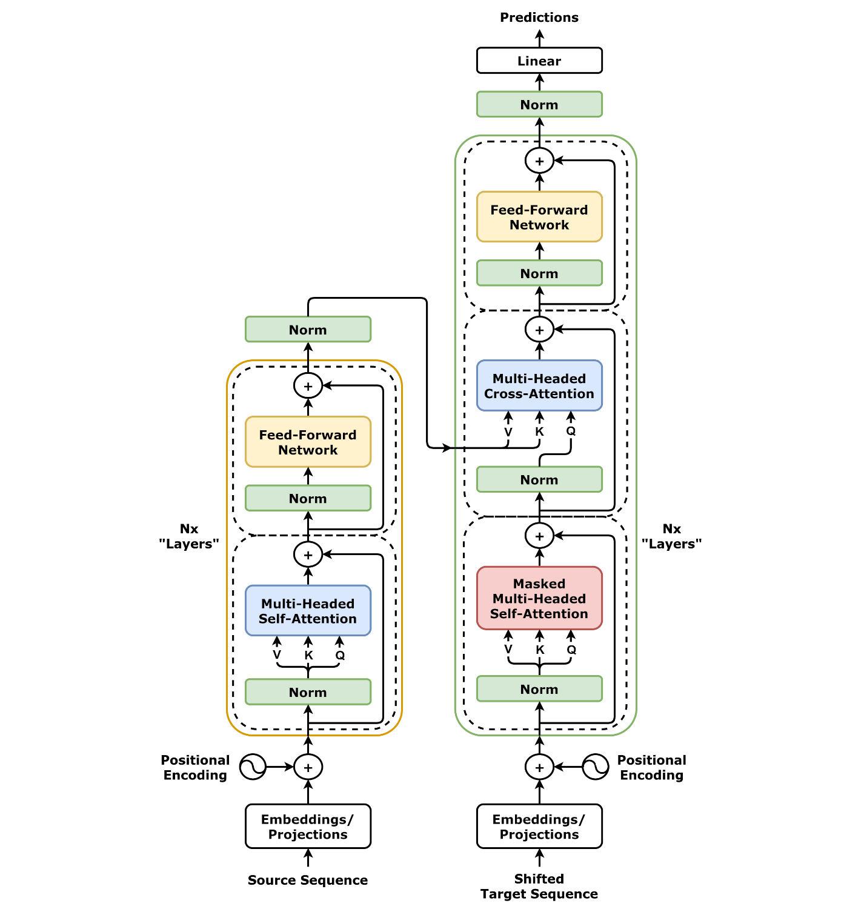
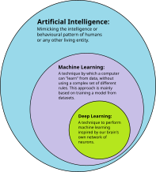
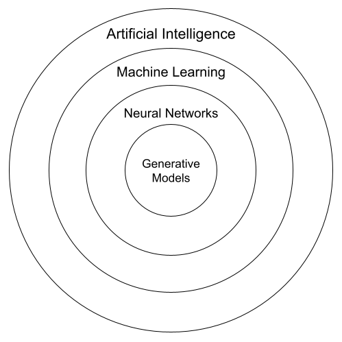
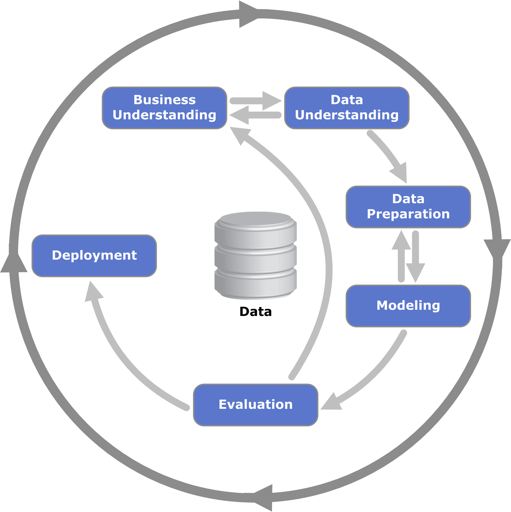
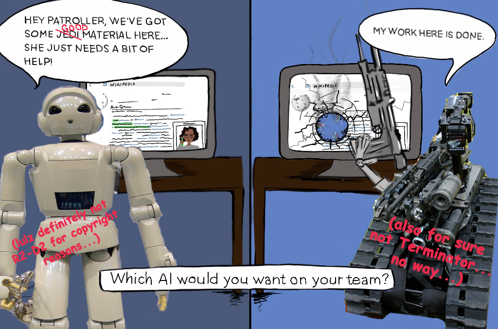

### Agenda

- Motivation & a short history
- Core concepts (ML, DL, GenAI)
- How learning works: data → model → training → evaluation
- Pitfalls + responsible use

Note:
- This lecture is intentionally visual and conceptual (not a math-heavy ML course).
- Deeper dives later: neural nets, LLMs, embeddings, agents.

---

### Why AI matters (especially for BI)

  

    
  

  

    
From dashboards to decisions

    <ul class="muted" style="margin-top: 0.5rem">
      <li>Prediction: forecast churn & demand</li>
      <li>Detection: anomalies & fraud</li>
      <li>Automation: reports & recurring analysis</li>
      <li>Interfaces: natural-language BI (“chat with data”)</li>
    </ul>
  

Note:
Source (image): https://commons.wikimedia.org/wiki/File:Artificial-Intelligence.jpg

---

### A very short history (overview)

Note:
Source: https://commons.wikimedia.org/wiki/File:AI-History-Timeline-300dpi.jpg

---

### 1950: Alan Turing — “Can machines think?”

Idea: evaluate intelligence via conversation (Turing Test).

Note:
Source: https://commons.wikimedia.org/wiki/File:Alan_Turing_(1912-1954)_in_1936_at_Princeton_University.jpg

---

### 1958: Perceptron — early neural networks

Note:
Source: https://commons.wikimedia.org/wiki/File:Rosenblattperceptron.png

---

### 1997: Deep Blue beats world chess champion

Note:
Source: https://commons.wikimedia.org/wiki/File:Deep_Blue_versus_Kasparov,_1997,_Game_6.gif

---

### 2012: AlexNet (ImageNet) — deep learning “comes back”

Note:
Source: https://commons.wikimedia.org/wiki/File:AlexNet_block_diagram.svg

---

### 2016: AlphaGo — reinforcement learning at scale

Note:
Source: https://commons.wikimedia.org/wiki/File:Lee-sedol-alphago-divine-move.jpg

---

### 2017+: Transformers — foundation for modern LLMs

Note:
Source: https://commons.wikimedia.org/wiki/File:Transformer,_full_architecture.png

---

### How do we build AI systems?

  

    
Symbolic AI (rules)

    <ul class="muted" style="margin-top: 0.6rem">
      <li>hand-crafted rules & logic</li>
      <li>search, planning, constraints</li>
      <li>works great if rules are explicit</li>
    </ul>
  

  

    
Machine learning (learn from data)

    <ul class="muted" style="margin-top: 0.6rem">
      <li>learn patterns from examples</li>
      <li>needs data, evaluation, iteration</li>
      <li>dominates many real-world AI systems</li>
    </ul>
  

Note:
- Contrast: Deep Blue ≈ search; AlphaGo ≈ learning.

---

### Deep learning = neural networks

Note:
- “Deep” = multiple hidden layers → powerful representations (vision, language, speech).
Source: https://commons.wikimedia.org/wiki/File:Artificial_neural_network.svg

---

### AI ⊃ Machine Learning ⊃ Deep learning

Note:
- Deep learning is (mostly) neural networks trained on lots of data and compute.
Source: https://commons.wikimedia.org/wiki/File:AI-ML-DL.svg

---

### Where does Generative AI fit?

Note:
- Generative AI creates new content (text, images, audio, code) — often using transformers.
Source: https://commons.wikimedia.org/wiki/File:Artificial_Intelligence_relation_to_Generative_Models_subset,_Venn_diagram.png

---

### The “learning” problem (one picture)

  

    
Inputs

    
data points

    

      \(x \rightarrow \hat{y}\)
    

    

      Examples: customer features → churn risk, images → class, text → answer
    

  

  

    
Model

    

      \(\hat{y} = f_\theta(x)\)
    

    

      \(\theta\) = parameters learned from data
    

  

  

    
Learning / training

    

      \(\min_\theta \mathcal{L}(\hat{y}, y)\)
    

    

      minimize a loss → better predictions / behavior
    

  

Note:
- Key idea: choose a model family and train its parameters to minimize a loss.
- This pattern covers ML, deep learning, and parts of generative AI.

---

### Training vs. inference

  

    
Training

    

      Many examples \((x, y)\)  
      + optimizer  
      → update parameters \(\theta\)
    

    

      expensive, done “offline” (hours/days/weeks)
    

  

  

    
Inference

    

      New input \(x\)  
      + fixed \(\theta\)  
      → output \(\hat{y}\)
    

    

      cheap(er), done “online” (milliseconds/seconds)
    

  

Note:
- Practical takeaway: production constraints mostly hit inference (latency, cost, reliability).

---

### Data splitting: training vs. validation vs. test

Note:
Source: https://commons.wikimedia.org/wiki/File:ML_dataset_training_validation_test_sets.png

---

### Supervised learning

You have labels.

--

  

    <h4 style="color: orange; margin-bottom: 0.5rem">Classification</h4>
    
  

  

    <h4 style="color: orange; margin-bottom: 0.5rem">Regression</h4>
    
  

Note:
Confusion matrix source: https://commons.wikimedia.org/wiki/File:ConfusionMatrixRedBlue.png
Linear regression source: https://commons.wikimedia.org/wiki/File:Linear_regression.svg

---

### Unsupervised learning

No labels → discover structure (clusters, compression, anomalies).

Note:
Source: https://commons.wikimedia.org/wiki/File:K-means_convergence.gif

---

### Reinforcement learning (RL)

Note:
Source: https://commons.wikimedia.org/wiki/File:Reinforcement_learning_diagram.svg

---

### Model “zoo” (very rough)

  

    <h4 style="color: orange; margin-bottom: 0.5rem">Decision trees</h4>
    
  

  

    <h4 style="color: orange; margin-bottom: 0.5rem">Neural networks</h4>
    
  

Note:
Decision tree source: https://commons.wikimedia.org/wiki/File:Simple_decision_tree.svg
Neural network source: https://commons.wikimedia.org/wiki/File:Artificial_neural_network.svg

---

### Training = optimization (gradient descent)

Note:
Source: https://commons.wikimedia.org/wiki/File:Gradient_descent_method.png

---

### Generalization vs. overfitting

Note:
Source: https://commons.wikimedia.org/wiki/File:Overfitting_svg.svg

---

### Bias–variance tradeoff (intuition)

Note:
Source: https://commons.wikimedia.org/wiki/File:Bias_and_variance_contributing_to_total_error.svg

---

### Embeddings: turning “meaning” into vectors

Later: embeddings → vector search → RAG.

Note:
Source: https://commons.wikimedia.org/wiki/File:CBOW_eta_Skipgram.png

---

### From “model” to “project”: the lifecycle is iterative

Note:
Source: https://commons.wikimedia.org/wiki/File:CRISP-DM_Process_Diagram.png

---

### Pitfall: “It works in the notebook” ≠ “It works in the world”

  

    
Common failure modes

    <ul class="muted" style="margin-top: 0.6rem">
      <li>data leakage</li>
      <li>biased / non-representative data</li>
      <li>dataset shift / drift</li>
      <li>wrong metric / wrong goal</li>
      <li>no monitoring</li>
    </ul>
  

  

    
Visualization idea (TODO)

    

      Plot two distributions:
       
      training data vs.
      production data
       
      → decision boundary no longer fits
    

    

      (Add later: simple histogram + shifted histogram, or scatter plot with shifted clusters)
    

  

Note:
This slide is intentionally a placeholder to insert a custom plot later.

---

### Pitfall: automation without judgement

Note:
Source: https://commons.wikimedia.org/wiki/File:AI_cartoon_for_assisting_with_content_moderation_on_Wikipedia.jpg

---

### Wrap-up

  
If you remember 5 things:

  <ul class="muted" style="margin-top: 0.6rem">
    <li>AI is bigger than ML; ML is bigger than deep learning.</li>
    <li>Learning = choose a model + minimize a loss on data.</li>
    <li>Generalization matters → splits, metrics, and overfitting checks.</li>
    <li>Embeddings + transformers power modern GenAI/LLMs.</li>
    <li>In production: data shifts, monitoring, and responsible use are key.</li>
  </ul>

--

Next: Large Language Models & Agent-based Systems
 
(+ embeddings, vector DBs, and RAG)

