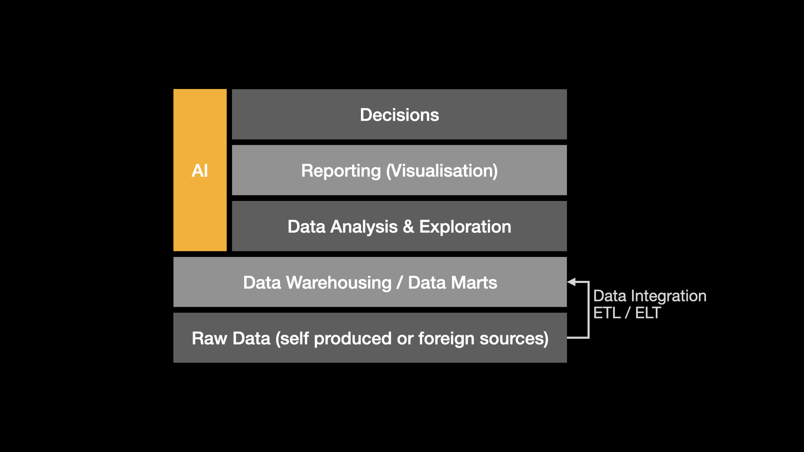
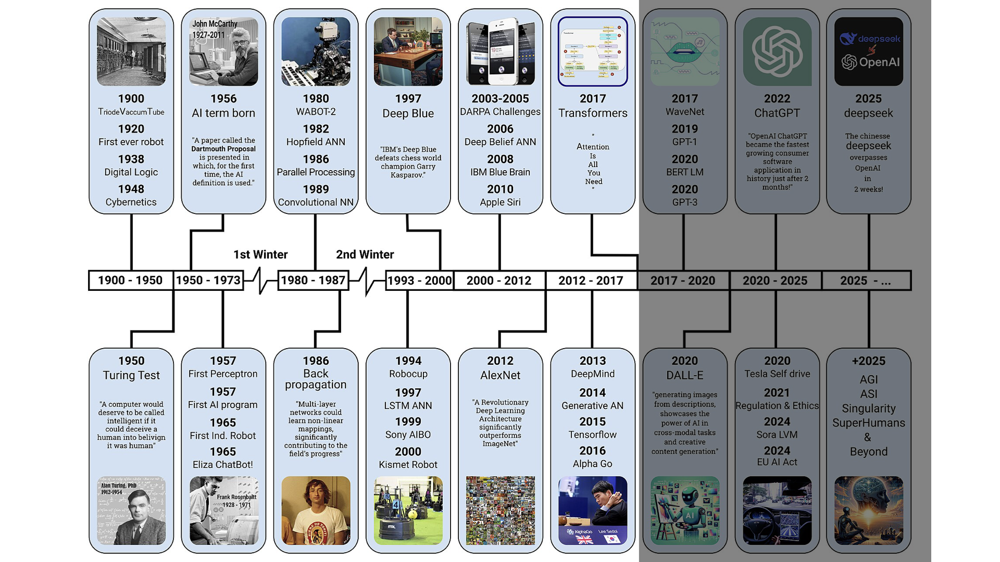
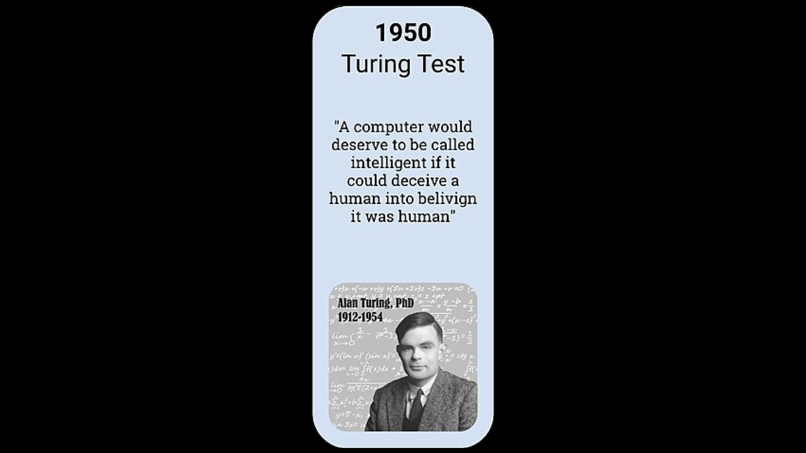
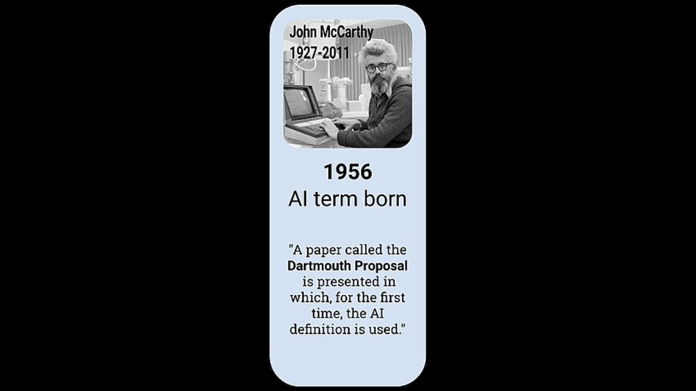
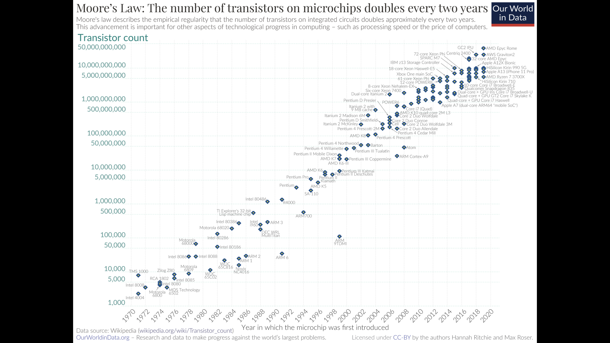
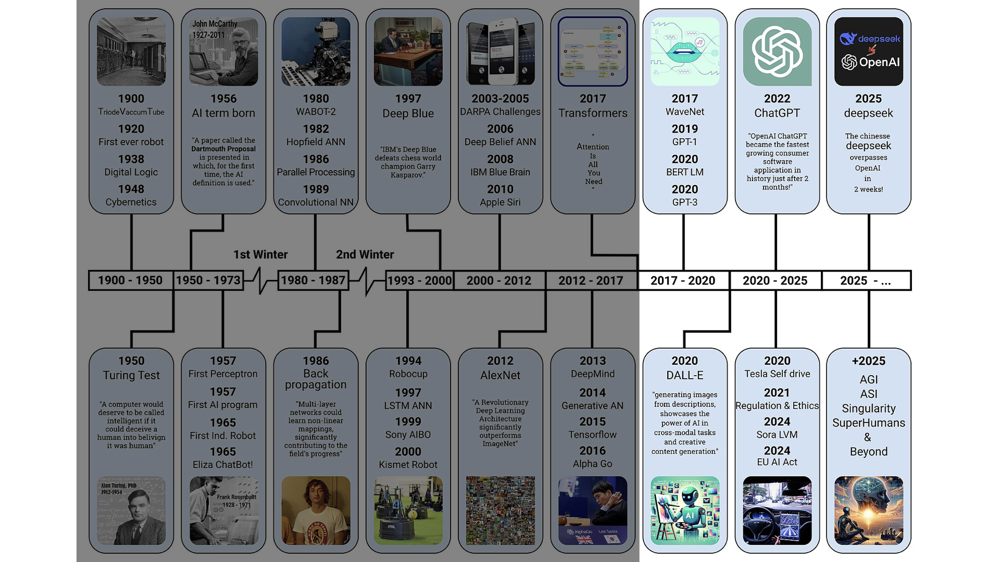
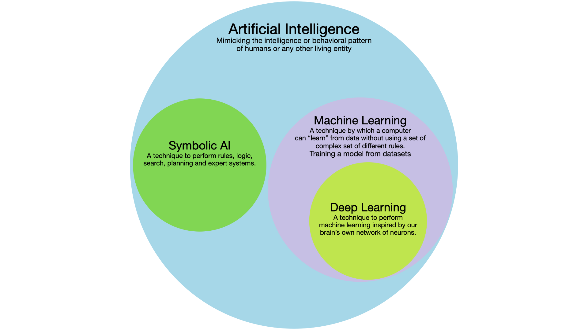
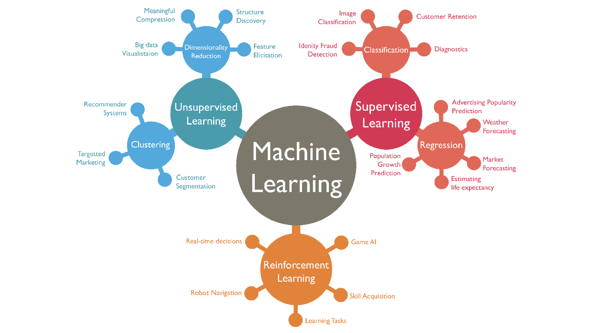

<!-- TODO: 
 - one slide with some examples
 - ai based future is full of ai and human need to find reinvent themself if even possible
 - talking about AGI, superintelligence, ...
 - taking it a little slower and start with the fundamentals.
 - EU AI Act, some regulatories
 - shit in shit out (data)
 - Implications of AI should be a unique little excursion where the students can discuss that
 - what does a world with a superintelligence might look like? -->

Where are we located during the lecture?

---

####  Why does AI matter for BI? 

  

    
  

--

  

    
From data to dashboards to decisions, e.g.

    <ul class="muted" style="margin-top: 0.55rem">
      <li>Prediction: demand, churn, delivery delay</li>
      <li>Detection: fraud, anomalies, quality issues</li>
      <li>Automation: summaries, routing, recurring analysis</li>
      <li>Interfaces: “chat with your data”</li>
    </ul>
  

Note:
- One message: BI becomes more valuable when it drives action, not only reporting.
- ShopNow example: reduce chargebacks, keep inventory healthy, and improve search/recommendations.
Source (image): https://commons.wikimedia.org/wiki/File:Artificial-Intelligence.jpg

---

#### Timeline overview (big picture)

Note:
- Use as map, then zoom into characters + turning points.
- In this lecture we stop around AlphaGo; the modern GenAI part is next lecture.
Source: https://commons.wikimedia.org/wiki/File:AI-History-Timeline-300dpi.jpg

--

#### Can machines think?

--

#### A new field was born

---

####  How would you define Artificial Intelligence?

--

####  Please read the <a href="http://jmc.stanford.edu/articles/dartmouth/dartmouth.pdf">Dartmouth research proposal</a>

--

Artificial Intelligence is the simulation of intelligence, especially learning.

---

####  Research 3 historical breakthroughs in the field of AI and describe them.

---

#### Eras of AI

--

#### Era 1: Pre-Deep Learning (1950s-2010)

  

    <ul>
      <li>Context: Dartmouth 1956, symbolic AI + early ML</li>
      <li>Moore's Law: compute doubles ~every 20 months</li>
      <li>Focus: rules, logic, expert systems, limited data</li>
      <li>AI winters: 1970s and late 1980s funding cuts</li>
    </ul>
  

--

#### Moore's Law

--

#### Era 2: Deep Learning Era (2010-2015)

  

    <ul>
      <li>Context: big data + GPUs + new NN techniques</li>
      <li>Acceleration: compute use doubles ~every 6 months</li>
      <li>Focus: image recognition and early NLP</li>
      <li>Milestones: AlexNet (2012) and deep CNNs</li>
    </ul>
  

  

    <svg width="360" height="220" viewBox="0 0 360 220" aria-label="Compute acceleration">
      <rect x="0" y="0" width="360" height="220" fill="transparent"></rect>
      <line x1="30" y1="185" x2="330" y2="185" stroke="#888" stroke-width="2"></line>
      <line x1="30" y1="185" x2="30" y2="25" stroke="#888" stroke-width="2"></line>
      <path d="M30 175 L80 150 L130 120 L180 85 L230 55 L280 35 L330 25" stroke="#ff6b6b" stroke-width="3" fill="none"></path>
      <text x="34" y="205" fill="#aaa" font-size="12">2010</text>
      <text x="292" y="205" fill="#aaa" font-size="12">2015</text>
      <text x="40" y="40" fill="#aaa" font-size="12">Compute</text>
      <text x="120" y="70" fill="#ff6b6b" font-size="12">~6 months</text>
      <text x="120" y="85" fill="#ff6b6b" font-size="12">doubling</text>
    </svg>
    
Training compute accelerates

  

--

#### Era 3: Large-Scale Era (2015-Present)

  

    <ul>
      <li>Context: models 10-100x larger + massive datasets</li>
      <li>Focus: foundation models, LLMs, advanced vision</li>
      <li>Shift: deployment, alignment, agents (2025-2026)</li>      
    </ul>
  

  

    
    
Modern AI timeline (context)

  

---

#### Classification of AI

---

#### Symbolic AI example: rule-based system

  

    <ul>
      <li>Use case: fraud detection at checkout</li>
      <li>Rules: IF/THEN logic (transparent, brittle)</li>
      <li>
        Example decision logic: 
        ≥3 failed payment attempts → block 
        else if new customer → if order &gt; €500 AND credit card → manual review; else approve 
        else if billing ≠ shipping → if rush shipping OR new address → flag; else approve 
        else if high-risk category AND order &gt; €300 → manual review; else approve
      </li>
    </ul>
  

Note:
- create decision tree on white board
- create the corresponding python code

--

####  Create the rule based decision tree!

---

#### Symbolic AI example: search (parcel delivery)

  

    <ul>
      <li>Use case: parcel delivery shortest route</li>
      <li>State: current city/node in the graph</li>
      <li>Goal: reach destination with minimal cost</li>
      <li>Algorithm: Dijkstra or A* (weighted graph)</li>
    </ul>
  

  

  

---

#### From Data to Decisions: The ML Family

---

#### Mini-talk: learning paradigms

- Form 6 groups: 3 presenters + 3 challenge teams
- Topics: supervised, unsupervised, reinforcement (each has a presenter + challenger)
- ~25-30 min prep, ~5 min talk + ~3 min Q&A per topic
- Must include: data, algorithm, prediction/output
- Provide one concrete example
- Prep on slides, Miro board, or similar

--

#### Your example template

<table style="width: 80%; margin: 0 auto; font-size: 0.85em;">
  <tr>
    <th style="text-align: left; width: 25%;">Step</th>
    <th style="text-align: left;">What you answer</th>
  </tr>
  <tr>
    <td>Problem</td>
    <td>What are we trying to predict/optimize?</td>
  </tr>
  <tr>
    <td>Data</td>
    <td>What inputs do we have? Are there labels?</td>
  </tr>
  <tr>
    <td>Algorithm</td>
    <td>Which method would you use (name 1)?</td>
  </tr>
  <tr>
    <td>Prediction</td>
    <td>What is the model output?</td>
  </tr>
</table>

--

#### Quick reference cards

  

    
Supervised learning

    
Labels available (y)

    
Examples: churn, fraud, demand

    
Algorithms: linear/logistic reg., trees

  

  

    
Unsupervised learning

    
No labels, find structure

    
Examples: segmentation, anomalies

    
Algorithms: k-means, PCA

  

  

    
Reinforcement learning

    
Learn by rewards

    
Examples: pricing, routing

    
Algorithms: Q-learning, policy gradient

  

---

#### Supervised vs. Unsupervised: labels or not?

  

    
Supervised learning

    
Inputs x + labels y

    
Goal: predict y for new x

    
Examples: churn, fraud, demand

  

  

    
Unsupervised learning

    
Inputs x only (no labels)

    
Goal: discover structure or clusters

    
Examples: segmentation, anomalies

  

---

#### Supervised learning: regression first

  

    
Use case: predict delivery time or demand.

    <ul>
      <li>Inputs (x): distance, traffic, basket size.</li>
      <li>Target (y): delivery time (minutes).</li>
      <li>Output: a number.</li>
    </ul>
  

  

    <svg width="380" height="240" viewBox="0 0 380 240" aria-label="Regression line">
      <line x1="40" y1="200" x2="340" y2="200" stroke="#777" stroke-width="2"></line>
      <line x1="40" y1="200" x2="40" y2="30" stroke="#777" stroke-width="2"></line>
      <circle cx="80" cy="160" r="5" fill="#55c2ff"></circle>
      <circle cx="110" cy="150" r="5" fill="#55c2ff"></circle>
      <circle cx="140" cy="145" r="5" fill="#55c2ff"></circle>
      <circle cx="170" cy="130" r="5" fill="#55c2ff"></circle>
      <circle cx="200" cy="120" r="5" fill="#55c2ff"></circle>
      <circle cx="230" cy="110" r="5" fill="#55c2ff"></circle>
      <circle cx="260" cy="95" r="5" fill="#55c2ff"></circle>
      <path d="M70 170 Q170 130 300 80" stroke="#ffa500" stroke-width="3" fill="none"></path>
      <text x="250" y="75" fill="#ffa500" font-size="12">prediction</text>
    </svg>
  

---

#### Training phase: learn the parameters

  

    <ul>
      <li>Model: y = w1 * x + b</li>
      <li>Loss: how wrong are we?</li>
      <li>Update: adjust w, b to reduce loss</li>
      <li>Result: best-fit line (training)</li>
    </ul>
    

      If you want: add a 3-step animation of the line moving.
    

  

  

    <svg width="380" height="220" viewBox="0 0 380 220" aria-label="Parameter updates">
      <line x1="40" y1="180" x2="340" y2="180" stroke="#777" stroke-width="2"></line>
      <line x1="40" y1="180" x2="40" y2="30" stroke="#777" stroke-width="2"></line>
      <path d="M70 160 Q170 140 300 110" stroke="#888" stroke-width="2" fill="none"></path>
      <path d="M70 170 Q170 130 300 80" stroke="#ffa500" stroke-width="3" fill="none"></path>
      <path d="M70 150 Q170 110 300 60" stroke="#55c2ff" stroke-width="2" fill="none"></path>
      <text x="250" y="105" fill="#888" font-size="11">step 1</text>
      <text x="250" y="75" fill="#ffa500" font-size="11">step 2</text>
      <text x="250" y="55" fill="#55c2ff" font-size="11">step 3</text>
    </svg>
  

---

#### Regression example: demand forecasting

  

    <ul>
      <li>Data: past sales, price, promotions, season.</li>
      <li>Model: linear regression.</li>
      <li>Prediction: units sold next week.</li>
      <li>Use: inventory planning.</li>
    </ul>
  

  

    <svg width="380" height="220" viewBox="0 0 380 220" aria-label="Forecast line">
      <line x1="40" y1="180" x2="340" y2="180" stroke="#777" stroke-width="2"></line>
      <line x1="40" y1="180" x2="40" y2="30" stroke="#777" stroke-width="2"></line>
      <path d="M50 160 L90 140 L130 150 L170 120 L210 130 L250 110 L290 100" stroke="#55c2ff" stroke-width="2" fill="none"></path>
      <path d="M290 100 L330 90" stroke="#ffa500" stroke-width="3" fill="none"></path>
      <text x="290" y="85" fill="#ffa500" font-size="12">forecast</text>
    </svg>
  

---

#### Classification example: neural network classifier

  

    
Task: classify orders as fraud or not.

    <ul>
      <li>Inputs: features (device, value, time).</li>
      <li>Output: class probability.</li>
      <li>Model: neural network.</li>
    </ul>
  

  

    

      Insert your neural network classification image here
    

  

---

#### Unsupervised learning: k-means clustering

  

    
Idea: group similar points without labels.

    <ul>
      <li>Input: customer features only.</li>
      <li>Output: cluster assignment.</li>
      <li>Use: segmentation.</li>
    </ul>
  

  

    <svg width="380" height="230" viewBox="0 0 380 230" aria-label="K-means clusters">
      <circle cx="110" cy="150" r="7" fill="#55c2ff"></circle>
      <circle cx="95" cy="130" r="7" fill="#55c2ff"></circle>
      <circle cx="125" cy="135" r="7" fill="#55c2ff"></circle>
      <circle cx="260" cy="110" r="7" fill="#ff6b6b"></circle>
      <circle cx="240" cy="90" r="7" fill="#ff6b6b"></circle>
      <circle cx="280" cy="90" r="7" fill="#ff6b6b"></circle>
      <circle cx="200" cy="190" r="7" fill="#8bdc65"></circle>
      <circle cx="180" cy="170" r="7" fill="#8bdc65"></circle>
      <circle cx="210" cy="165" r="7" fill="#8bdc65"></circle>
      <circle cx="160" cy="70" r="7" fill="#f1c453"></circle>
      <circle cx="180" cy="55" r="7" fill="#f1c453"></circle>
      <circle cx="200" cy="75" r="7" fill="#f1c453"></circle>
    </svg>
  

---

#### k-means: step-by-step

  

    
1) Initialize

    
Pick k starting centroids

  

  

    
2) Assign

    
Attach points to nearest centroid

  

  

    
3) Update

    
Move centroids to the mean

  

  

    
Repeat

    
Until centroids stop moving

  

---

#### k-means example: customer segments

  

    <ul>
      <li>Features: frequency, basket size, returns.</li>
      <li>Clusters: value seekers, loyalists, premium.</li>
      <li>Action: tailor offers per segment.</li>
    </ul>
  

  

    

      Optional: insert a segmentation chart
    

  

---

####  Try to describe your 3 historical breakthroughs in AI from the beginning of the lecture in more technical terms.

