

<!-- ========================================================= -->
<!-- 0) Opening -->
<!-- ========================================================= -->

### Agenda (90 min)

- Where AI comes from: history as a story
- Foundations: paradigms + representation + first algorithms
- Learning types (5 buckets)
- Core task families (what we solve)
- Why models work (or fail)
- Classical ML toolbox
- Deep learning essentials (no transformers today)

Note:
- Format: visual-first slides; speaker notes contain the talk track + sources.
- Thread: we’ll use a recurring BI/Data Science example — an e-commerce company (“ShopNow”).

---

### Why AI matters (especially for BI)

  

    
  

  

    
From dashboards to decisions

    <ul class="muted" style="margin-top: 0.55rem">
      <li>Prediction: demand, churn, delivery delay</li>
      <li>Detection: fraud, anomalies, quality issues</li>
      <li>Automation: summaries, routing, recurring analysis</li>
      <li>Interfaces: “chat with your data”</li>
    </ul>
  

Note:
- One message: BI becomes more valuable when it drives action, not only reporting.
- ShopNow example: reduce chargebacks, keep inventory healthy, and improve search/recommendations.
Source (image): https://commons.wikimedia.org/wiki/File:Artificial-Intelligence.jpg

---

<!-- ========================================================= -->
<!-- 1) Where AI comes from (history as story) -->
<!-- ========================================================= -->

  
1) Where AI comes from

  
History as a story

  
From rules and search → learning from data

Note:
- Goal: give a narrative that explains why ML/deep learning took over many tasks.

---

### Timeline overview (big picture)

  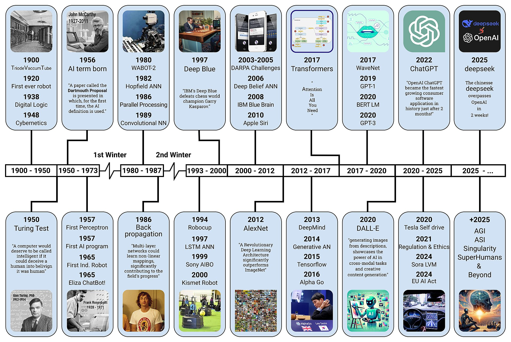
  <!-- Hide the “modern GenAI” part: next lecture -->
  

    

      
Next lecture

      

        Generative AI & Agents
      

    

  

Note:
- Use as map, then zoom into characters + turning points.
- In this lecture we stop around AlphaGo; the modern GenAI part is next lecture.
Source: https://commons.wikimedia.org/wiki/File:AI-History-Timeline-300dpi.jpg

---

### Alan Turing: the question + the test

  “Can machines think?” → test behavior, not philosophy

Note:
- Teaching point: “intelligence” becomes a measurable goal/metric.
- ShopNow analogy: “reduce fraud” becomes a measurable objective (chargebacks, false positives, review rate).
Source: https://commons.wikimedia.org/wiki/File:Alan_Turing_(1912-1954)_in_1936_at_Princeton_University.jpg

---

### Dartmouth / early optimism (term “AI”)

  

    
  

  

    
  

Note:
- Dartmouth workshop (1956): “AI” as a named research agenda.
Sources:
- Dartmouth photo: https://commons.wikimedia.org/wiki/File:Buttermilk_Dartmouth_1959_(51180053141).jpg
- McCarthy photo: https://commons.wikimedia.org/wiki/File:John_McCarthy_(computer_scientist)_Stanford_2006_(272020300).jpg

---

### Symbolic era → reasoning with rules and search

Note:
- Symbolic AI: explicit knowledge (logic, rules) + search/planning.
- ShopNow tie-in: rules still matter (compliance/eligibility), but patterns like fraud are “adaptive”.
Source: https://commons.wikimedia.org/wiki/File:SRI_Shakey_robot,_1969,_Computer_History_Museum.jpg

---

### Expert systems (1970s–1980s)

  

    
Knowledge base

    

      rules + facts
       
      “IF X AND Y THEN Z”
    

  

  

    
Inference engine

    

      chaining + search
       
      apply rules consistently
    

  

  

    
Explanation

    

      “why this result?”
       
      trace rule chain
    

  

Note:
- Successes: MYCIN, XCON. Weakness: brittle + expensive maintenance.
- ShopNow: fraud rules explode as attackers adapt.

---

### AI winters (when hype met reality)

  

    
  

  

    
Two famous slowdowns

    <ul class="muted" style="margin-top: 0.6rem">
      <li>1974–1980: expectations too high, compute too weak</li>
      <li>1987–1993: expert systems under-delivered</li>
    </ul>
  

Note:
- Teach: hype cycles are normal.
Source (image): https://commons.wikimedia.org/wiki/File:Winter_landscape_4.jpg

---

### Data + compute + algorithms: why ML / DL “won”

  

    
Data

    
logs, sensors, storage

    
more examples

  

  

    
Compute

    
GPUs + faster hardware

    
bigger models

  

  

    
Algorithms

    
better training tricks

    
better accuracy

  

  Key shift: instead of writing rules, we learn from examples.

Note:
- ShopNow: clickstream + orders + catalog images = data fuel.

--

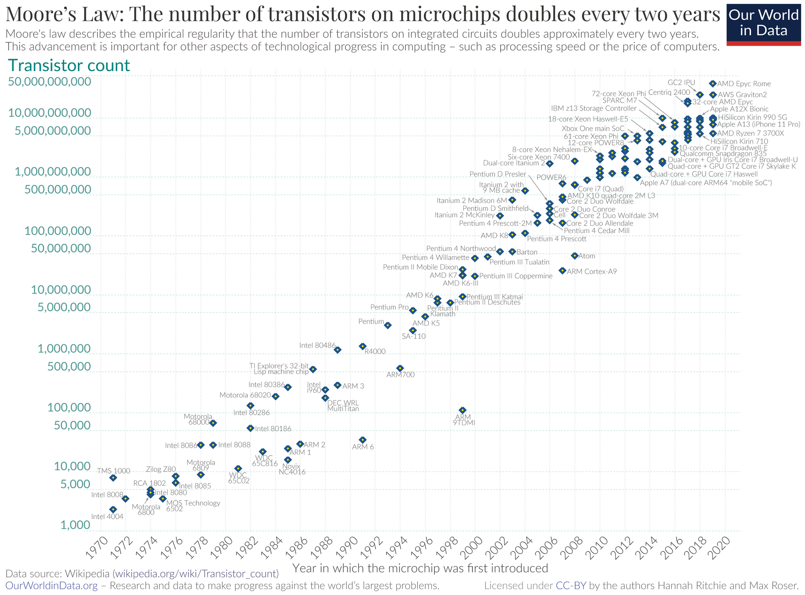

Note:
- Supporting visual: compute grew exponentially.
Source: https://commons.wikimedia.org/wiki/File:Moore%27s_Law_Transistor_Count_1970-2020.png

---

### Milestone (contrast): Deep Blue (search/symbolic flavor)

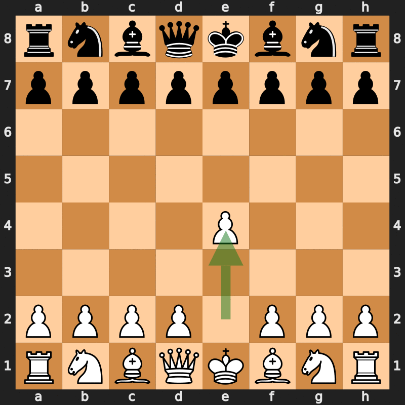

Note:
- Deep Blue: search + engineered evaluation (less “learning from data”).
Source: https://commons.wikimedia.org/wiki/File:Deep_Blue_versus_Kasparov,_1997,_Game_6.gif

---

### Milestone (contrast): AlexNet (deep learning comeback)

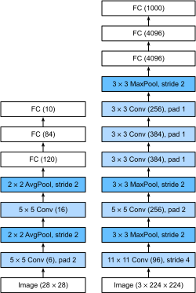

Note:
- AlexNet (2012) + ImageNet + GPUs = deep learning works at scale.
Source: https://commons.wikimedia.org/wiki/File:AlexNet_block_diagram.svg

---

### Milestone (contrast): AlphaGo (learning at scale)

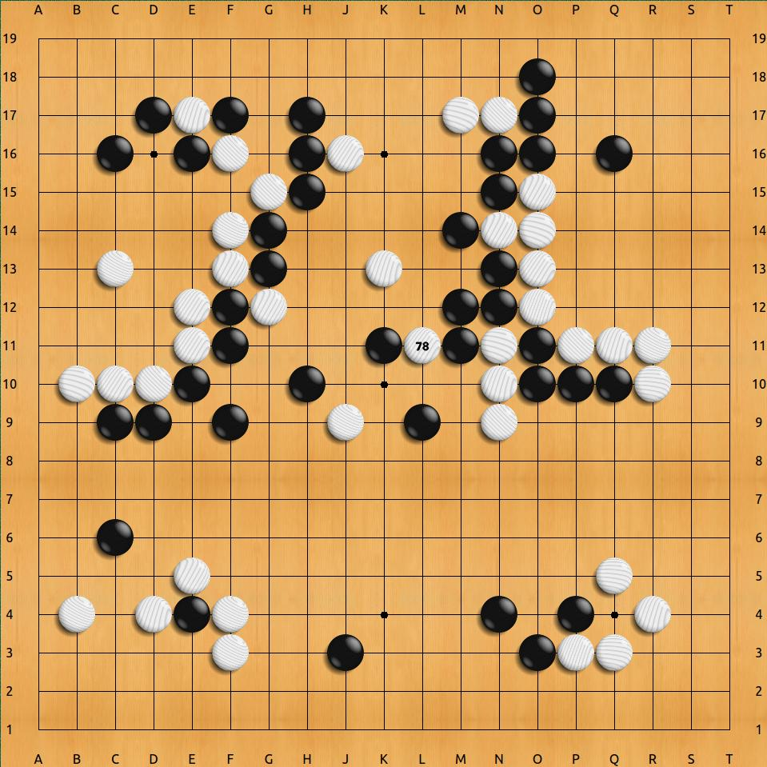

Note:
- AlphaGo blends deep learning + reinforcement learning + search.
Source: https://commons.wikimedia.org/wiki/File:Lee-sedol-alphago-divine-move.jpg

---

<!-- ========================================================= -->
<!-- 2) Two paradigms + knowledge representation -->
<!-- ========================================================= -->

  
2) Paradigms & knowledge

  
How do we build AI systems?

  
Paradigms, representations, first concrete examples

Note:
- Now we convert the history into the conceptual toolkit.

---

### Symbolic AI vs. Machine Learning

  

    
Symbolic AI

    <ul class="muted" style="margin-top: 0.6rem">
      <li>explicit rules + logic</li>
      <li>search + planning</li>
      <li>great when rules are clear</li>
    </ul>
  

  

    
Machine learning

    <ul class="muted" style="margin-top: 0.6rem">
      <li>learn patterns from data</li>
      <li>needs evaluation + iteration</li>
      <li>dominates messy tasks</li>
    </ul>
  

Note:
- Real systems are hybrid: business rules as guardrails + ML scores.
- ShopNow: “never ship to embargoed regions” (rule) + “fraud risk score” (ML).

---

### Knowledge representation (1/2): rules + graphs

  

    
Rules / logic

    

      IF (new_customer AND high_amount AND shipping≠billing)
       
      THEN flag_as_risky
    

    

      easy to explain, hard to scale
    

  

  

    
Graphs / ontologies

    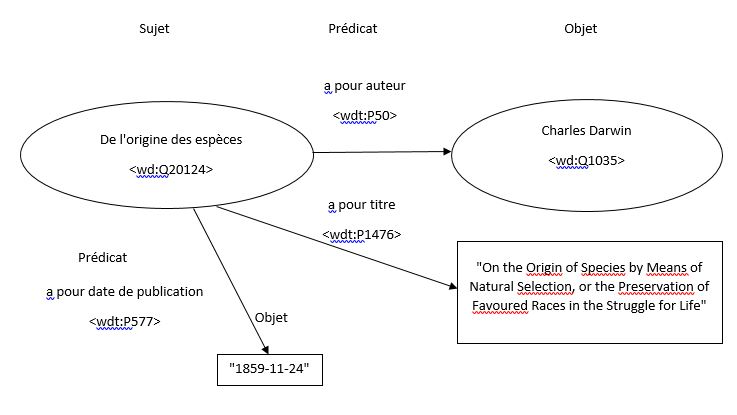
    

      entities + relations (“product → category → brand”)
    

  

Note:
- ShopNow: catalog knowledge graph (brand ↔ category ↔ product).
RDF triples source: https://commons.wikimedia.org/wiki/File:Fig.3_Graphe_de_trois_triplets_RDF_avec_litt%C3%A9raux.jpg

---

### Knowledge representation (2/2): features + vectors

  

    
Features

    <ul class="muted" style="margin-top: 0.6rem">
      <li>age, cart_value, #returns</li>
      <li>category, brand, region</li>
      <li>time since last purchase</li>
    </ul>
    

      feed features into a model
    

  

  

    
Vectors (“embeddings”)

    <svg width="100%" height="240" viewBox="0 0 520 240" xmlns="http://www.w3.org/2000/svg">
      <rect x="0" y="0" width="520" height="240" fill="transparent" />
      <circle cx="90" cy="170" r="7" fill="#9bd" />
      <circle cx="125" cy="130" r="7" fill="#9bd" />
      <circle cx="155" cy="165" r="7" fill="#9bd" />
      <circle cx="210" cy="105" r="7" fill="#9bd" />
      <circle cx="240" cy="130" r="7" fill="#9bd" />
      <circle cx="315" cy="165" r="7" fill="#bd9" />
      <circle cx="345" cy="145" r="7" fill="#bd9" />
      <circle cx="365" cy="175" r="7" fill="#bd9" />
      <circle cx="435" cy="110" r="7" fill="#bd9" />
      <circle cx="455" cy="130" r="7" fill="#bd9" />
      <line x1="70" y1="200" x2="470" y2="200" stroke="rgba(255,255,255,0.35)" stroke-width="2" />
      <line x1="70" y1="200" x2="70" y2="30" stroke="rgba(255,255,255,0.35)" stroke-width="2" />
      <text x="75" y="48" fill="rgba(255,255,255,0.75)" font-size="16">vector space</text>
      <text x="90" y="224" fill="rgba(255,255,255,0.65)" font-size="14">dimension 1</text>
    </svg>
    

      similar items/users end up close together
    

  

Note:
- Sets up recommenders and embeddings later.

---

### First algorithms (search/pathfinding): BFS vs DFS vs A*

  

    
BFS

    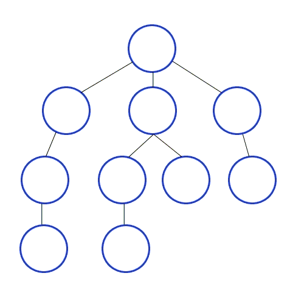
  

  

    
DFS

    
  

  

    
A*

    
  

  BFS explores “in waves”, DFS goes “deep”, A* uses a heuristic to focus.

Note:
- Visual note: BFS/DFS gifs are on graphs; A* is on a grid. If you want one single “same maze” comparison image, replace with a custom 3-panel maze illustration.
- ShopNow: warehouse picking paths, routing, configuration search.
Sources:
- BFS: https://commons.wikimedia.org/wiki/File:Breadth-First-Search-Algorithm.gif
- DFS: https://commons.wikimedia.org/wiki/File:Depth-First-Search.gif
- A*: https://commons.wikimedia.org/wiki/File:Astar_progress_animation.gif

---

### Rule-based example vs learned classifier

  

    
Rule-based

    

      IF order_value &gt; 500
       
      AND new_customer
       
      AND shipping≠billing
       
      THEN review
    

    

      transparent, brittle, easy to evade
    

  

  

    
Learned classifier

    

      input features → score
       
      \(x \rightarrow p(\mathrm{fraud}\mid x)\)
    

    

      adapts, needs data + evaluation + monitoring
    

  

Note:
- In practice: hybrid is common (rules as guardrails + ML score).
- ShopNow: fraud/chargeback detection is a canonical example.

---

<!-- ========================================================= -->
<!-- 3) Learning types -->
<!-- ========================================================= -->

  
3) Learning types

  
How do models learn?

  
Five buckets

Note:
- Learning type is about what feedback signal you have.

---

### Learning types (overview)

  

    
Supervised

    
labeled examples (x, y)

    
fraud yes/no, demand prediction

  

  

    
Unsupervised

    
no labels (x)

    
segments, compression

  

  

    
Reinforcement

    
reward signal

    
control, bidding

  

  

    
Semi-supervised

    
few labels + many unlabeled

  

  

    
Self-supervised

    
labels from the data itself

  

  

Note:
- One taxonomy you can reuse across the whole course.

---

### Supervised learning

  
You have labels.

  

    learn \(f(x)\) from examples \((x, y)\)
  

Note:
- ShopNow: fraud detection, churn prediction, delivery delay prediction, demand forecasting.

---

### Unsupervised learning

  
No labels.

  

    discover structure in \(x\) (groups, patterns, compression)
  

Note:
- ShopNow: customer segmentation; explore browsing sessions; learn product/user representations.

---

### Semi-supervised learning

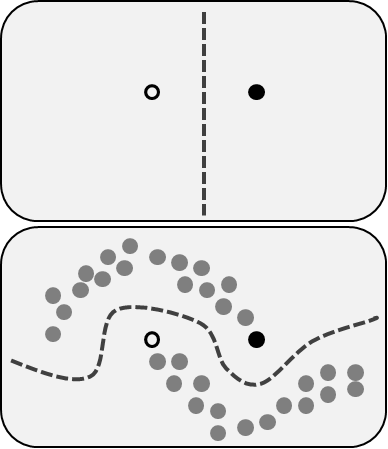

Note:
- Typical situation: labels are expensive, raw data is abundant.
- ShopNow: only some orders are confirmed fraud; many are unlabeled.
Source: https://commons.wikimedia.org/wiki/File:Example_of_unlabeled_data_in_semisupervised_learning.png

---

### Self-supervised learning

Note:
- Create training signal from the data.
- ShopNow: learn product representations from images/text without hand labels.
Source: https://commons.wikimedia.org/wiki/File:Autoencoder_structure.png

---

### Reinforcement learning (RL)

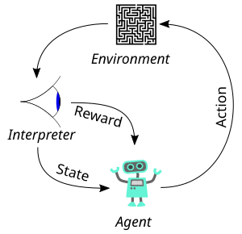

Note:
- Learn by trial-and-error with rewards.
- ShopNow: bidding/ads (reward = conversion), inventory policy (reward = profit).
Source: https://commons.wikimedia.org/wiki/File:Reinforcement_learning_diagram.svg

---

<!-- ========================================================= -->
<!-- 4) Core task families -->
<!-- ========================================================= -->

  
4) Core task families

  
What problems do we solve?

  
Tasks mapped to learning types

Note:
- Learning type = feedback. Task family = what output you want.

---

### Task families × learning types (overview)

<table class="taskmap">
  <thead>
    <tr>
      <th>Task family</th>
      <th>Supervised</th>
      <th>Unsupervised</th>
      <th>Self-/semi</th>
      <th>RL</th>
    </tr>
  </thead>
  <tbody>
    <tr>
      <td>Classification / Regression</td>
      <td>✓</td>
      <td></td>
      <td></td>
      <td></td>
    </tr>
    <tr>
      <td>Clustering / Dim. reduction</td>
      <td></td>
      <td>✓</td>
      <td>✓</td>
      <td></td>
    </tr>
    <tr>
      <td>Anomaly detection</td>
      <td>✓</td>
      <td>✓</td>
      <td>✓</td>
      <td></td>
    </tr>
    <tr>
      <td>Ranking & recommenders</td>
      <td>✓</td>
      <td>✓</td>
      <td>✓</td>
      <td></td>
    </tr>
    <tr>
      <td>Generative modeling</td>
      <td></td>
      <td></td>
      <td>✓</td>
      <td></td>
    </tr>
  </tbody>
</table>

Note:
- Generative modeling is mentioned only; next lecture covers GenAI & agents (no transformers/LLMs today).

---

### Classification / Regression

  

    <h4 style="color: orange; margin-bottom: 0.5rem">Classification</h4>
    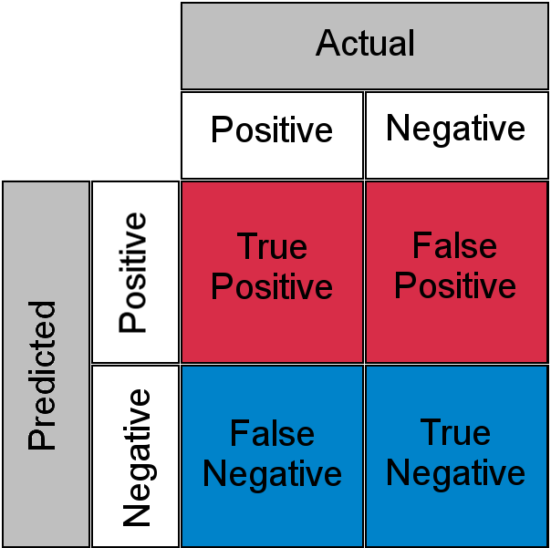
  

  

    <h4 style="color: orange; margin-bottom: 0.5rem">Regression</h4>
    
  

Note:
- ShopNow classification: fraud vs legit, “will churn?”, “will return?”
- ShopNow regression: demand forecasting, delivery ETA, lifetime value.
Sources:
- Confusion matrix: https://commons.wikimedia.org/wiki/File:ConfusionMatrixRedBlue.png
- Linear regression: https://commons.wikimedia.org/wiki/File:Linear_regression.svg

---

### Clustering / Dimensionality reduction

  

    <h4 style="color: orange; margin-bottom: 0.5rem">Clustering</h4>
    
  

  

    <h4 style="color: orange; margin-bottom: 0.5rem">PCA</h4>
    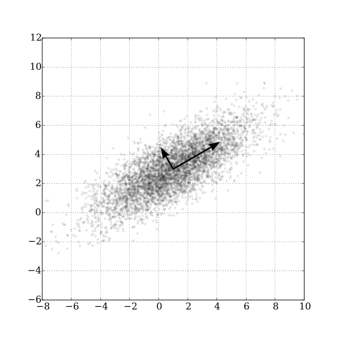
  

Note:
- PCA often used for visualization; also common: t-SNE and UMAP.
- ShopNow: segment customers; visualize products/users.
Sources:
- k-means: https://commons.wikimedia.org/wiki/File:K-means_convergence.gif
- PCA: https://commons.wikimedia.org/wiki/File:GaussianScatterPCA.svg

---

### Anomaly detection

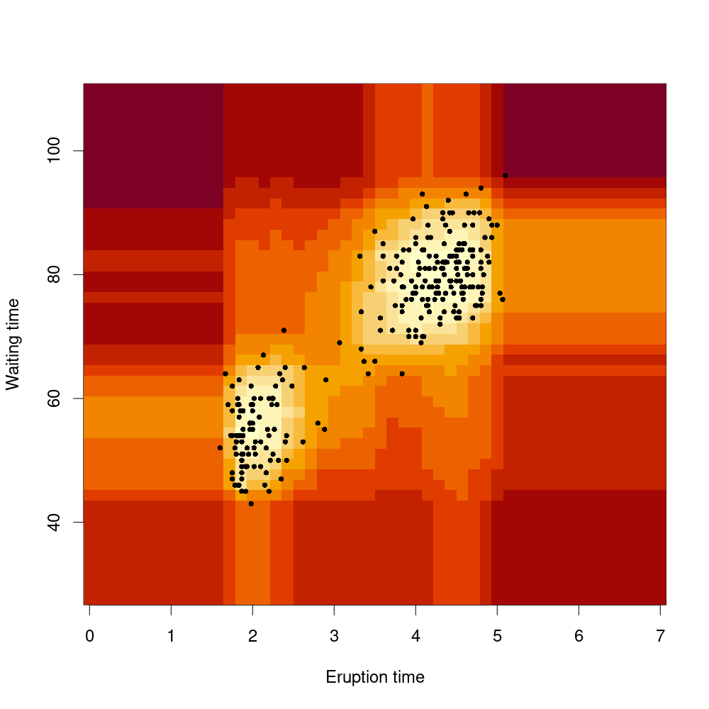

Note:
- ShopNow: card testing, bot traffic, unusual return behavior.
Source: https://commons.wikimedia.org/wiki/File:Normalized_Anomaly_Scores_of_Isolation_Forest.png

---

### Ranking & recommender systems

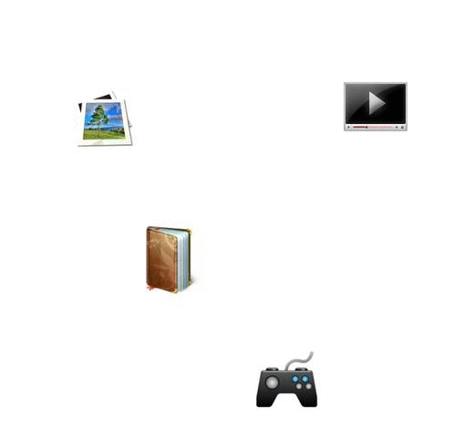

Note:
- ShopNow: search ranking, homepage feed, “you may also like”.
Source: https://commons.wikimedia.org/wiki/File:Collaborative_filtering.gif

---

### Generative modeling (mention only)

  
Generative modeling

  

    generate text/images/audio/code
     
    We cover this next lecture.
  

Note:
- Keep short. No transformers/LLMs content here.
- ShopNow (teaser): product description drafts, support agent drafts.

---

<!-- ========================================================= -->
<!-- 5) Why models work (or fail) -->
<!-- ========================================================= -->

  
5) Why models work (or fail)

  
Generalization + evaluation

  
The part that breaks in production

Note:
- This section is “how to avoid expensive mistakes”.

---

### Train / validation / test

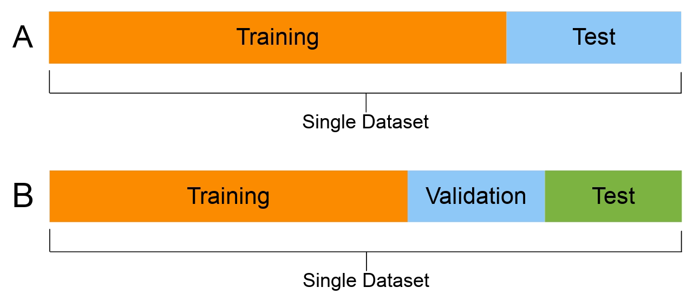

Note:
- Train: fit parameters. Validation: tune choices. Test: final unbiased check.
- ShopNow tip: use time-based splits for demand/seasonality (don’t shuffle).
Source: https://commons.wikimedia.org/wiki/File:ML_dataset_training_validation_test_sets.png

---

### Cross-validation (k-fold)

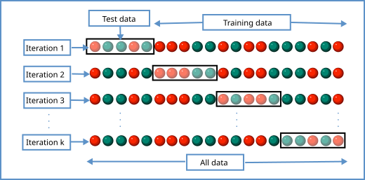

Note:
- Cross-validation stabilizes evaluation when data is limited.
- Time series caveat: use rolling/blocked CV.
Source: https://commons.wikimedia.org/wiki/File:K-fold_cross_validation_EN.svg

---

### Overfitting vs. underfitting

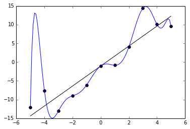

Note:
- Underfit: too simple → misses structure. Overfit: too complex → learns noise.
Source: https://commons.wikimedia.org/wiki/File:Overfitted_Data.png

---

### Overfitting (training curves)

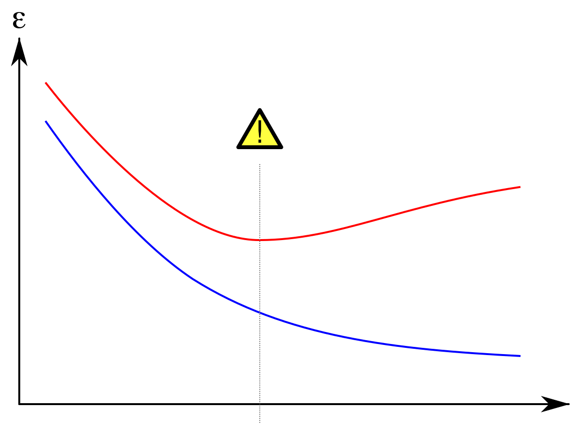

Note:
- When validation error rises while training error falls → overfitting.
- Early stopping: stop near best validation point.
Source: https://commons.wikimedia.org/wiki/File:Overfitting_svg.svg

---

### Bias–variance tradeoff (intuition)

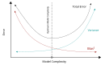

Note:
- High bias: too simple. High variance: too sensitive.
Source: https://commons.wikimedia.org/wiki/File:Bias_and_variance_contributing_to_total_error.svg

---

### Generalization + dataset shift (placeholder)

  

    
What changes?

    <ul class="muted" style="margin-top: 0.6rem">
      <li>customer behavior</li>
      <li>pricing / promotions</li>
      <li>catalog mix</li>
      <li>fraud strategies</li>
    </ul>
  

  

    
Visualization (TODO)

    

      Plot training data distribution vs.
      production data
       
      → decision boundary no longer fits
    

    

      (Histogram shift or shifted clusters in a scatter plot)
    

  

Note:
- Keep as TODO placeholder for a custom plot.
- ShopNow: Black Friday changes everything (distribution shift).

---

### Regularization (L1/L2, dropout, early stopping)

  

    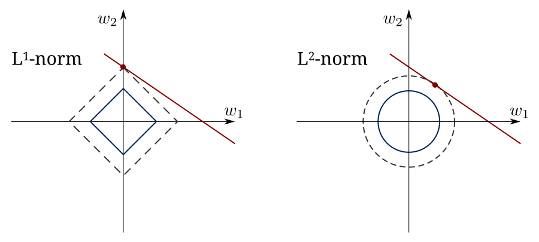
  

  

    <svg width="100%" height="240" viewBox="0 0 520 240" xmlns="http://www.w3.org/2000/svg">
      <rect x="0" y="0" width="520" height="240" fill="transparent" />
      <circle cx="70" cy="70" r="12" fill="rgba(155,220,180,0.9)"/>
      <circle cx="70" cy="120" r="12" fill="rgba(155,220,180,0.9)"/>
      <circle cx="70" cy="170" r="12" fill="rgba(155,220,180,0.9)"/>
      <circle cx="210" cy="55" r="12" fill="rgba(180,180,255,0.9)"/>
      <circle cx="210" cy="105" r="12" fill="rgba(180,180,255,0.25)"/>
      <line x1="200" y1="95" x2="220" y2="115" stroke="rgba(255,80,80,0.9)" stroke-width="4"/>
      <line x1="200" y1="115" x2="220" y2="95" stroke="rgba(255,80,80,0.9)" stroke-width="4"/>
      <circle cx="210" cy="155" r="12" fill="rgba(180,180,255,0.9)"/>
      <circle cx="390" cy="120" r="14" fill="rgba(255,230,150,0.95)"/>
      <g stroke="rgba(255,255,255,0.25)" stroke-width="2">
        <line x1="82" y1="70" x2="198" y2="55"/>
        <line x1="82" y1="120" x2="198" y2="55"/>
        <line x1="82" y1="170" x2="198" y2="55"/>
        <line x1="82" y1="70" x2="198" y2="105"/>
        <line x1="82" y1="120" x2="198" y2="105"/>
        <line x1="82" y1="170" x2="198" y2="105"/>
        <line x1="82" y1="70" x2="198" y2="155"/>
        <line x1="82" y1="120" x2="198" y2="155"/>
        <line x1="82" y1="170" x2="198" y2="155"/>
        <line x1="222" y1="55" x2="375" y2="120"/>
        <line x1="222" y1="105" x2="375" y2="120"/>
        <line x1="222" y1="155" x2="375" y2="120"/>
      </g>
      <text x="60" y="25" fill="rgba(255,255,255,0.75)" font-size="16">dropout</text>
      <text x="250" y="210" fill="rgba(255,255,255,0.6)" font-size="14">randomly drop units during training</text>
    </svg>
  

  

    
Early stopping

    

      stop training when validation gets worse
    

    

      cheap + effective regularization
    

  

Note:
- Regularization reduces overfitting.
- L2 (ridge) vs L1 (lasso): lasso encourages sparsity.
Source (L1/L2 balls): https://commons.wikimedia.org/wiki/File:L1_and_L2_balls.svg

---

### Optimization (gradient descent, learning rate)

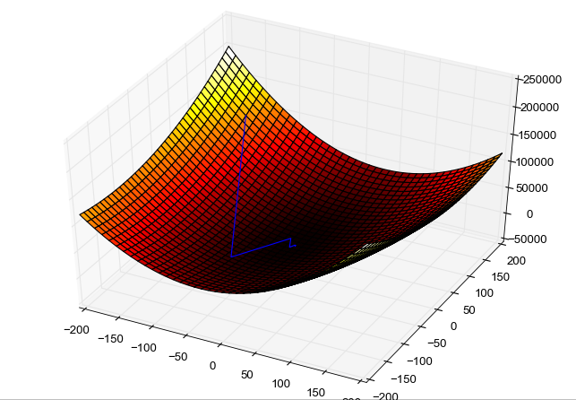

Note:
- Training = minimize a loss by updating parameters.
- Learning rate: step size (too big diverges; too small is slow).
Source: https://commons.wikimedia.org/wiki/File:Gradient_descent_method.png

---

### Loss functions (MSE vs cross-entropy)

  

    
Regression: MSE

    

      \(\mathcal{L} = (y - \hat{y})^2\)
    

    <svg width="100%" height="180" viewBox="0 0 520 180" xmlns="http://www.w3.org/2000/svg">
      <rect x="0" y="0" width="520" height="180" fill="transparent"/>
      <line x1="60" y1="150" x2="470" y2="150" stroke="rgba(255,255,255,0.25)" stroke-width="2"/>
      <line x1="265" y1="20" x2="265" y2="150" stroke="rgba(255,255,255,0.25)" stroke-width="2"/>
      <path d="M 80 150 Q 265 20 450 150" fill="none" stroke="rgba(155,220,180,0.9)" stroke-width="4"/>
      <text x="78" y="170" fill="rgba(255,255,255,0.6)" font-size="14">error</text>
      <text x="275" y="35" fill="rgba(255,255,255,0.6)" font-size="14">min</text>
    </svg>
  

  

    
Classification: cross-entropy

    

      \(\mathcal{L} = -\log p(y)\)
    

    <svg width="100%" height="180" viewBox="0 0 520 180" xmlns="http://www.w3.org/2000/svg">
      <rect x="0" y="0" width="520" height="180" fill="transparent"/>
      <line x1="60" y1="150" x2="470" y2="150" stroke="rgba(255,255,255,0.25)" stroke-width="2"/>
      <line x1="60" y1="20" x2="60" y2="150" stroke="rgba(255,255,255,0.25)" stroke-width="2"/>
      <path d="M 70 25 C 120 40, 180 60, 240 90 C 310 125, 380 145, 450 150" fill="none" stroke="rgba(255,220,150,0.95)" stroke-width="4"/>
      <text x="68" y="170" fill="rgba(255,255,255,0.6)" font-size="14">p(correct)</text>
      <text x="82" y="40" fill="rgba(255,255,255,0.6)" font-size="14">high loss</text>
      <text x="360" y="135" fill="rgba(255,255,255,0.6)" font-size="14">low loss</text>
    </svg>
  

Note:
- Loss defines what “good” means and drives training.
- ShopNow: fraud detection often needs cost-sensitive evaluation (false positives are expensive).

---

### Pitfall: “It works in the notebook” ≠ “It works in the world”

  

    
Common failure modes

    <ul class="muted" style="margin-top: 0.6rem">
      <li>data leakage</li>
      <li>biased / non-representative data</li>
      <li>dataset shift / drift</li>
      <li>wrong metric / wrong goal</li>
      <li>no monitoring</li>
    </ul>
  

  

    
E-commerce “gotchas”

    <ul class="muted" style="margin-top: 0.6rem">
      <li>promo periods break assumptions</li>
      <li>bots mimic users</li>
      <li>inventory constraints change outcomes</li>
      <li>feedback loops (recommenders)</li>
    </ul>
  

Note:
- This is the “production reality check” slide.

---

<!-- ========================================================= -->
<!-- 6) Classical ML toolbox -->
<!-- ========================================================= -->

  
6) Classical ML toolbox

  
Baselines that still win

  
Often faster, cheaper, easier to debug

Note:
- Pragmatic tip: start with strong baselines before deep nets.

---

### Linear & logistic regression

  

    
  

  

    
  

Note:
- Linear regression: predict a number. Logistic regression: predict a probability.
- ShopNow: demand forecasting baseline; churn/fraud score baseline.
Sources:
- Linear regression: https://commons.wikimedia.org/wiki/File:Linear_regression.svg
- Logistic curve: https://commons.wikimedia.org/wiki/File:Logistic-curve.svg

---

### Decision trees

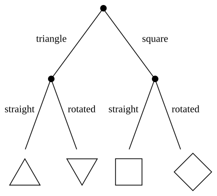

Note:
- Pros: interpretable. Cons: can overfit.
Source: https://commons.wikimedia.org/wiki/File:Simple_decision_tree.svg

---

### Random forests

Note:
- Many trees averaged → robust. Strong default for tabular data.
Source: https://commons.wikimedia.org/wiki/File:Random_forest_explain.png

---

### Gradient boosting

  
Sequentially fix mistakes

  

    build model₁ → look at errors → add model₂ to correct → add model₃ → …
  

<svg width="100%" height="200" viewBox="0 0 900 200" xmlns="http://www.w3.org/2000/svg">
  <defs>
    <marker id="arr" markerWidth="10" markerHeight="10" refX="8" refY="5" orient="auto">
      <path d="M 0 0 L 10 5 L 0 10 z" fill="rgba(255,255,255,0.65)"/>
    </marker>
  </defs>
  <rect x="40" y="70" width="180" height="70" rx="14" fill="rgba(255,255,255,0.08)" stroke="rgba(255,255,255,0.25)" stroke-width="2"/>
  <rect x="300" y="70" width="180" height="70" rx="14" fill="rgba(255,255,255,0.08)" stroke="rgba(255,255,255,0.25)" stroke-width="2"/>
  <rect x="560" y="70" width="180" height="70" rx="14" fill="rgba(255,255,255,0.08)" stroke="rgba(255,255,255,0.25)" stroke-width="2"/>
  <text x="130" y="110" fill="rgba(255,255,255,0.85)" font-size="18" text-anchor="middle">tree 1</text>
  <text x="390" y="110" fill="rgba(255,255,255,0.85)" font-size="18" text-anchor="middle">tree 2</text>
  <text x="650" y="110" fill="rgba(255,255,255,0.85)" font-size="18" text-anchor="middle">tree 3</text>
  <line x1="220" y1="105" x2="300" y2="105" stroke="rgba(255,255,255,0.35)" stroke-width="3" marker-end="url(#arr)"/>
  <line x1="480" y1="105" x2="560" y2="105" stroke="rgba(255,255,255,0.35)" stroke-width="3" marker-end="url(#arr)"/>
  <text x="260" y="70" fill="rgba(255,165,0,0.9)" font-size="14" text-anchor="middle">fix errors</text>
  <text x="520" y="70" fill="rgba(255,165,0,0.9)" font-size="14" text-anchor="middle">fix errors</text>
  <text x="820" y="110" fill="rgba(155,220,180,0.9)" font-size="18">final model</text>
</svg>

Note:
- Top performer on tabular data.
- Tools: XGBoost, LightGBM, CatBoost.

---

### k-Nearest Neighbors (kNN)

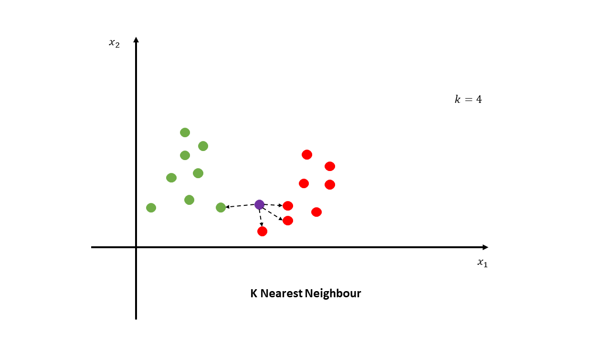

Note:
- Simple baseline; can be slow at inference; sensitive to feature scaling.
Source: https://commons.wikimedia.org/wiki/File:K_nearest_neighbour_explain.png

---

### Support Vector Machines (SVM)

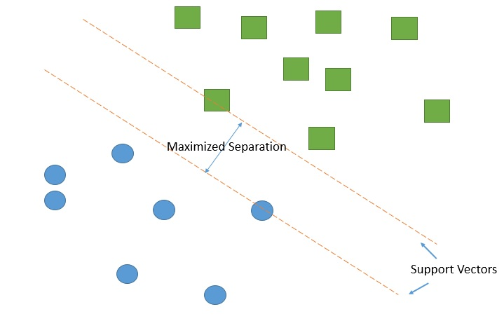

Note:
- Maximize margin between classes.
Source: https://commons.wikimedia.org/wiki/File:Support_vector_machine.jpg

---

### Naive Bayes

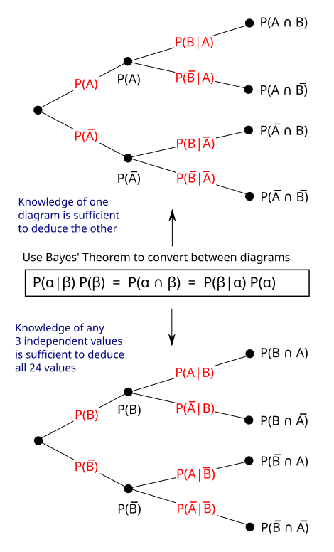

Note:
- Surprisingly strong for text classification despite “naive” independence assumption.
Source: https://commons.wikimedia.org/wiki/File:Bayes_theorem_tree_diagrams.svg

---

<!-- ========================================================= -->
<!-- 7) Deep learning essentials (without transformers) -->
<!-- ========================================================= -->

  
7) Deep learning essentials

  
Neural networks

  
Layers, activations, backprop — plus CNN/RNN/embeddings

Note:
- No transformers/LLMs today. We keep this as “essentials”.

---

### Neural networks: layers

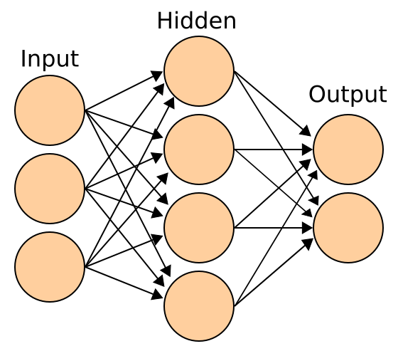

Note:
- A neural net is a stacked function \(f_\theta(x)\).
Source: https://commons.wikimedia.org/wiki/File:Artificial_neural_network.svg

---

### Activations (nonlinearity)

  

    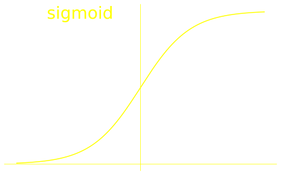
  

  

    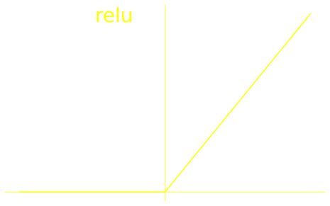
  

Note:
- Without activations, stacking layers collapses to linear.
- Sigmoid outputs probabilities; ReLU common in hidden layers.
Source (local course assets): `slides/neural_networks/assets/`

---

### Backpropagation (intuition)

<svg width="100%" height="270" viewBox="0 0 900 270" xmlns="http://www.w3.org/2000/svg">
  <defs>
    <marker id="arrow" markerWidth="10" markerHeight="10" refX="8" refY="5" orient="auto">
      <path d="M 0 0 L 10 5 L 0 10 z" fill="rgba(255,255,255,0.65)"/>
    </marker>
    <marker id="arrowBack" markerWidth="10" markerHeight="10" refX="8" refY="5" orient="auto">
      <path d="M 0 0 L 10 5 L 0 10 z" fill="rgba(255,165,0,0.85)"/>
    </marker>
  </defs>

  <circle cx="120" cy="80" r="18" fill="rgba(155, 220, 180, 0.9)"/>
  <circle cx="120" cy="190" r="18" fill="rgba(155, 220, 180, 0.9)"/>
  <circle cx="360" cy="60" r="18" fill="rgba(180, 180, 255, 0.9)"/>
  <circle cx="360" cy="135" r="18" fill="rgba(180, 180, 255, 0.9)"/>
  <circle cx="360" cy="210" r="18" fill="rgba(180, 180, 255, 0.9)"/>
  <circle cx="600" cy="100" r="18" fill="rgba(180, 180, 255, 0.9)"/>
  <circle cx="600" cy="170" r="18" fill="rgba(180, 180, 255, 0.9)"/>
  <circle cx="800" cy="135" r="22" fill="rgba(255, 230, 150, 0.95)"/>

  <line x1="138" y1="80" x2="342" y2="60" stroke="rgba(255,255,255,0.5)" stroke-width="3" marker-end="url(#arrow)"/>
  <line x1="138" y1="80" x2="342" y2="135" stroke="rgba(255,255,255,0.5)" stroke-width="3" marker-end="url(#arrow)"/>
  <line x1="138" y1="80" x2="342" y2="210" stroke="rgba(255,255,255,0.5)" stroke-width="3" marker-end="url(#arrow)"/>
  <line x1="138" y1="190" x2="342" y2="60" stroke="rgba(255,255,255,0.5)" stroke-width="3" marker-end="url(#arrow)"/>
  <line x1="138" y1="190" x2="342" y2="135" stroke="rgba(255,255,255,0.5)" stroke-width="3" marker-end="url(#arrow)"/>
  <line x1="138" y1="190" x2="342" y2="210" stroke="rgba(255,255,255,0.5)" stroke-width="3" marker-end="url(#arrow)"/>

  <line x1="378" y1="60" x2="582" y2="100" stroke="rgba(255,255,255,0.5)" stroke-width="3" marker-end="url(#arrow)"/>
  <line x1="378" y1="135" x2="582" y2="100" stroke="rgba(255,255,255,0.5)" stroke-width="3" marker-end="url(#arrow)"/>
  <line x1="378" y1="210" x2="582" y2="170" stroke="rgba(255,255,255,0.5)" stroke-width="3" marker-end="url(#arrow)"/>

  <line x1="618" y1="100" x2="776" y2="135" stroke="rgba(255,255,255,0.5)" stroke-width="3" marker-end="url(#arrow)"/>
  <line x1="618" y1="170" x2="776" y2="135" stroke="rgba(255,255,255,0.5)" stroke-width="3" marker-end="url(#arrow)"/>

  <line x1="776" y1="155" x2="630" y2="180" stroke="rgba(255,165,0,0.8)" stroke-width="3" marker-end="url(#arrowBack)"/>
  <line x1="776" y1="115" x2="630" y2="90" stroke="rgba(255,165,0,0.8)" stroke-width="3" marker-end="url(#arrowBack)"/>
  <line x1="582" y1="185" x2="400" y2="225" stroke="rgba(255,165,0,0.8)" stroke-width="3" marker-end="url(#arrowBack)"/>
  <line x1="582" y1="85" x2="400" y2="45" stroke="rgba(255,165,0,0.8)" stroke-width="3" marker-end="url(#arrowBack)"/>

  <text x="100" y="28" fill="rgba(255,255,255,0.8)" font-size="18">forward pass</text>
  <text x="610" y="28" fill="rgba(255,165,0,0.9)" font-size="18">backward pass</text>
  <text x="780" y="205" fill="rgba(255,255,255,0.75)" font-size="16">loss</text>
</svg>

Note:
- Forward pass: compute predictions and loss.
- Backward pass: compute gradients via chain rule.

---

### CNNs (vision)

Note:
- ShopNow: product image classification, defect detection.
Source: https://commons.wikimedia.org/wiki/File:Typical_cnn.png

---

### RNN / LSTM (sequences)

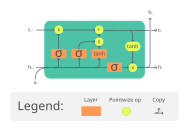

Note:
- Historical sequence model; keeps a state over time.
Source: https://commons.wikimedia.org/wiki/File:The_LSTM_Cell.svg

---

### Embeddings (concept only)

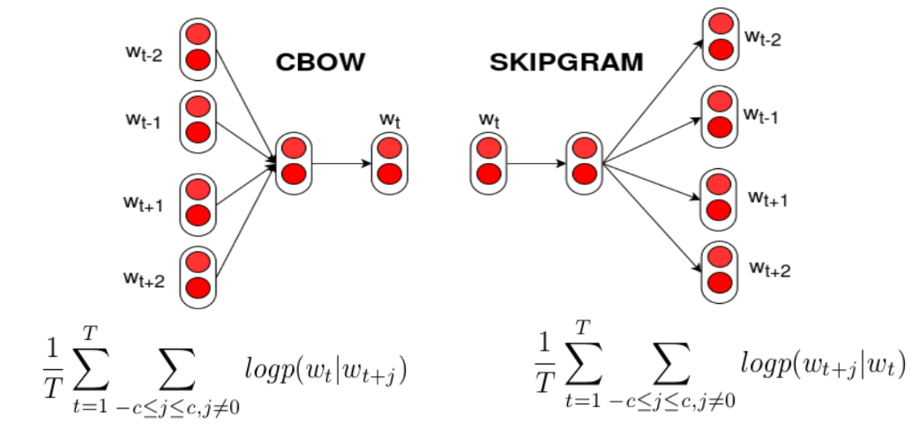

Note:
- Embeddings map items/text into vectors where similar ≈ close.
- ShopNow: “similar products”, personalization, semantic search.
Source: https://commons.wikimedia.org/wiki/File:CBOW_eta_Skipgram.png

---

### Transfer learning + fine-tuning

  

    
Pre-train

    
large dataset

    
general features

  

  

    
Re-use

    
freeze most layers

    
keep representations

  

  

    
Fine-tune

    
your small dataset

    
adapt to task

  

Note:
- Practical win: less data + less compute.

---

<!-- ========================================================= -->
<!-- 8) Wrap-up -->
<!-- ========================================================= -->

  
8) Wrap-up

  
Key takeaways

  
A mental model you can reuse

---

### Key takeaways

  
If you remember 7 things:

  <ul class="muted" style="margin-top: 0.6rem">
    <li>AI evolved from rules + search to learning from data.</li>
    <li>Learning types: supervised, unsupervised, semi-/self-supervised, RL.</li>
    <li>Task families: classification, regression, clustering, PCA, anomalies, ranking.</li>
    <li>Generalization is everything: splits, CV, and dataset shift.</li>
    <li>Regularization + good evaluation prevent overfitting.</li>
    <li>Classical ML is still powerful on tabular data.</li>
    <li>Deep learning adds representation learning (CNNs, LSTMs, embeddings).</li>
  </ul>

Note:
- Invite students to map any AI product to learning type + task family + model family.

---

### Next lecture

  
Next

  
Generative AI & Agent-Based Systems

  
How modern systems generate, reason, and use tools

Note:
- Next: generative modeling, LLMs, and agents — and what that means for BI.
